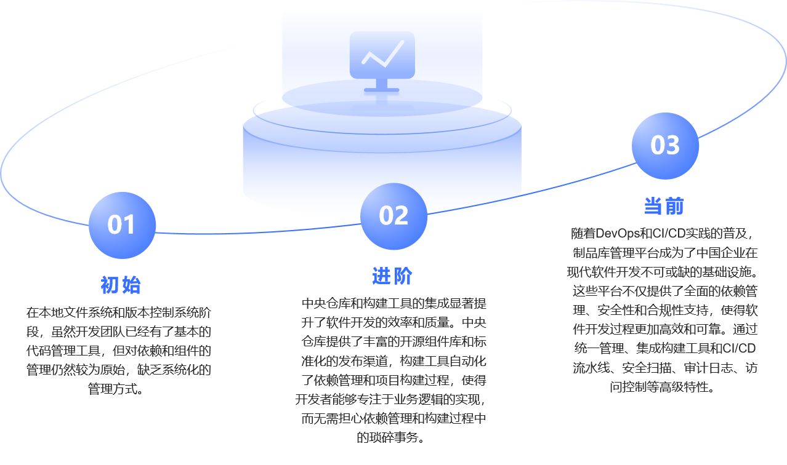

# Introduction to Artifact Repositories

An artifact repository is a platform for centrally storing and managing all kinds of artifacts produced during software development. These artifacts include, but are not limited to, source code, compiled binaries, dependency libraries, configuration files, and documentation. Its primary purpose is to provide a unified storage and version-control platform so that teams can easily share, retrieve, and manage required artifacts.

---

## Evolution of Artifact Repositories

The evolution of artifact repositories reflects a leap in software engineering practice: from early reliance on local systems and basic VCS, to central repositories paired with build tools that improved dependency management and automation, and finally to modern DevOps and CI/CD, where full‑fledged repository platforms emerged. These platforms integrate advanced features such as security scanning and audit logs, centralize management for diverse artifacts, deeply integrate with build tools and CI/CD, and use distributed technologies to ensure high availability and performance. This shift has turned artifact repositories into a cornerstone of modern software development, dramatically improving efficiency, security, and compliance.

In modern development, an artifact repository is critical—not only as the core tool for storing and managing build outputs, but also as a key link in continuous integration and delivery (CI/CD). Its value shows up in several areas:

1. **Dependency management**: centralizing dependencies resolves conflicts and streamlines versioning, ensuring stable and reproducible builds.
2. **Security and compliance**: integrated scanning quickly finds and helps fix vulnerabilities, while audit logs provide trustworthy traceability for reviews and regulatory needs.
3. **Efficient collaboration, “one package end‑to‑end”**: a unified platform fosters cross‑team collaboration, reduces duplication, and automatically syncs packages across environments.
4. **Automation support**: deep integration with build tools and CI/CD pipelines automates the path from commit to release, enabling rapid iteration and continuous delivery.
5. **High availability and performance**: distributed architectures keep services responsive and available under heavy load, supporting large teams.

---

## Relationship with DevOps

Across the entire R&D lifecycle, the repository serves as both an indispensable link and the **single source of truth**. It ensures dependencies are lawful, secure, and trustworthy; facilitates effective collaboration between development and operations; supports agile and DevOps practices; and meets strict enterprise security and compliance requirements.

During compilation and build, the repository provides a secure, polyglot, unified source of dependencies for CI—improving stability and reliability and speeding teams up. During release, it becomes the carrier for synchronized upgrades and distribution across development, test, and production environments and across regions/data centers. This guarantees consistency, avoids version conflicts and dependency issues, and supports distributed teams.

Repositories also help DevOps deliver a secure, compliant “one‑package end‑to‑end” approach. From code commit to product release, unified management and distribution ensure security and compliance throughout the lifecycle, boosting transparency and control and helping organizations meet standards and regulations.

In addition, high availability and performance provide a solid technical foundation for large teams: distributed technologies and effective caching keep the repository stable under high concurrency. With integrated security scanning and audit logs, the repository is not just a storage/distribution platform but also a key instrument for enterprise security and compliance reviews.

---

## Applying Artifact Repositories in the Development Process

As the **single source of truth**, a repository ensures the accuracy and consistency of code, dependency libraries, and other critical information. Centralized management avoids data redundancy and drift, enabling teams to make decisions and build on the same reliable information.

Key applications and value:

- **Ensure dependency accuracy and consistency**: fix versions and contents for all libraries; avoid incidents where the version number stays the same but the dependency’s code changes.
- **Standardized dependency management**: a unified environment provides standardized third‑party dependencies, ensuring consistent and reproducible compilation/builds and improving overall quality and velocity.
- **Centralized data management**: store artifacts of multiple languages and types in one place to reduce redundancy and inconsistency and lower the risk of manual copy/paste errors.
- **Improve collaboration efficiency**: a unified dependency/artifact platform reduces duplication and communication overhead, letting teams work seamlessly with the same tech stack and versioning model.
- **Enhance security and compliance**: built‑in security scanning and audit logs ensure artifact safety and regulatory compliance.
- **Support AI model management**: covers model storage, third‑party model downloads, and staged promotion/distribution, ensuring secure and consistent lifecycle management and enabling rapid iteration and deployment.

### Classified by Usage Scenario

| Repository Type  | Purpose |
|------------------|---------|
| **Local**        | Stores first‑ and second‑party packages; supports private deployment and internal sharing |
| **Proxy**        | Proxies external repositories (e.g., Maven Central, npm Registry) or internal sources across network segments |
| **Composite**    | Virtual repository that aggregates multiple repos (e.g., local + proxy) by priority and exposes a unified dependency‑resolution endpoint |

---

## Core Capabilities of an Artifact Repository

An artifact repository is the core tool of artifact management and provides the following capabilities:

1. **Centralized storage**  
   Unified management of all artifact types to avoid version sprawl.
2. **Security governance**  
   Scan vulnerable dependencies (e.g., Log4j), and enforce access controls.
3. **Efficient distribution**  
   Accelerate artifact sync across environments (dev/test/prod); support CDN‑based distribution.
4. **Metadata management**  
   Record build info and dependency relationships; support traceability across versions.

---
