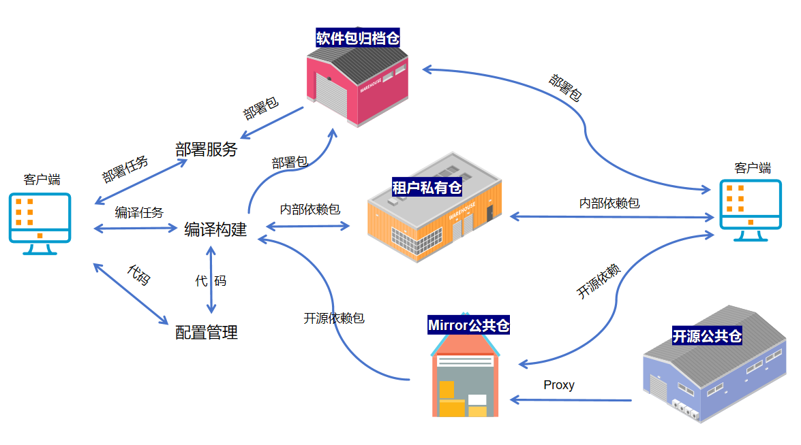
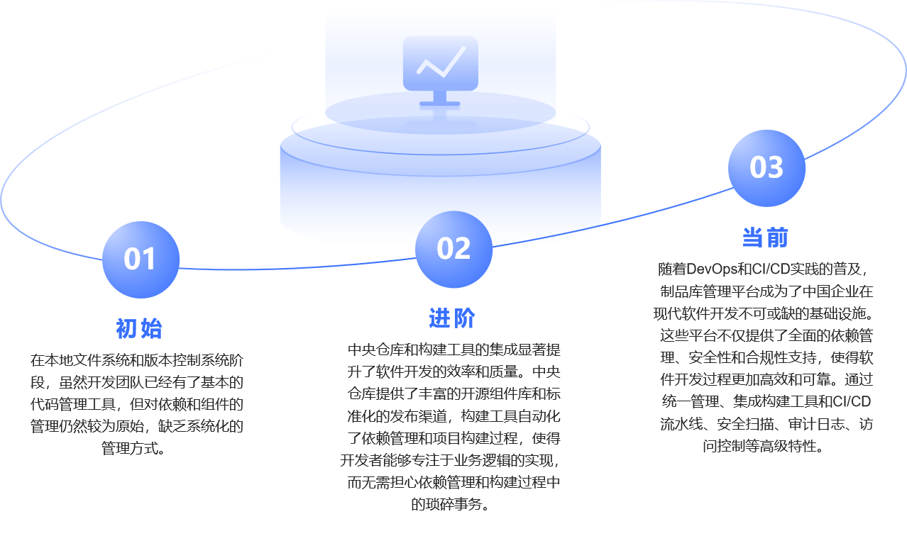
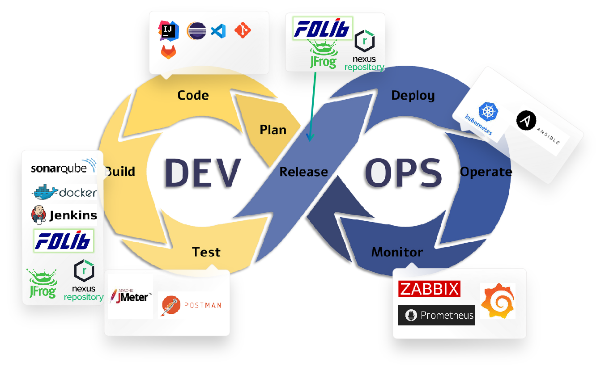
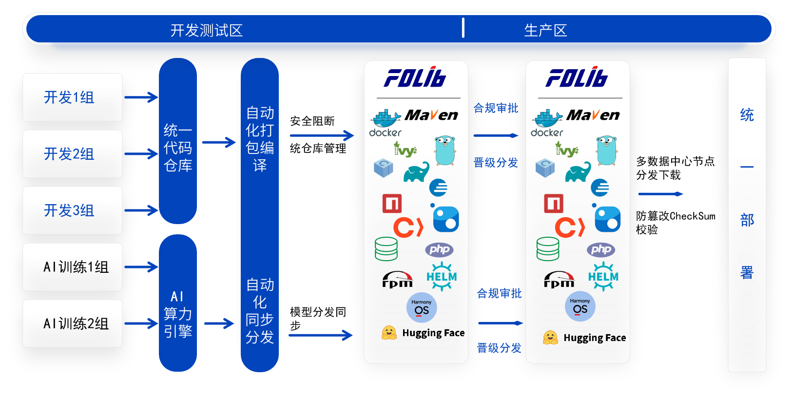

# Введение в репозиторий артефактов

Репозиторий артефактов — это платформа для централизованного хранения и управления всеми видами артефактов, возникающих в процессе разработки ПО. К таким артефактам относятся, помимо прочего, исходный код, скомпилированные двоичные файлы, библиотеки зависимостей, конфигурации и документация. Основная задача репозитория — предоставить единое хранилище и систему контроля версий, чтобы членам команды было удобно совместно использовать, получать и управлять нужными артефактами.

---

## История развития репозитория артефактов

Эволюция репозиториев артефактов (Artifact Repository) отражает качественный скачок в практике инженерии ПО: от ранних подходов с опорой на локальные системы и простой контроль версий — к центральным хранилищам и связке с инструментами сборки, улучшившим управление зависимостями и автоматизацию; далее — к эпохе DevOps и CI/CD, где сформировались полноценные платформы репозиториев. Эти платформы интегрируют продвинутые функции (сканирование уязвимостей, аудит), централизуют управление артефактами, глубоко встраиваются в сборочные инструменты и CI/CD, а также используют распределённые технологии для обеспечения высокой доступности и производительности. Всё это сделало репозиторий артефактов краеугольным камнем современной разработки, резко повысив эффективность, безопасность и соответствие требованиям.

В современной разработке репозиторий артефактов играет критически важную роль: это не только ключевой инструмент для хранения и управления сборочными результатами, но и узловой элемент непрерывной интеграции и доставки (CI/CD). Его значимость проявляется в следующем:

1. **Управление зависимостями**: централизованное управление зависимостями устраняет конфликты и упорядочивает версии, обеспечивая стабильность и воспроизводимость сборок.
2. **Безопасность и соответствие требованиям**: встроенное сканирование помогает оперативно выявлять и устранять уязвимости, а журналы аудита дают надёжную основу для отслеживания и проверок.
3. **Эффективная коллаборация, «один пакет от начала до конца»**: единая платформа артефактов укрепляет межкомандное взаимодействие, снижает дублирование труда и автоматически синхронизирует пакеты между средами.
4. **Поддержка автоматизации**: глубокая интеграция со сборочными инструментами и конвейерами CI/CD позволяет автоматизировать путь от коммита до релиза, ускоряя итерации.
5. **Высокая доступность и производительность**: благодаря распределённой архитектуре платформа выдерживает высокую нагрузку, сохраняя отклик и доступность для крупных команд.

---

## Связь репозитория артефактов и DevOps

На всём протяжении жизненного цикла разработки репозиторий выступает как незаменимое звено и **единственный доверенный источник**. Он гарантирует законность, безопасность и надёжность зависимостей; укрепляет взаимодействие Dev и Ops; поддерживает гибкие методологии и практики DevOps; помогает соблюсти строгие корпоративные требования по безопасности и комплаенсу.

Во время компиляции и сборки репозиторий предоставляет безопасный и многоязычный единый источник зависимостей для CI, что повышает стабильность и надёжность сборок и ускоряет работу команд. На этапе релиза репозиторий становится носителем для синхронизированных обновлений и дистрибуции между средами (dev/test/prod) и регионами/ЦОДами, обеспечивая согласованность, предотвращая конфликты версий и проблемы зависимостей и поддерживая распределённые команды.

Репозиторий также помогает DevOps реализовать безопасный и соответствующий требованиям подход «один пакет от начала до конца»: от коммита до релиза единые механизмы управления и распространения обеспечивают безопасность и комплаенс на всём жизненном цикле, повышая прозрачность и управляемость процесса и упрощая соответствие стандартам и регуляциям.

Кроме того, высокая доступность и производительность платформы создают надёжную основу для масштабных команд: распределённые технологии и эффективное кэширование позволяют стабильно работать под высокой нагрузкой. Интегрированные сканирование безопасности и аудит превращают репозиторий не только в платформу хранения/распространения, но и в важный инструмент корпоративной безопасности и комплаенса.

---

## Применение репозитория артефактов в процессе разработки

В разработке репозиторий, выступая как **единственный доверенный источник**, обеспечивает точность и согласованность кода, библиотек и иных критичных данных. Централизация устраняет избыточность и рассинхронизацию данных, позволяя командам принимать решения и разрабатывать на единой, согласованной базе.

Ценность и применение репозитория проявляются в следующем:

- **Точность и согласованность зависимостей**: фиксируются версии и содержимое всех библиотек; избегаются инциденты, когда версия не меняется, а фактический код зависимости — изменился.
- **Стандартизированное управление зависимостями**: единая среда с типовыми сторонними зависимостями гарантирует согласованную и воспроизводимую компиляцию и сборку, повышая качество и скорость.
- **Централизация данных**: хранение артефактов разных языков и типов в одном месте уменьшает избыточность и несогласованность и снижает риски ошибок ручного копирования пакетов.
- **Повышение эффективности сотрудничества**: единая платформа зависимостей и артефактов сокращает дублирование и коммуникационные издержки; команды работают в одной стековой и версионной модели.
- **Усиление безопасности и комплаенса**: встроенные сканирование и аудит обеспечивают безопасность артефактов и соответствие корпоративным и отраслевым требованиям.
- **Поддержка управления AI‑моделями**: хранение моделей, загрузка сторонних моделей, промоутирование версий и их распространение; безопасность и согласованность жизненного цикла моделей; быстрые итерации и деплой.

### Классификация по сценариям использования

| Тип репозитория   | Назначение |
|-------------------|------------|
| **Локальный**     | Хранит пакеты 1-й и 2-й стороны; поддерживает приватное размещение и внутренний обмен |
| **Проксирующий**  | Проксирует внешние репозитории (например, Maven Central, npm Registry) или внутрисетевые зеркала в других сегментах |
| **Составной**     | Виртуальный репозиторий, агрегирует несколько хранилищ (например, локальные + прокси) по приоритетам и предоставляет единый эндпоинт разрешения зависимостей |

---

## Ключевые функции репозитория артефактов

Репозиторий артефактов — ядро управления артефактами и предоставляет следующие возможности:

1. **Централизованное хранение**  
   Единство хранения всех типов артефактов, без «расползания» версий.
2. **Безопасность и контроль доступа**  
   Сканирование уязвимых зависимостей (например, уязвимость Log4j), разграничение прав доступа.
3. **Эффективная дистрибуция**  
   Ускоренная синхронизация артефактов между средами (dev/test/prod), поддержка распространения через CDN.
4. **Управление метаданными**  
   Фиксация сведений о сборках и зависимостях, поддержка трассировки и ретроспективы версий.

---
