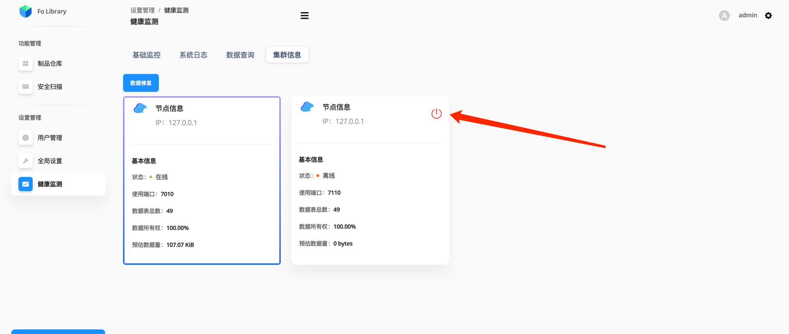

# Онлайн‑обслуживание кластера

## Онлайн удаление сбойного узла
Когда один из узлов в кластере выходит из строя или был аварийно остановлен, его нужно удалить из кворума онлайн, а затем выполнить восстановительный запуск.

### Шаг 1. Удалите сбойный узел на странице
Откройте **Здоровье системы → Информация о кластере** и нажмите **Удалить** у нужного узла.



### Шаг 2. Выполните восстановительный запуск узла
Команда исправит состояние узла и перезапустит его:
```bash
folib repair_start
```

## Восстановление данных в мульти‑узловом кластере
Хранилище БД является распределённым: одна и та же запись хранится частично на нескольких узлах. Поэтому после **repair_start** дополнительно нажмите кнопку **Восстановить данные** (на странице информации о кластере).

> **Внимание.** Восстановление данных выполняется в фоновом режиме и может занять время, но работе не мешает. До завершения восстановления используйте исправные узлы.
