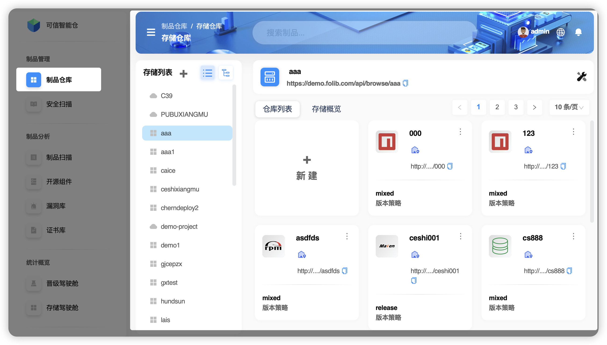
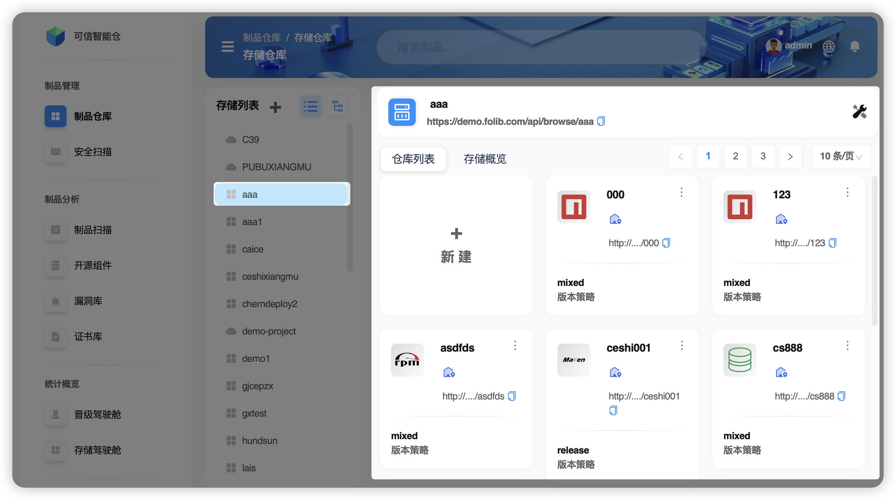

# Space Overview

**Storage Space** is an independent resource pool used to isolate different business units (e.g., departments or subsidiaries). It supports two storage modes: local storage (NFS directory) and S3 object storage. Within a space, you can create and manage the repositories you need. A space ensures inter‑department resource isolation, security, and scalability.

- Two storage modes

| Term | Explanation |
|------|-------------|
| **NFS Storage** | **Definition**: a network file storage solution based on the NFS (Network File System) protocol, allowing clients to access files on a server as if they were local. **Protocol**: over TCP/IP or UDP. **Mounting**: the remote filesystem must be mounted to a local path; once mounted, it is accessed via that path. **Read/Write**: supports local‑like disk operations with performance close to a local filesystem. **Scaling**: by adding server capacity or network bandwidth; requires manual configuration. **Flexibility**: expansion/config changes can be complex and may impact continuity. **Use cases**: on‑prem/local networks with high performance requirements and moderate data volumes. |
| **S3 Storage**  | **Definition**: a cloud‑based object storage service for large‑scale data with high availability, accessed via HTTP/HTTPS and RESTful APIs. **Protocol**: HTTP/HTTPS. **Mounting**: traditional filesystem mounting is not supported; use SDKs or command‑line tools. **Read/Write**: network‑based; performance depends on bandwidth and latency. **Scaling**: automatic, no capacity pre‑provisioning; pay‑as‑you‑go. **Flexibility**: highly flexible scaling without manual intervention; ideal for dynamic workloads. **Use cases**: large‑scale data storage, cloud‑native apps, and workloads with strong cost and availability requirements. |

## Interface Guide

1. **External view of a storage space**  
   The external view shows all storage spaces owned by the current account and the artifact repositories under the selected space.

2. **Internal view of a storage space**  
   The internal view focuses only on what’s inside the selected space.

