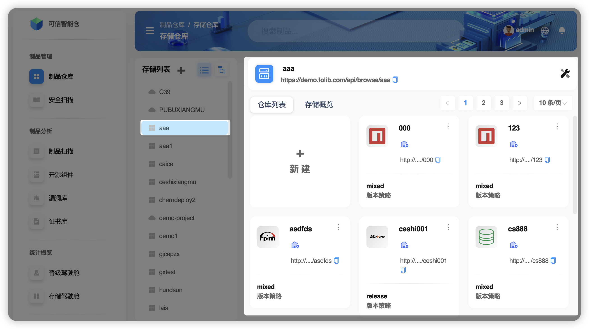

# Обзор пространства хранения

**Пространство хранения** — это независимый пул ресурсов для изоляции разных бизнес‑единиц (например, отделов или дочерних компаний). Поддерживаются два режима: локальное хранилище (каталог NFS) и облачное объектное хранилище S3. В рамках выбранного пространства вы можете создавать и управлять нужными репозиториями. Пространство обеспечивает изолированность ресурсов между подразделениями, безопасность и масштабируемость.

- Два режима хранения

| Термин        | Пояснение термина |
|--------------|--------------------|
| **NFS‑хранилище** | **Определение**: сетевое файловое хранилище на базе протокола NFS (Network File System), позволяющее клиентам обращаться к файлам на сервере так же, как к локальной ФС. **Протокол**: поверх TCP/IP или UDP. **Монтаж (mount)**: удалённая ФС монтируется в локальный путь; после монтирования доступна как локальный каталог. **Операции чтения/записи**: поддерживаются операции, близкие по производительности к локальной ФС. **Масштабирование**: за счёт увеличения дисковой ёмкости сервера или сетевой полосы; требует ручной настройки. **Гибкость**: расширение и конфигурация сложнее, возможны перерывы в работе. **Сценарии**: локальные сети с высокими требованиями к производительности и умерёнными объёмами данных. |
| **S3‑хранилище**  | **Определение**: облачное объектное хранилище, рассчитанное на большие объёмы данных и высокую доступность; управление через HTTP/HTTPS и RESTful API. **Протокол**: HTTP/HTTPS. **Монтаж (mount)**: классическое монтирование ФС не поддерживается; работа через SDK или CLI‑инструменты. **Операции чтения/записи**: зависят от сети (пропускная способность, задержки). **Масштабирование**: автоматическое; предвыделение ёмкости не требуется; оплата по факту использования. **Гибкость**: масштабируется без ручного вмешательства; удобно для динамических нагрузок. **Сценарии**: крупномасштабное хранение данных, cloud‑native приложения, требования к оптимальным затратам и высокой доступности. |

## Описание интерфейса

1. **Внешний вид пространства хранения**  
   Во внешнем представлении отображаются все пространства хранения текущего аккаунта и репозитории артефактов, принадлежащие выбранному пространству.

2. **Внутренний вид пространства хранения**  
   Во внутреннем представлении показывается только состояние внутри выбранного пространства.

