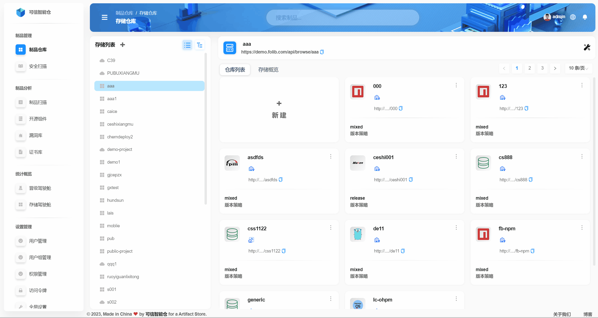
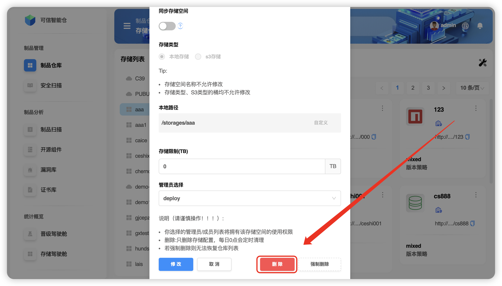
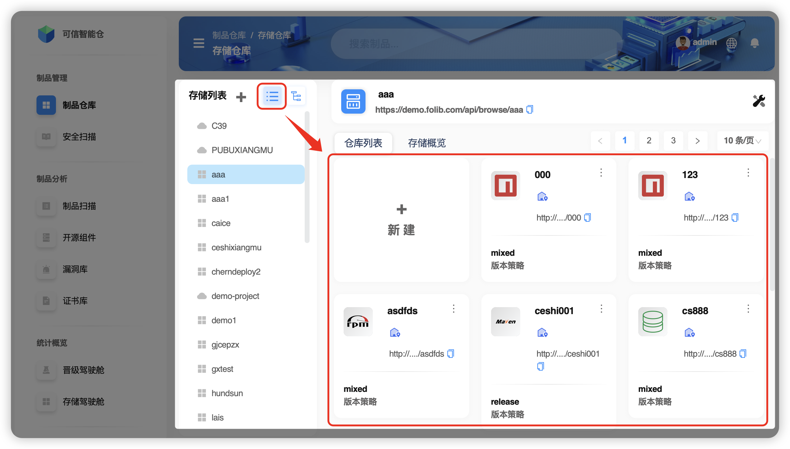

# Basic Operations

A **storage space** can be created by a **platform administrator**, who assigns **space administrators** to manage it. A space can be **modified and deleted**. The **storage space list** shows all spaces owned by your account; that is where you operate on spaces.

- Glossary of terms used in operations

| Term | Explanation |
|---|---|
| **Storage space name** | The unique identifier of the space |
| **Sync storage space** | Turning sync ON/OFF at the space level turns sync ON/OFF for **all** repositories in that space. Each repository can also have its own sync option; changes at the repo level **do not affect** the overall space‑level switch. |
| **Storage type** | Two types: local storage (NFS directory) and S3 storage (cloud bucket) |
| **Local path** | Physical path for local storage; user configurable |
| **Storage limit** | The maximum capacity of the space |
| **Administrator assignment** | Set by the platform administrator when creating the space; assigned admins can modify/delete this space |

> TIP  
>  denotes NFS storage.  
>  denotes S3 storage.

---

## Create a Storage Space

**Step 1.** In the space’s **external view**, click the **“+”** icon.  

**Step 2.** Configure the **storage space** parameters and click **“Confirm”**.  

> TIP  
> 📄 See the naming conventions document.

---

## Modify a Storage Space

Example space: `<aaa>`.

**Step 1.** In the **internal view**, click the **“Edit”** icon in the upper right.  

**Step 2.** Configure the options and click **“Edit”** to save, or **“Cancel”** to abort.  

> TIP  
> 💡 You can modify only: **sync space**, **storage limit**, and **space administrators**.  

---

## Delete a Storage Space

Example space: `<aaa>`.

**Step 1.** In the **internal view**, click the **“Edit”** icon.  

**Step 2.** Click **“Delete”** (*recommended*).  

There are two deletion modes: **Delete** and **Force delete**.

| Mode | Explanation |
|:--:|:--|
| **Delete** 👍🏻 | Removes only the storage configuration; physical data is cleaned up on a scheduled job at 00:00 daily |
| **Force delete** ⚠️ | Completely deletes with no way to restore the repository list |

---

## Switch Repository View

The repository list shows the storage spaces your account has access to. The system defaults to **Flat mode** and lets you switch to **Tree mode**.

- **Flat mode**  
  

- **Tree mode**  
  

---

## Space Storage Overview

In the storage overview you can see file sizes/counts and artifact sizes/counts for the space.

- In Flat mode, choose **Storage Overview**.  
    
  
