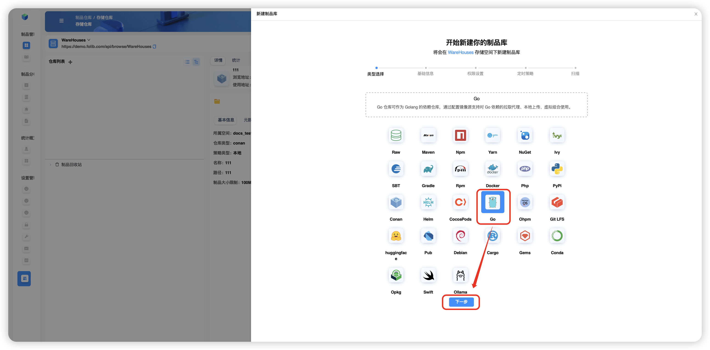
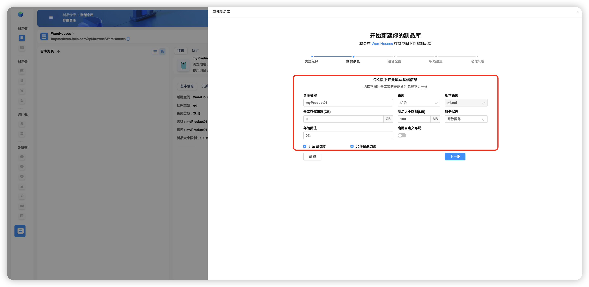
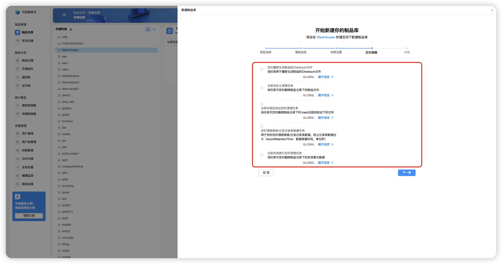
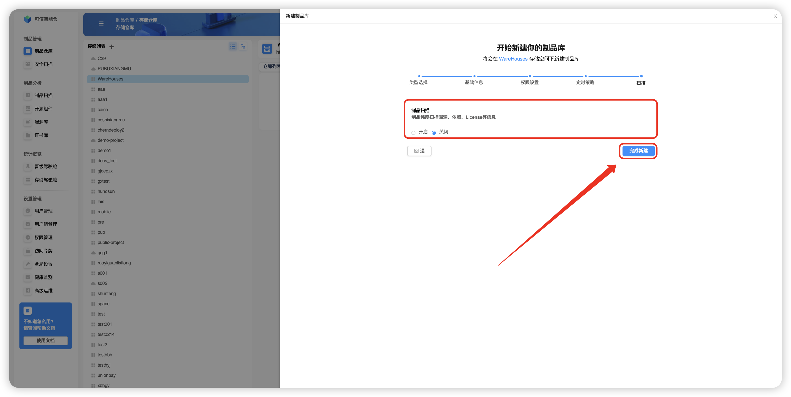
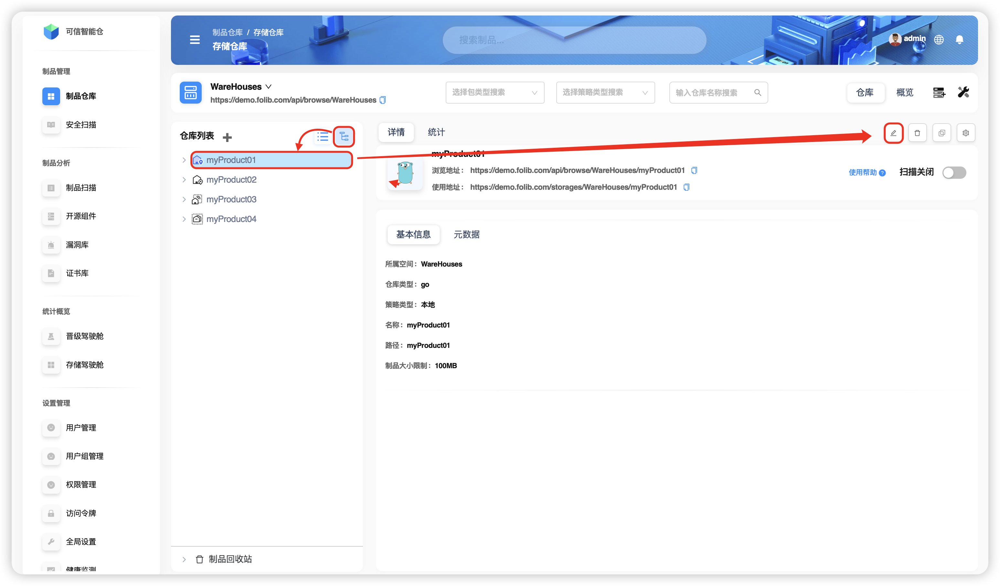
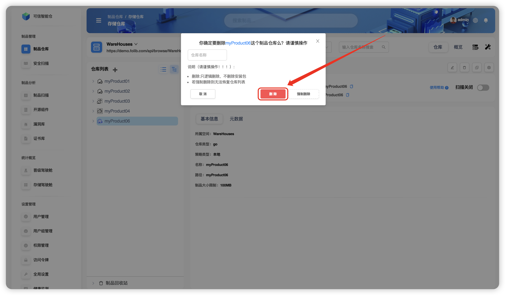
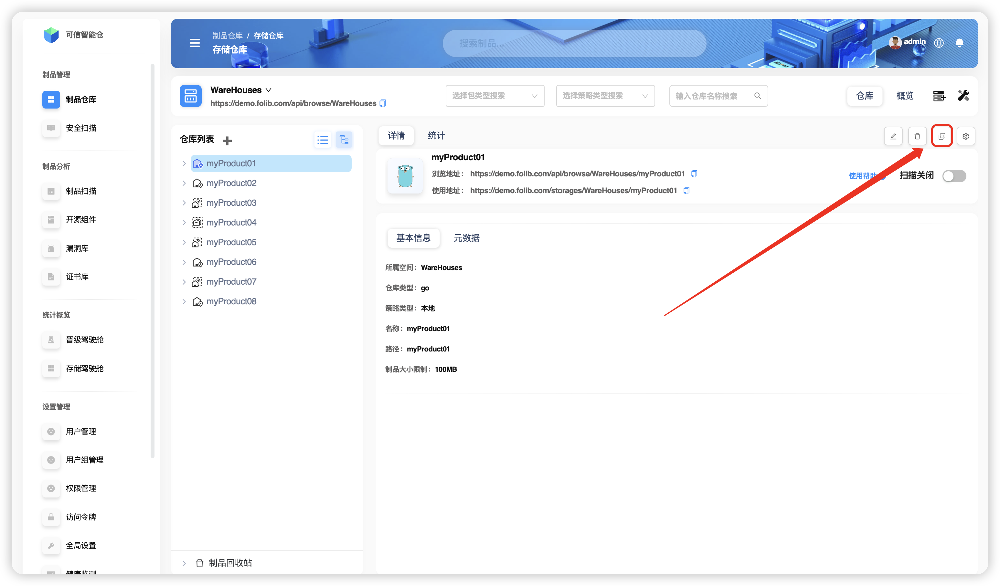
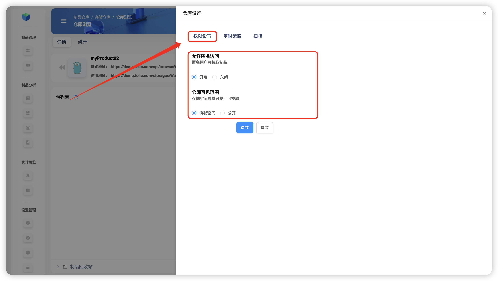
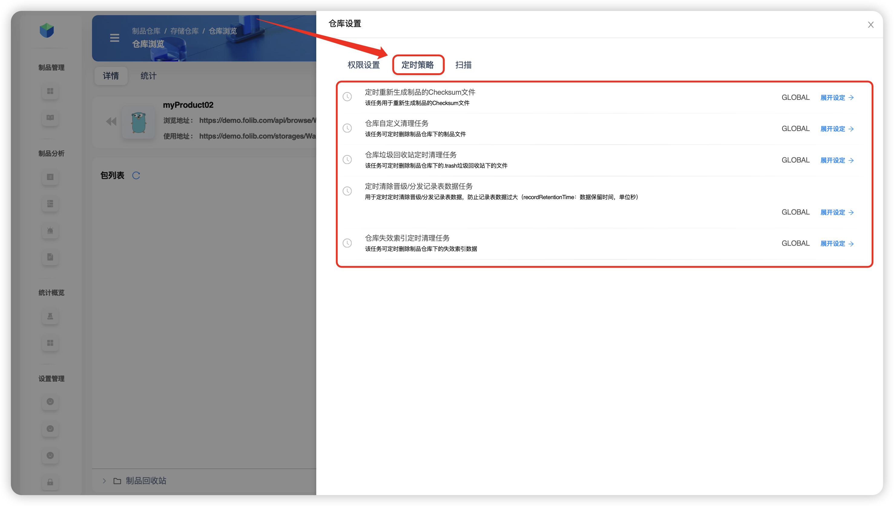
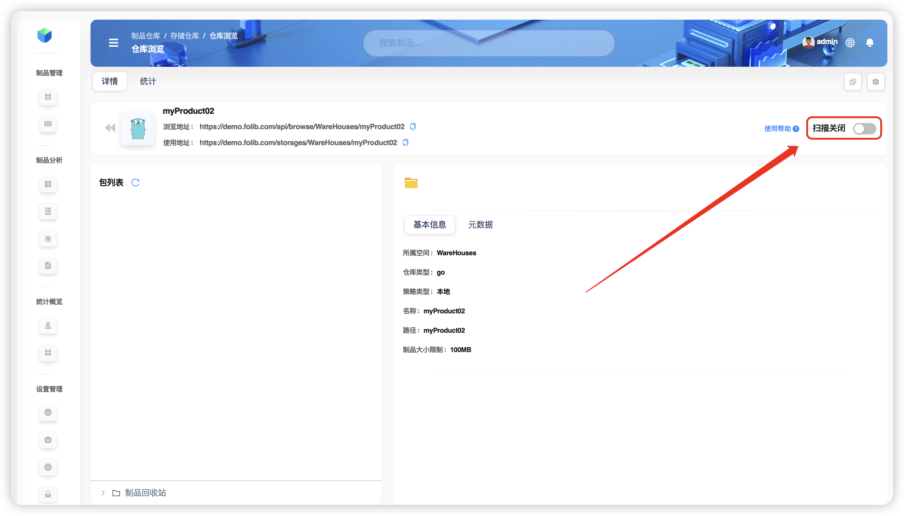

# Operations Guide

> This section explains how to work with **artifact repositories**: strategies, storage and size limits, how to create/edit/delete repositories, and how to configure access, schedules, and scanning.

## Glossary (selected terms)

| Term | Explanation |
|:--:|:--|
| **Strategy** | Three strategies: **Local**, **Proxy**, and **Virtual (Combined)**. |
| **Version policy** | Restricts which artifact versions are allowed. Typically used in local repositories. If the type is *release*, only *release* artifacts are allowed; *snapshot* is not. |
| **Repository storage limit (GB)** | Upper bound for the total size of artifacts stored in a repository. |
| **Artifact size limit (MB)** | Per‑artifact size cap. Default is *100 MB*. Prevents users from uploading excessively large files. |
| **Service status** | Repository availability: **Open** or **Closed**. |
| **Storage threshold** | Similar to “Repository storage limit (GB)”. When reached, an alert is sent and uploads are blocked. |
| **Enable custom layout** | Choose the storage structure. Supported: **Simple Layout** and **Maven 2 Layout** (hierarchy `groupId/artifactId/version`, snapshot & metadata aware). |

> [!TIP] Notes  
> - **Version policy:** for **proxy** and **virtual** repositories it’s common to use *mixed*. Local repos may also use *mixed*, or strictly separate *snapshot* / *release*.  
> - **Artifact size limit:** usually increased only for **raw** repositories (final installers tend to be large).

---

## Three strategies

1.  **Local:** private, on‑prem publication; typically used for 1st‑ and 2nd‑party artifacts.  
2.  **Proxy:** proxies external sources (e.g., *aliyun*, *tsinghua*) and internal repos in other network zones.  
3.  **Virtual (Combined):** a virtual repo that aggregates multiple same‑type repos in order and exposes a single endpoint.

### First/Second/Third‑party packages

| Term | Explanation |
|:--:|:--|
| **First‑party** | Inter‑module dependencies within the same system. |
| **Second‑party** | Internal, cross‑team/company dependencies (artifacts published by other internal projects). |
| **Third‑party** | External open‑source or vendor libs (e.g., Apache, IBM, Google). |

---

## Create an artifact repository

### Step 1

Example: create a repo in storage space `WareHouses`.

- **Flat view:** in the storage list, select *WareHouses* and click **Create +** on the right.  
  
- **Tree view:** first select *WareHouses*, switch to the tree view, then click **+**.  
  

### Step 2: follow the creation wizard

> [!TIP] Wizard buttons  
> **Back** — return to the previous step.  
> **Next** — go to the next step.  
> **Save** — (on the basic info step) create immediately with default settings for subsequent steps.

#### Process 1: repository type

See supported types: [🔍 Repository type support](/help/docs/supplement-explanation/supplement-explanation-type-support.html).  

#### Process 2: basic info (depends on strategy)

**Local strategy**  

| Term | Explanation |
|:--:|:--|
| **Recycle Bin** | After deletion, a package is logically deleted and can be restored via API. |
| **Deletion** | Can be disabled so users are allowed to add only (no deletions) — useful for important repos. |
| **Force delete** | If enabled and chosen on deletion, repository lists cannot be restored. |
| **Upload/Deploy** | Allow uploading artifacts (via CLI or build tools) to the local repo. |
| **Upload overwrite** | If enabled, uploading the same version overwrites it; if disabled, timestamped micro‑versions are used and the latest is downloaded. |
| **Directory browsing** | HTML/Bower‑like index to browse/download repository files from a browser; handy for public use. |
| **Sync repository** | Sync artifacts and metadata with other configured repositories. |

Then click **Next** (switch strategy — **Back**).

**Proxy strategy**  
Used when the current repository **cannot reach** the remote address directly (e.g., intranet). Traffic goes through a configured proxy.  

**💡 Remote configuration is required for proxy**  

| Term | Explanation |
|:--:|:--|
| **Remote URL** | Upstream (proxied) address. |
| **Check interval** | How often to verify the address is reachable. |
| **Check mechanism** | How reachability is verified. |
| **Local proxy** | Use a local proxy when direct access to the remote repo is not possible. |
| **Remote index download** | For Maven, download the remote index. |

Local proxy settings:  

**Virtual (combined) strategy**  

**💡 Needs a composition configuration:** from **Selectable repositories** (same type), **drag** ones you need to the right to build the combined repo.  

#### Process 3: permission settings

Enable/disable **anonymous access** and choose visibility: **Storage‑space only** or **Public**. See [Permission settings](#permission-settings).  

#### Process 4: schedules

Configure the **scheduler**. See [Schedules](#schedules).  

#### Process 5: scanning

Enable/disable **scanning**. See [Scanning](#scanning).  

Click **Finish** to create the repository 🎉 (to adjust schedules, click **Back**).

> [!TIP] **Virtual** repositories do **not** support scanning.

---

## Edit a repository

### Entry points

Example: edit repo `myProduct01` under storage space `WareHouse`.

- **Flat view:** select `WareHouse`, on `myProduct01` click **⋯ More** to reveal **Edit**.  
  
- **Tree view:** select `WareHouse` → **Expand tree** → select `myProduct01` → click **Edit**.  
  

### What can be changed

> [!TIP] Restrictions  
> You **cannot** change **repository type**, **repository name**, **strategy**, or **version policy**.  
> The **edit** flow is identical to the **creation** wizard.

- **Local**  
  
- **Proxy**  
  
- **Virtual**  
  

---

## Delete a repository

Example: delete `myProduct06` under `WareHouse` (this repo allowed **force delete** on creation).

### Entry points

- **Flat view:** select `WareHouse`, on `myProduct06` click **⋯ More → Delete**.  
  
- **Tree view:** select `WareHouse` → **Expand tree** → select `myProduct06` → **Delete** icon.  
  

### Delete vs Force delete

> [!TIP] If **Allow force delete** was enabled during creation, you can choose **Force delete**. To avoid data loss, the regular **Delete** is recommended.

Type `myProduct06` and confirm — done 🎉.  

| Mode | Difference |
|:--:|:--|
| **Delete** 👍🏻 | Removes only storage configuration; physical cleanup runs daily at 00:00. |
| **Force delete** ⚠️ | Fully removes data; repository lists cannot be recovered. |

---

## Repository search

See: [🔍 Artifact repository search](/help/docs/search-summary/search-summary-warehouse.html).

---

## Distribution / Promotion records

You can view **distribution/promotion records** per repository.

**Entry:** select the repository and click **Records** in the top‑right.  

The **Distribution / Promotion records** page shows target paths and lets you **compensate** failed records and view **failure reasons**.  

---

## Repository settings

Select a repository and click the **gear** icon. You can configure [Permission settings](#permission-settings), [Schedules](#schedules), and [Scanning](#scanning).  

> [!TIP] Options set during **creation** can be modified both in **Edit** and on the **Repository settings** page.

### Permission settings

Click **Permission settings** (top‑left). You can allow **anonymous access** and choose **visibility** (storage‑space members only vs. public).  

### Schedules

Click **Schedules**.  

Then click **Expand settings** to configure details.

> [!TIP] The red box in the screenshot is a **Cron expression** (run cadence). It usually has 6 parts from seconds to year.  
> Example: `0 0 2 * * ?` — run **every day at 02:00**:  
> - `0` (seconds) — at second 0;  
> - `0` (minutes) — at minute 0;  
> - `2` (hour) — at 02:00;  
> - `*` (day of month) — every day;  
> - `*` (month) — every month;  
> - `?` (day of week) — not specified (ignore day of week).

Other parameters:

| Name | Description |
|---|---|
| **loop** | Run the task repeatedly per the Cron expression. |
| **storageDay** | Number of days to retain artifacts. |
| **forceRegeneration** | Whether to force artifact regeneration. |
| **basePath** | Base path within the repository. |

### Scanning

Click **Scanning**. You can enable artifact‑level **vulnerability**, **dependency**, and **license** scanning.  

**Scan toggle:**  

