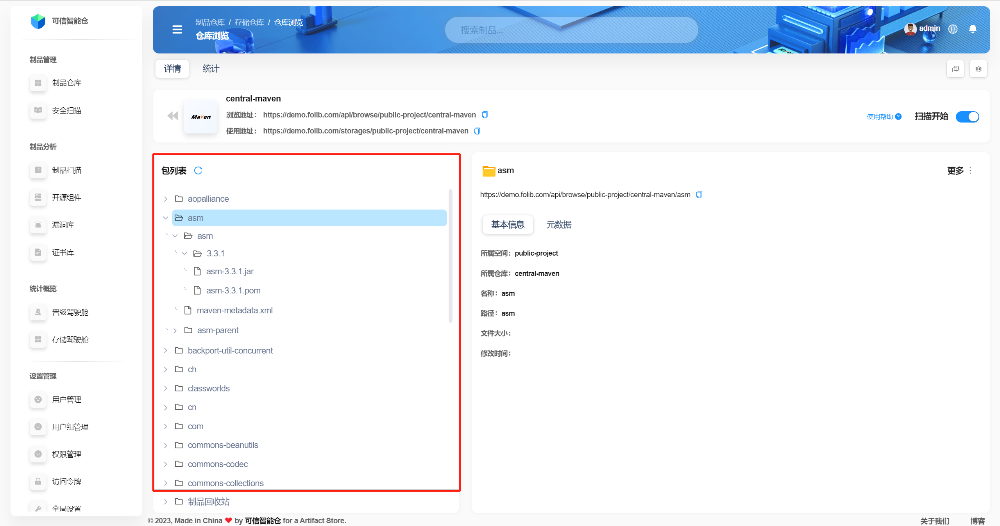
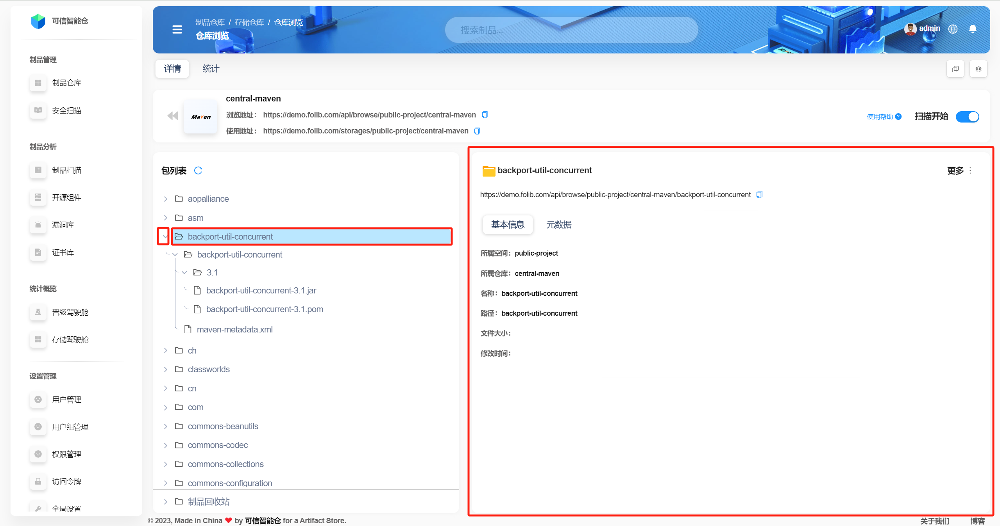
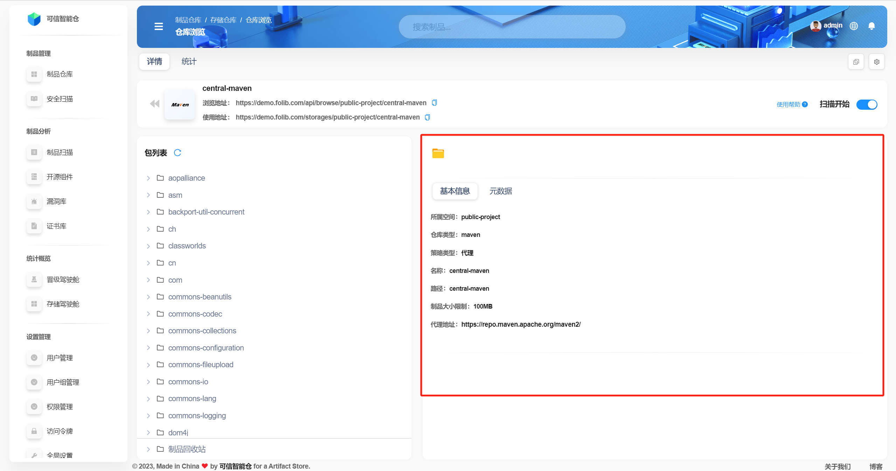
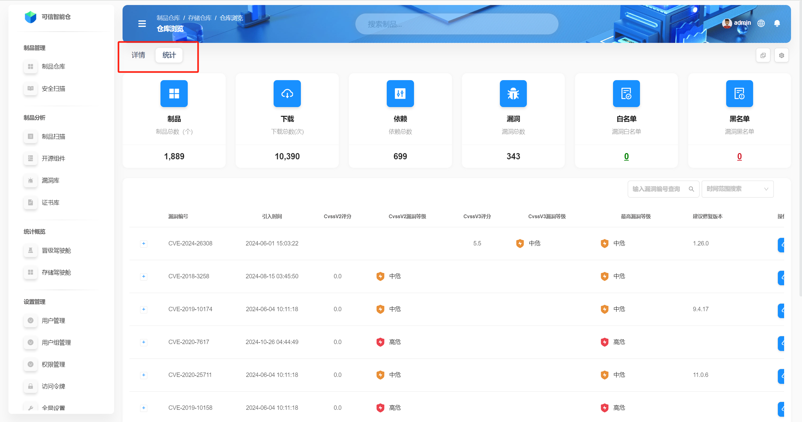
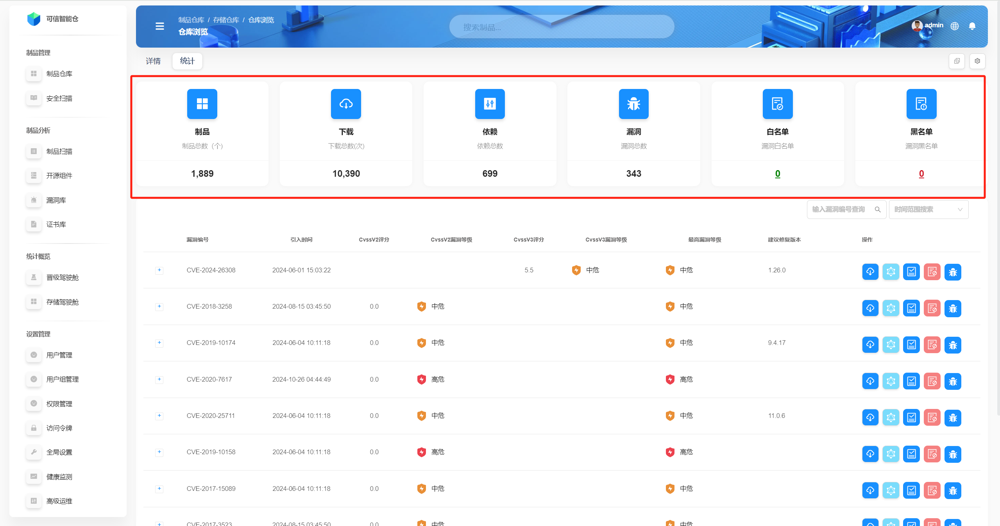
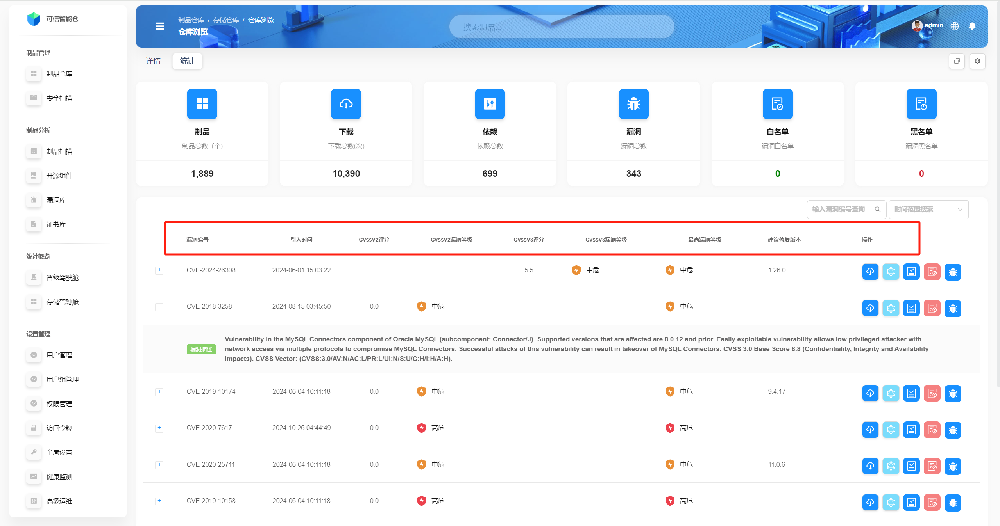
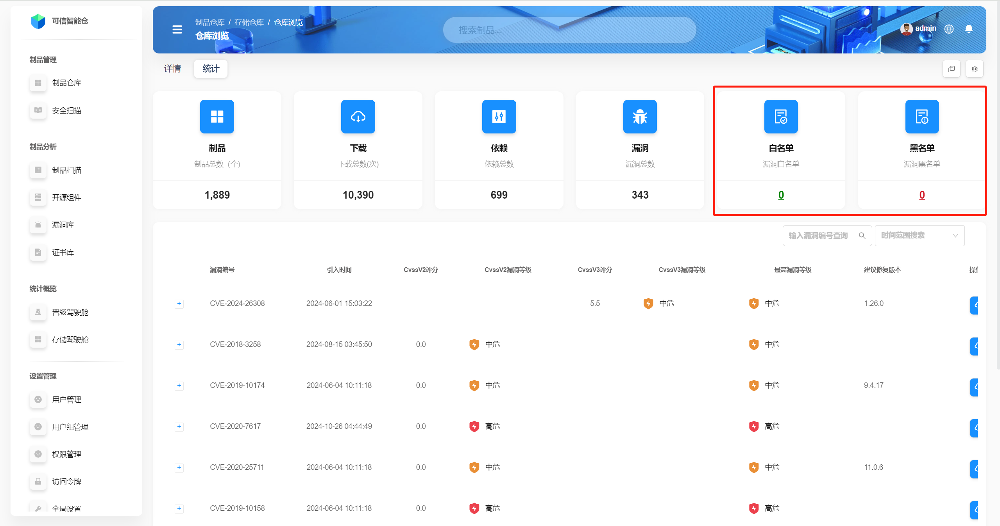
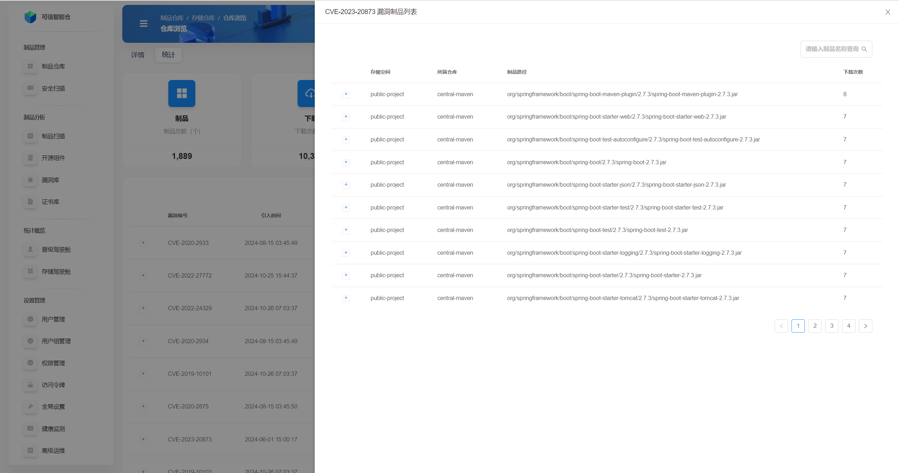

# Repository Overview

An **artifact repository** is a platform for centrally storing and managing artifacts produced during software development: source code, compiled binaries, dependency libraries, configuration files, documentation, etc. Its main purpose is to provide unified storage and version control so teams can share, retrieve, and manage artifacts easily.

This UI explains the **storage space internal view** for repositories, plus the **Repository Details** and **Repository Statistics** pages.

---

## Interface Guide

In the **internal view of a storage space**, all repositories under that space are listed on the right. Click a **repository** card to open its **Details** page.

💡 **Explanation of elements in a repository card (inside a space):**  

| Element | Explanation |
|---|---|
| **Repository usage URL** | The URL clients/tools use to consume the repository. See **Usage Instructions** on the **Repository Details** page for specifics. |
| **Visibility scope** | With the public icon, the repo is **publicly visible**: everyone can see and pull. Without it, the repo is **space‑member visible**: only members of the space can see and pull. You can change this under **Repository Settings → Permissions**. |
| **Repository policy** | **Local** — private on‑prem storage; typically for first/second‑party packages. **Proxy** — proxies third‑party sources (e.g., `aliyun`, `qinghua`) or internal repos across network segments. **Composite (virtual)** — aggregates multiple same‑language/related repos, defines order, and exposes a single external endpoint. |
| **Version policy** | **release** — only Release versions (production). **snapshot** — only Snapshots (development, frequent updates). **mixed** — both Release and Snapshot; common for proxy/virtual repos. |

---

## Repository Details

By default, the **Details** tab is shown.

### Browse URL
This is the URL for **browsing the repository directory**. Click the link or paste it into your browser. You can also click the **repository name** (e.g., `generic`) at the top to open the directory.

The **repository directory** and the **package list** on the Details page show the same folders/files. Click a file to download it.

| Browse view | Package list |
|---|---|
|  |  |

### Usage URL
This is the URL to configure in build tools/clients. Click **Usage Instructions** on the right; the content depends on repo type (e.g., Maven vs. HuggingFace).

| Sample instructions | Another example |
|---|---|
|  |  |

### Package List
Shows the folders and files in the repository.

- Clicking the **main area** of a row shows the **basic info and metadata** card on the right.  
- Clicking the **“>”** icon at a folder expands its children.

### Basic Information
When entering from the external view, the **basic information** card for the repository is shown by default (right side).

**Common fields (for all three repo types):**

| Field | Description |
|---|---|
| **Space** | The storage space the repository belongs to, used to organize and isolate resources. |
| **Repository type** | For example: Maven, Docker, npm, etc. |
| **Policy type** | Local / Proxy / Composite. |
| **Name** | Repository identifier. |
| **Path** | Location in the package list; at root equals the repo name. |
| **Artifact size limit** | Maximum allowed size for a single file. |

**Proxy‑only fields:**

| Field | Description |
|---|---|
| **Proxy address** | Upstream endpoint used to forward requests and fetch resources. In internal networks, configure a proxy server to indirectly access the upstream if external access is blocked. |

**Composite‑only fields:**

| Field | Description |
|---|---|
| **Composite members** | Child repositories included in the composite (local, proxy, or other composites). |

### Metadata
**Repositories** and **non‑artifact files** (e.g., *.xml*) have **no metadata**.  
**Folders** and **artifact files** (e.g., *.jar*, *.war*) **do** have metadata.  
For details, see *Artifact File Management — Overview* (`/help/docs/warefile/warefile-outline.html`).

### Artifact Recycle Bin
Select a file → **More** (top‑right) → **Delete** → confirm. Deleted items go to the **artifact recycle bin**; access it at the bottom of the **package list** to restore items.

### View Distribution/Promotion Events
Click the **square** icon (top‑right) to open the **repository event log**. Details: *Operations — Distribution/Promotion Records* (`/help/docs/warehouse/warehouse-operation.html`).

### Repository Settings
Click the **settings** icon (top‑right) to open the **repository settings**. Details: *Operations — Repository Settings* (`/help/docs/warehouse/warehouse-operation.html`).

### Scan Shortcut
Toggle **Enable Scan** (top‑right) to turn security scanning on or off.

---

## Repository Statistics

Click **Statistics** to open the statistics view.

### Statistical Metrics
The following example shows scan results for a specific repository.

| Metric | Description |
|---|---|
| **Total artifacts** | Number of artifacts under the current package list. |
| **Downloads** | Total download count of artifacts under the list. |
| **Total dependencies** | Total number of dependencies across artifacts. |
| **Vulnerabilities** | Number of vulnerabilities detected in artifacts under the list. |
| **Whitelist count** | Vulnerabilities added to the allowlist. |
| **Blacklist count** | Vulnerabilities added to the denylist. |

### Vulnerability Data

| Field | Description |
|---|---|
| **Vulnerability ID** | Unique ID/number. |
| **Introduced at** | Time the vulnerability was introduced. |
| **CVSS v2 score** | Severity per CVSS v2. |
| **CVSS v2 level** | Level per CVSS v2 (e.g., Low/Medium/High). |
| **CVSS v3 score** | Severity per CVSS v3. |
| **CVSS v3 level** | Level per CVSS v3. |
| **Max level** | Highest level among related vulnerabilities. |
| **Suggested fix version** | Recommended version to upgrade to. |
| **Actions** | See below. |

### View Whitelist/Blacklist
Click the **Whitelist**/**Blacklist** cards to view the corresponding lists.

### View Vulnerability Description
Click the **“+”** to expand and view a vulnerability’s description.

### Vulnerability Search
Search by **vulnerability ID** and by **time range**.

### Vulnerability Operations
Five actions are available (left to right): **Download**, **Graph**, **Add to Whitelist**, **Add to Blacklist**, **View Affected Artifacts**.

- **Download** — export an Excel of the vulnerability impact scope.  
  
- **Graph** — visualize the impact scope.  
  
- **Add to Whitelist/Blacklist** — quick actions.  
  
- **View Affected Artifacts** — open the list of impacted artifacts.  
  
