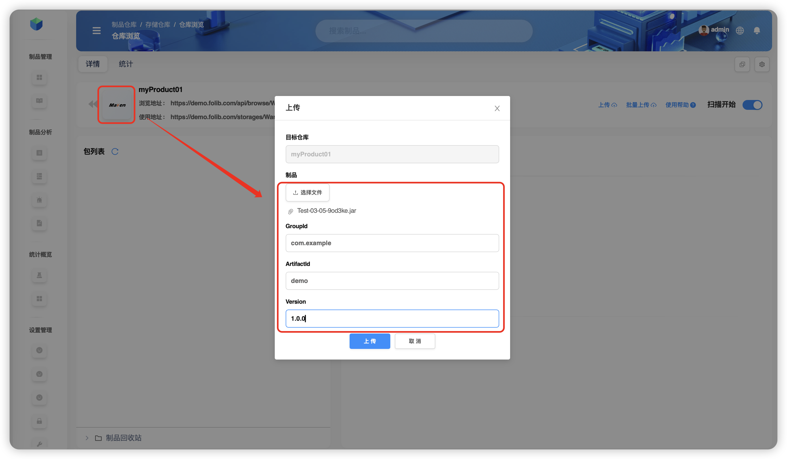

# Artifact operations

In a repository you can browse artifact lists and metadata, search, preview, upload, delete, copy, move, and also **distribute** and **promote** artifacts.

All examples below use storage **`WareFiles`** and repository **`myProduct`**.

## Navigate to the repository

**Flat view**  

**Tree view**  

---

## Uploading artifacts

> ⚠️ **Limitation:** repositories with **Proxy** or **Virtual (Combined)** strategy **do not support** uploads.

### Single upload
For a **Maven** repo click **Upload**. For non-standard packages specify `GroupID`, `ArtifactID`, and `Version`.  

### Batch upload
> ✅ Supported: **Gradle, SBT, Maven, Ivy, yarn, npm, raw, php, pub, debian, cargo**  
> 💡 Multi-select: hold **Cmd** (macOS) or **Ctrl** (Windows).

Example for a **raw** repo:  

### Upload archive
> 💡 After upload the archive is **automatically unpacked** to the target directory.

---

## Search
See the “🔍 Artifact file search” section.

---

## Preview

You can preview file contents (e.g., `pom.xml`, `*.xml`) and **only the directory tree** for archives (`*.jar`).  
Select `04/Extra.jar` → **More** → **Preview**.  

> ℹ️ Package files (e.g., `jar`) expose **directory only**; text files (`pom`, `xml`) show contents.

---

## Copying artifacts

> ❗️Copy **within the current repo** or to **another repo of the same type** only.

**Folder:** select `04` → **More** → **Copy** → `WareFiles / myProduct / Test-03/03/04`.  

**File:** select `04/Extra.jar` → **More** → **Copy** → `WareFiles / myProduct / Test-03/03`.  

---

## Moving artifacts

> ❗️Move **within the current repo** or to **another repo of the same type** only.

**Folder:** select `03` → **More** → **Move** → `WareFiles / myProduct / Test-03/05/03`.  

**File:** select `03/Extra.jar` → **More** → **Move** → `WareFiles / myProduct / Test-03/05`.  

---

## Deleting artifacts

**Folder:**  

**File:**  

---

## Distribution (Distribute)

Deliver artifacts to internal or external nodes. Review results in **Event records** (section **Distribute/Promote**).

### By folder

**To an internal node:** select `myProduct / Test-03 / 05` → **More** → **Distribute** → choose `aaa / generic`.  

**To an external node:** first add the node in *Global settings → Distribution nodes*, then pick it during distribution.  

### By file

**To an internal node:** select `myProduct / Test-03/05 / Test-03-05-9od3ke.jar` → **More** → **Distribute** → `aaa / generic`.  

**To an external node:**  

---

## Downloading

**Folder:** select `myProduct / Test-03 / 05` → **More** → **Download`. The entire folder is downloaded to the browser’s default download location.  

**File:** select `myProduct / Test-03/05 / Test-03-05-9od3ke.jar` → **More** → **Download**.  

---

## Metadata

### Add
> 💡 Customizable `KEY`; supported value types: **string**, **number**, **text**, **Markdown**, **JSON**.

Select `Test-03/05/Test-03-05-9od3ke.jar` → **Metadata** tab → **+**.  

**Recursive for folders:** when adding metadata to a **folder**, enable *Recursive* to apply the key to all nested files.  

### Edit
> ⚠️ You can’t toggle “custom/non-custom” on edit.  
> 💡 You can change the **value type** only for **custom** keys.

Select the file → **Metadata** → the entry → **Edit**.  

### Delete
Select the file → **Metadata** → the entry → **Delete**.  

**Recursive delete (folder):** removes the key from all nested files.  

