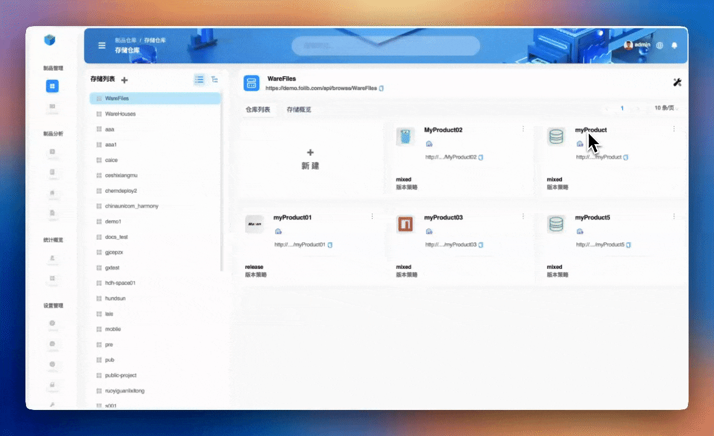
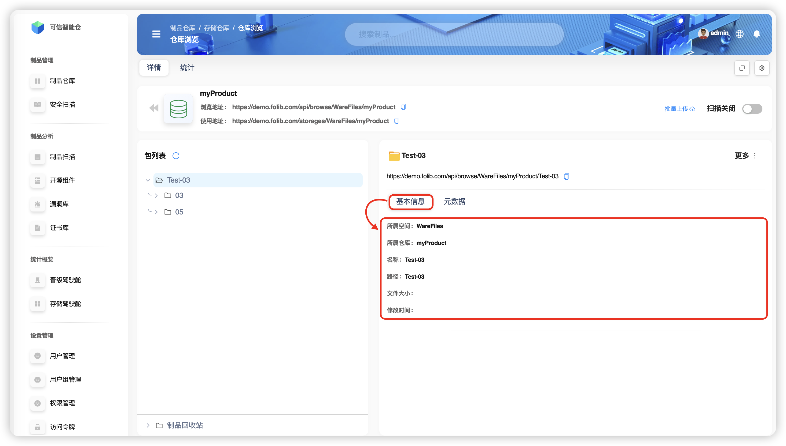
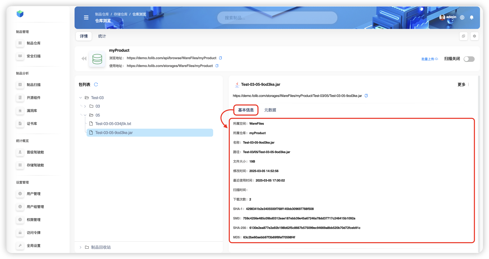
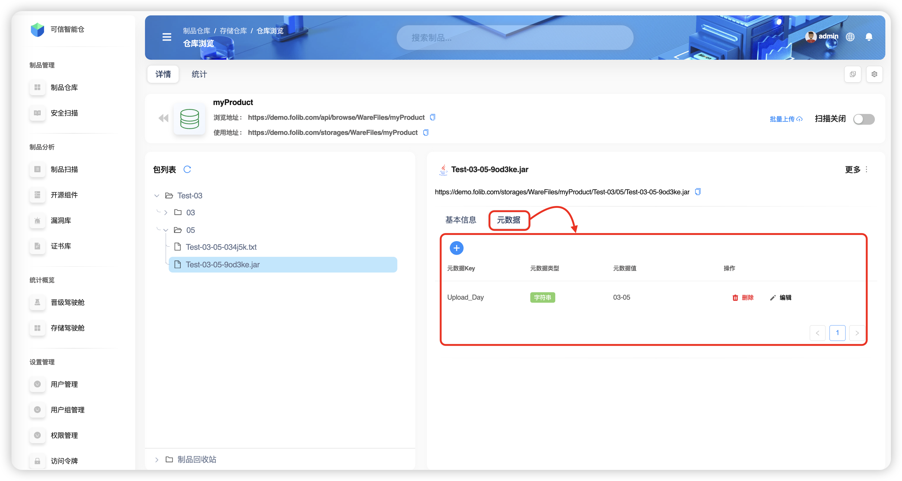

# Обзор артефактов

**Артефакт** — это результат процесса сборки. Это могут быть скомпилированные двоичные файлы, библиотеки, образы контейнеров, конфигурационные файлы, документация и др. **Артефакты** являются частью процесса поставки ПО и используются на разных этапах — разработка, тестирование, развертывание.

## Описание интерфейса

Пример: репозиторий `myProduct` в пространстве хранения `WareFiles`.

- В **левой** части панели находится **список пакетов** — файловая структура артефактов в репозитории. Нажмите на файл или папку, и в **правой** части панели появится подробная информация.

Внизу **списка пакетов** находится **Корзина артефактов** — сюда попадают **удалённые** файлы и папки артефактов.

- **Правая** часть панели показывает два блока сведений о выбранной папке или файле артефакта — **Базовая информация** и **Метаданные**.

### Базовая информация

**Для папок** отображаются следующие поля:

| Термин | Пояснение |
|:--:|:--:|
| **Принадлежит пространству** | Имя пространства хранения |
| **Принадлежит репозиторию** | Имя репозитория артефактов |
| **Имя** | Имя файла/папки артефакта |
| **Путь** | Путь в списке пакетов |
| **Размер файла** | Размер файла артефакта |
| **Время изменения** | Время последнего изменения |

**Для файлов** дополнительно отображаются следующие поля (совпадающие с папкой опущены):  

| Термин | Пояснение |
|:--:|:--:|
| **Время последнего использования** | Время последнего копирования, перемещения, скачивания или распространения |
| **Время сканирования** | Время последнего сканирования файла |
| **Количество скачиваний** | Сколько раз файл скачивали из репозитория |
| **SHA-1** | Криптографическая хэш‑функция для получения уникального дайджеста данных (*digest*) |
| **SM3** | Национальный стандарт хэш‑функции |
| **SHA‑256** | Хэш‑функция семейства SHA‑2 для получения уникального дайджеста данных |
| **MD5** | Широко используемая хэш‑функция |

### Метаданные

| Термин | Пояснение |
|:--:|:--:|
| **Ключ метаданных** | Ключ (KEY) метаданных |
| **Тип метаданных** | Тип значения для ключа; поддерживается пять типов |
| **Значение метаданных** | Значение для ключа; допустимые значения зависят от типа |
| **Действия** | Удаление или редактирование |

### Просмотр файлов в браузере

Возьмём репозиторий `myProduct` в качестве примера. На странице **репозитория** нажмите **адрес для просмотра** (или скопируйте его в браузер), чтобы попасть на **страницу просмотра файлов**.

Если выбран **файл**, клик по адресу файла в **правой панели** запустит скачивание.

Если выбрана **папка**, клик по её адресу в **правой панели** откроет **страницу просмотра файлов** этой папки.

