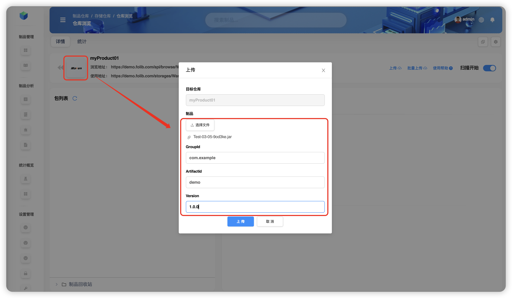

# Операции с артефактами

В репозитории можно просматривать списки артефактов и их метаданные, искать, предварительно просматривать, загружать, удалять, копировать, перемещать, а также **распространять (distribute)** и **повышать (promote)** артефакты.

Ниже все примеры показаны для хранилища **`WareFiles`** и репозитория **`myProduct`**.

## Навигация к репозиторию

**Плоский вид**  

**Деревовидный вид**  

---

## Загрузка артефактов

> ⚠️ **Ограничение:** репозитории со стратегией **Прокси** и **Комбинированный (виртуальный)** **не поддерживают** загрузку.

### Обычная загрузка
Для репозитория типа **Maven** нажмите **Загрузить**. Для нестандартных пакетов укажите `GroupID`, `ArtifactID`, `Version`.  

### Пакетная загрузка
> ✅ Поддержка: **Gradle, SBT, Maven, Ivy, yarn, npm, raw, php, pub, debian, cargo**  
> 💡 Мультивыбор: удерживайте **Cmd** (macOS) или **Ctrl** (Windows).

Пример для репозитория типа **raw**:  

### Загрузка архива
> 💡 После загрузки архив **автоматически распакуется** в целевой каталог.

---

## Поиск артефактов
Смотрите раздел «🔍 Поиск по файлам артефактов».

---

## Предпросмотр артефактов

Можно просматривать содержимое файлов (например, `pom.xml`, `*.xml`) и **только структуру** для архивов (`*.jar`).  
Выберите `04/Extra.jar` → **Ещё** → **Предпросмотр**.  

> ℹ️ Файлы-*пакеты* (например, `jar`) показывают **только каталог**, содержимое недоступно; текстовые файлы (`pom`, `xml`) — содержимое видно.

---

## Копирование артефактов

> ❗️Копировать можно **внутри текущего репозитория** или **в репозиторий того же типа**.

**Папка:** выберите `04` → **Ещё** → **Копировать** → укажите `WareFiles / myProduct / Test-03/03/04`.  

**Файл:** выберите `04/Extra.jar` → **Ещё** → **Копировать** → `WareFiles / myProduct / Test-03/03`.  

---

## Перемещение артефактов

> ❗️Перемещать можно **внутри текущего** или **в репозиторий того же типа**.

**Папка:** выберите `03` → **Ещё** → **Переместить** → `WareFiles / myProduct / Test-03/05/03`.  

**Файл:** выберите `03/Extra.jar` → **Ещё** → **Переместить** → `WareFiles / myProduct / Test-03/05`.  

---

## Удаление артефактов

**Папка:**  

**Файл:**  

---

## Распространение (Distribute)

Процесс доставки артефактов во внутренние или внешние узлы. Все события см. в **записях событий** (раздел «**Distribute/Promote**»).

### По папке

**Во внутренний узел:** выберите `myProduct / Test-03 / 05` → **Ещё** → **Разослать** → выберите `aaa / generic`.  

**Во внешний узел:** предварительно добавьте узел во *глобальных настройках → Конфигурация узлов для рассылки*, затем выберите его при рассылке.  

### По файлу

**Во внутренний узел:** выберите `myProduct / Test-03/05 / Test-03-05-9od3ke.jar` → **Ещё** → **Разослать** → `aaa / generic`.  

**Во внешний узел:**  

---

## Скачивание

**Папка:** выберите `myProduct / Test-03 / 05` → **Ещё** → **Скачать**. Скачается архив всей папки в стандартную папку загрузок браузера.  

**Файл:** выберите `myProduct / Test-03/05 / Test-03-05-9od3ke.jar` → **Ещё** → **Скачать**.  

---

## Метаданные

### Добавление
> 💡 `KEY` — произвольный; поддерживаемые типы значений: **строка**, **число**, **текст**, **Markdown**, **JSON**.

Выберите `Test-03/05/Test-03-05-9od3ke.jar` → вкладка **Метаданные** → **+**.  

**Рекурсивно для папки:** при назначении метаданных **папке** можно включить «Рекурсивно», чтобы применить ключ ко всем вложенным файлам.  

### Редактирование
> ⚠️ Переключать «кастомный/некастомный» нельзя при редактировании.  
> 💡 Менять **тип значения** можно только для **кастомных** ключей.

Выберите файл → **Метаданные** → нужная запись → **Редактировать**.  

### Удаление
Выберите файл → **Метаданные** → нужная запись → **Удалить**.  

**Рекурсивное удаление (для папки):** снимет ключ у всех вложенных файлов.  

