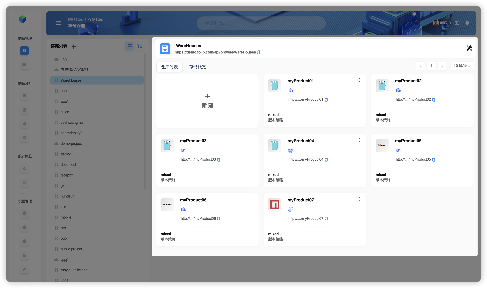
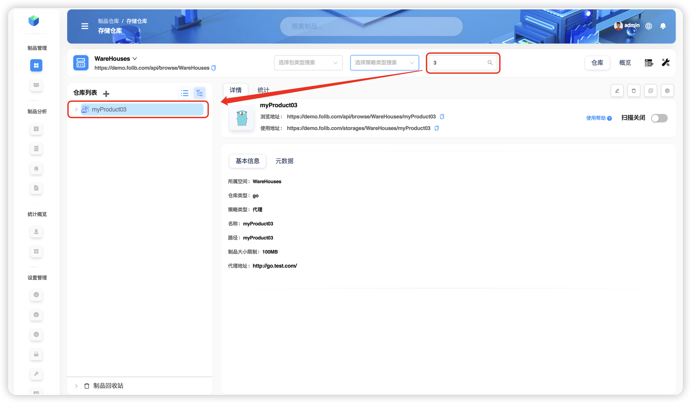
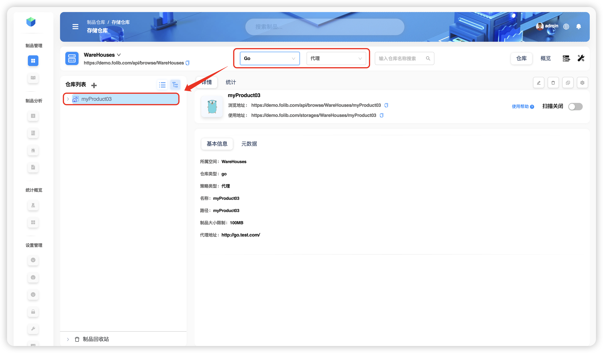

# Repository Search

This example demonstrates how to find the repository `myProduct01` within the storage space `WareHouse`. For context, the contents of the space are listed below.

**TIP**  
`WareHouse` includes:
- 4 `Go` repositories (`myProduct01` — Local, `myProduct02` — Local, `myProduct03` — Proxy, `myProduct04` — Virtual/Combined);
- 2 `Maven` repositories (`myProduct05` — Proxy, `myProduct06` — Local);
- 1 `Npm` repository (`myProduct07` — Proxy).

## Single‑dimension (simple) search

- Filter by **Type** = `Go` only  
  

- Filter by **Strategy** = **Proxy** only  
  

- Filter by **Name** only (supports partial/fuzzy match)  
  

## Multi‑dimension (combined) search

- **Type** = `Go` **and** **Strategy** = **Proxy**  
  
