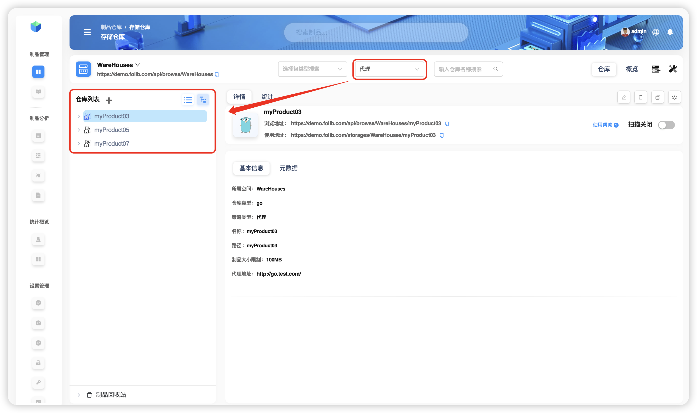

# Поиск по репозиториям

В этом примере ищем репозиторий `myProduct01` в пространстве хранения `WareHouse`. Для контекста состав пространства приведён ниже.

**TIP**  
Пространство `WareHouse` содержит:
- 4 репозитория типа `Go` (`myProduct01` — локальная, `myProduct02` — локальная, `myProduct03` — прокси, `myProduct04` — комбинированная);
- 2 репозитория типа `Maven` (`myProduct05` — прокси, `myProduct06` — локальная);
- 1 репозиторий типа `Npm` (`myProduct07` — прокси).

## Простой поиск по одному признаку

- Только признак **Тип** = `Go`  
  

- Только признак **Стратегия** = **Прокси**  
  

- Только признак **Название** (поддерживается частичный/нечёткий поиск)  
  

## Комбинированный поиск (несколько признаков)

- **Тип** = `Go` **и** **Стратегия** = **Прокси**  
  
