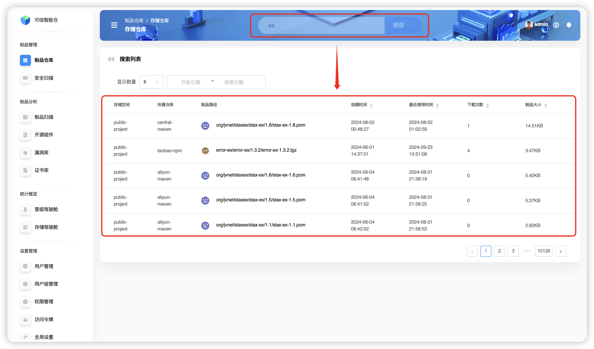
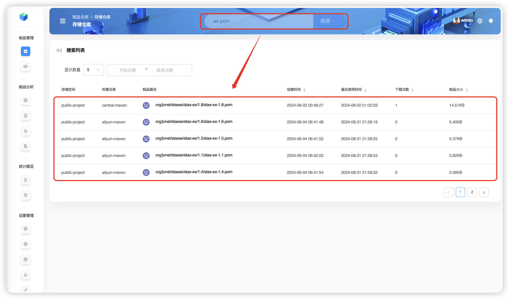
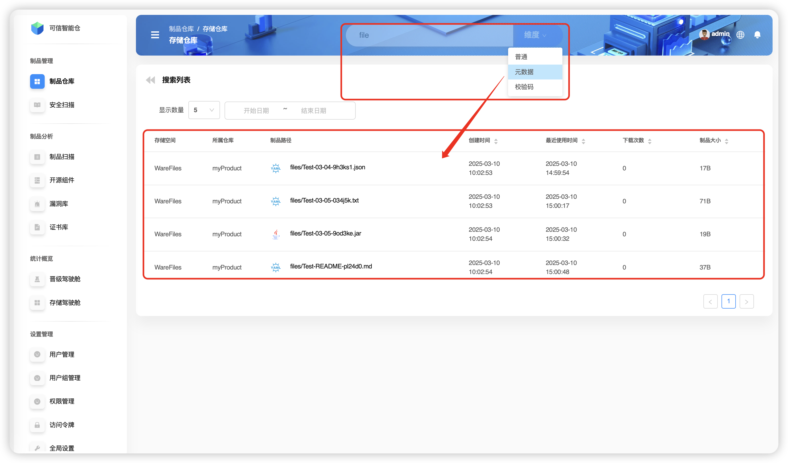
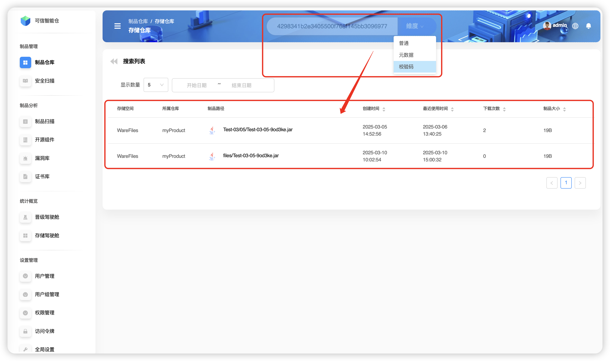
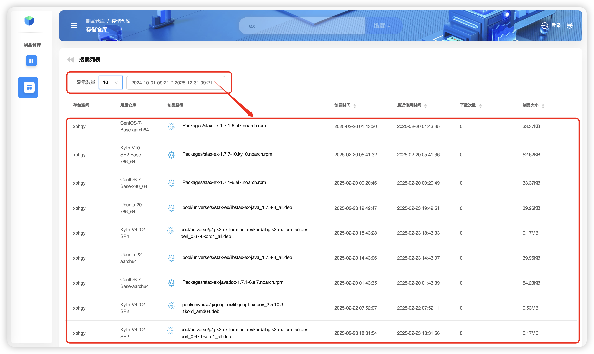

# Поиск файлов артефактов

`Folib` поддерживает поиск **по всему порталу** и **в пределах конкретного репозитория**. Эти режимы ищут по разным осям и имеют разные точки входа.

## Подсказки
- ⏳ Если **не выбран** конкретный репозиторий — выполняется **глобальный** поиск. Он может занять заметно больше времени.
- 💡 Если **выбран** репозиторий — поиск выполняется только в его пределах и работает быстрее.
- 🎯 Нажатие Enter после ввода запроса запускает поиск в режиме **Обычный** по умолчанию.

## Глобальный поиск

### Обычный 🔍 (поддерживает **нечёткий** и **учитывающий регистр** поиск)
Обычный поиск осуществляется по **имени пути артефакт‑файла**. Пример: один термин `ex`.

Обычный поиск поддерживает **несколько терминов**, разделённых пробелом. Пример: два термина `ex` и `pom`. В результат попадут файлы формата `pom`, чьи пути содержат `ex`.

### Метаданные 🔍 (поддерживает **нечёткий** и **учитывающий регистр** поиск)
Поиск по **метаданным** артефакта. Пример: термин `file`.

### Контрольная сумма 🔍
Поиск по **контрольным суммам** артефактов. Пример: `sha1: 4298341b2e3405500f768f145bb309697788f508` — поиск файла `Test-03-05-9od3ke.jar`.

## Локальный поиск

Рассмотрим поиск **внутри репозитория** `myProduct`. В пространстве хранения `warefiles` выберите репозиторий `myProduct` и введите запрос в верхней панели.

> В этом примере в `myProduct` существуют пути `Test-03/04` и `Test-03/05`.
> В `Test-03/04` находится `Extra.jar`.
> В `Test-03/05` находятся `Test-03-05-9od3ke.jar` и `Test-03-05-034j5k.txt`.

### Обычный 🔍 (поддерживает **нечёткий** и **учитывающий регистр** поиск)
Пример: нечёткий поиск `Ex` для нахождения `Extra.jar`.

> ❗️ **Учёт регистра:** при поиске по `ex` файл `Extra.jar` **не будет найден**.

### Метаданные 🔍 (поддерживает **нечёткий** и **учитывающий регистр** поиск)
Пример: нечёткий поиск по метаданным термином `file` для нахождения `Extra.jar`.

> ❗️ **Учёт регистра:** при поиске по `file` при несоответствии регистра запись может **не найтись**.

### Контрольная сумма 🔍
`Folib` поддерживает четыре типа контрольных сумм: `SHA-1`, `SM3`, `SHA-256` и `MD5`. Пример: `sha1: 4298341b2e3405500f768f145bb309697788f508` — поиск `Test-03-05-9od3ke.jar`.

## Дополнительные фильтры

При поиске можно дополнительно ограничить результаты по **количеству отображаемых записей** и по **диапазону дат (начало/конец)**.

