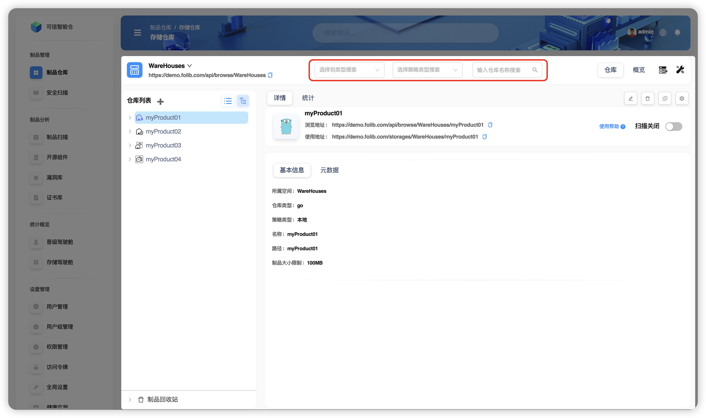
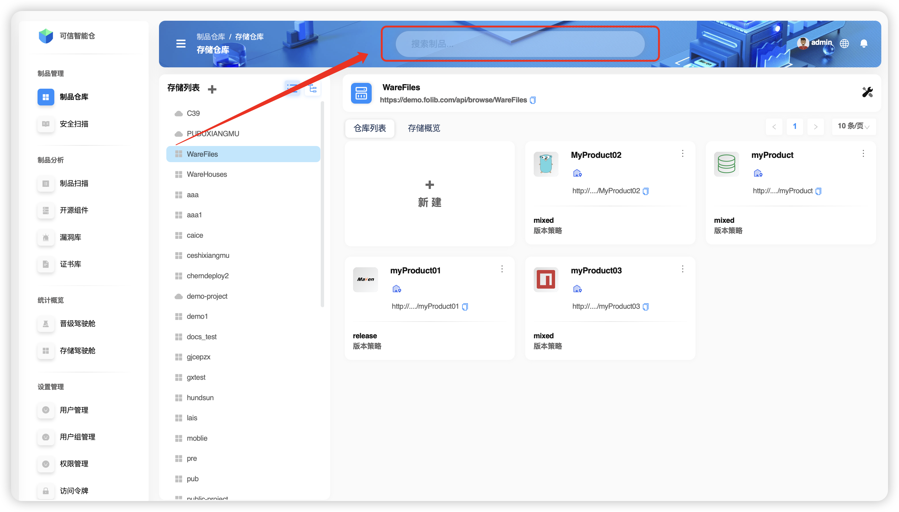

# Search Overview

`Folib` supports **Repository Search** and **Artifact Search**. These two modes differ in scope, filters, and entry points.

## Repository Search

Available **only in Tree View**. It runs within the selected **Storage Space** and lets you filter **repositories** by three dimensions (combinable):
- **Repository type** (e.g., Maven, Docker, npm, etc.)
- **Repository strategy** (local / proxy / virtual)
- **Repository name**

## Artifact Search

Use the search bar at the top of the screen. Three modes are supported: **Basic**, **Metadata**, and **Checksum**.

| Mode | What it searches | Global search | Local search |
|:--:|:--|:--:|:--:|
| **Basic** | Artifact file name | ✅ | ✅ |
| **Metadata** | Descriptive information attached to artifacts (metadata—“data about data”—helps you understand, manage, and use data) | ✅ | ✅ |
| **Checksum** | File hashes (SHA‑1, SHA‑256, MD5, etc.) used to verify data integrity and consistency | ✅ | ✅ |
