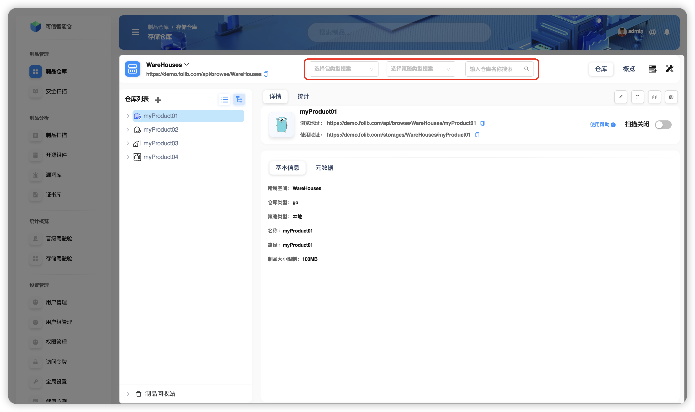
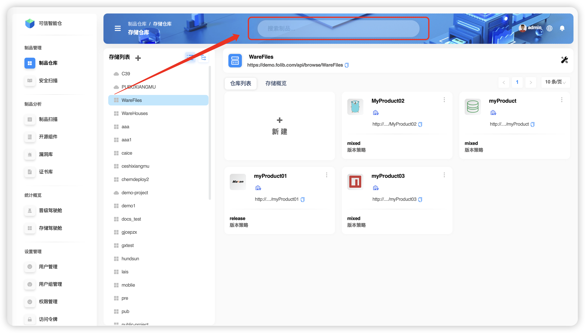

# Обзор поиска

`Folib` поддерживает **поиск по репозиториям** и **поиск по артефактам**. Это два разных режима с разными параметрами и точками входа.

## Поиск по репозиториям

Доступен **только в деревовидном представлении**. Выполняется для выбранного **хранилища (Storage Space)** и позволяет фильтровать **репозитории** по трём осям (можно комбинировать):
- **Тип репозитория** (например, Maven, Docker, npm и т. д.)
- **Стратегия репозитория** (локальная / прокси / комбинированная)
- **Название репозитория**

## Поиск по артефактам

Используйте строку поиска в верхней части интерфейса. Поддерживаются три режима: **Обычный**, **Метаданные**, **Контрольная сумма**.

| Режим | Что ищем | Глобальный поиск | Локальный поиск |
|:--:|:--|:--:|:--:|
| **Обычный** | По имени файла артефакта | ✅ | ✅ |
| **Метаданные** | По описательным данным артефакта (метаданные — «данные о данных», помогают понимать, управлять и использовать данные) | ✅ | ✅ |
| **Контрольная сумма** | По хешам файлов (SHA‑1, SHA‑256, MD5 и др.) — используются для проверки целостности и一致ности | ✅ | ✅ |
