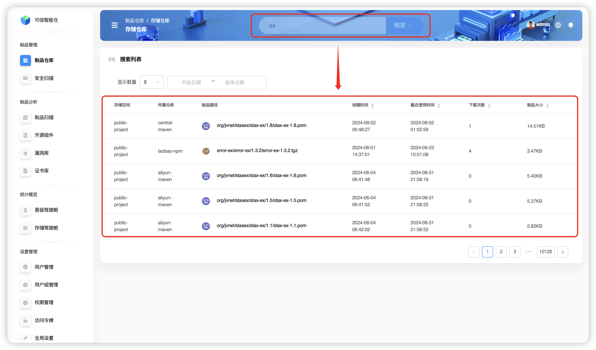
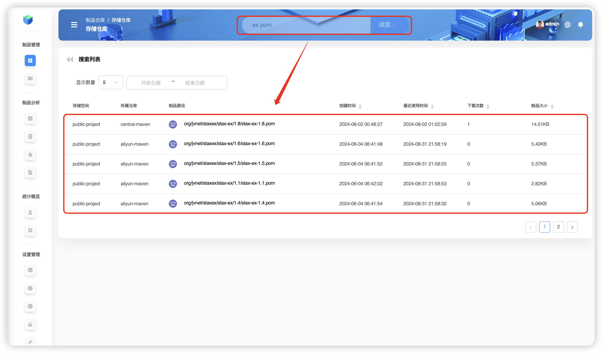
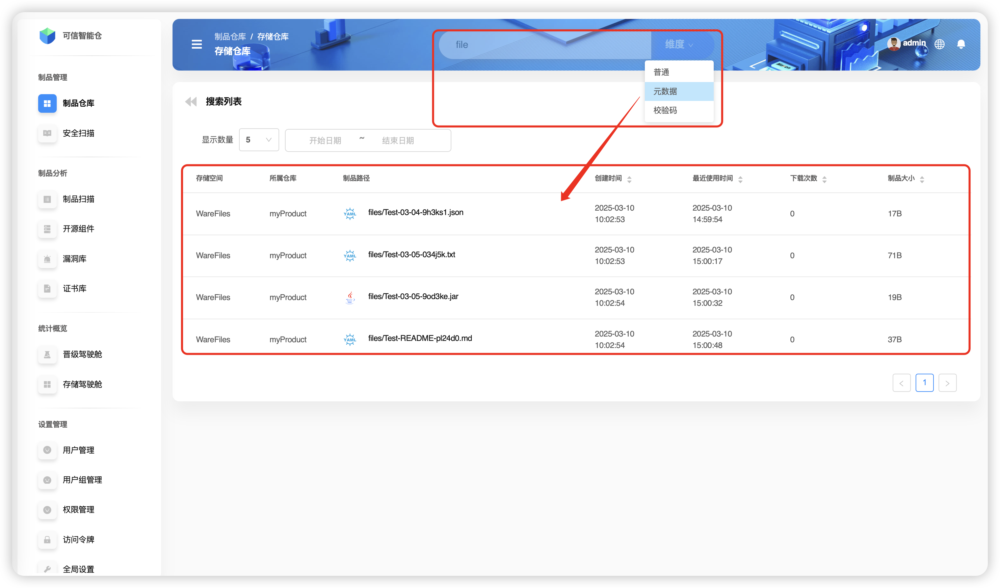
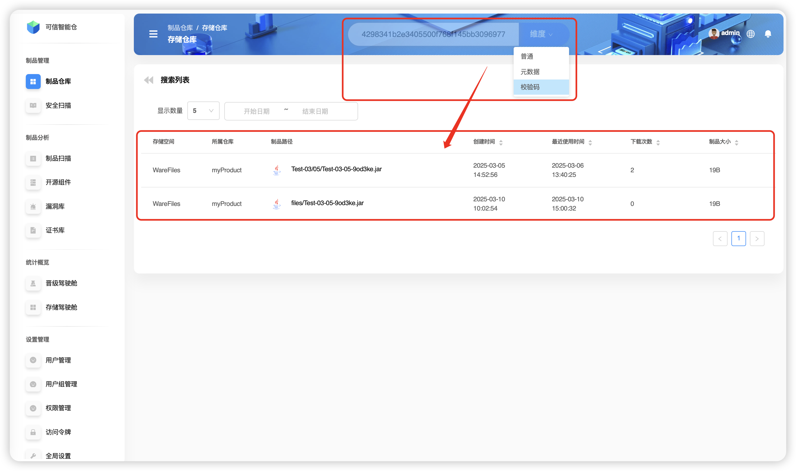
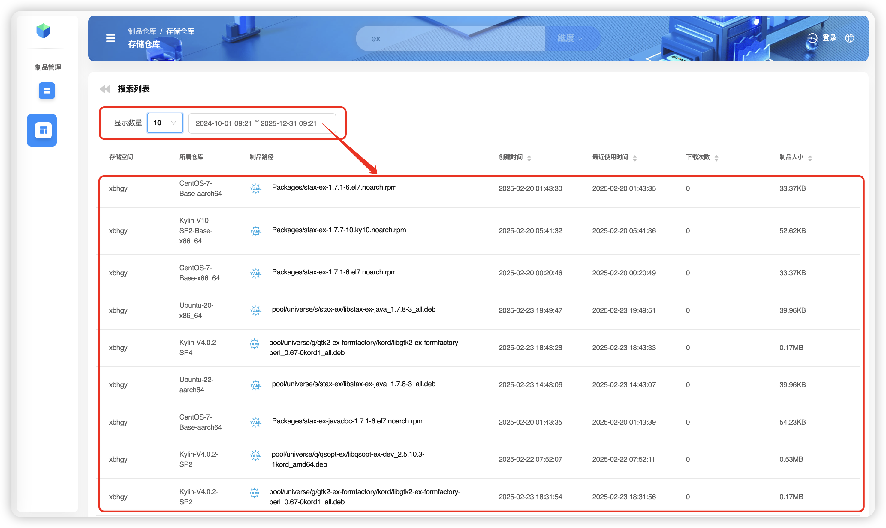

# Artifact File Search

`Folib` supports searching **globally** (across all repositories) and **locally** (within a selected repository). These modes differ in scope and entry points.

## Tips
- ⏳ If **no repository** is selected, a **global** search runs. It may take considerably more time.
- 💡 If a **repository is selected**, the search is limited to it and is faster.
- 🎯 Pressing Enter after typing a query triggers the **Common** mode by default.

## Global Search

### Common 🔍 (supports **fuzzy** and **case‑sensitive** search)
Common searches by the **artifact file path/name**. Example: a single term `ex`.

Common also supports **multiple terms** separated by spaces. Example: two terms `ex` and `pom`. Results include `pom` files whose paths contain `ex`.

### Metadata 🔍 (supports **fuzzy** and **case‑sensitive** search)
Search by **artifact metadata**. Example term: `file`.

### Checksum 🔍
Search by **artifact checksums**. Example: `sha1: 4298341b2e3405500f768f145bb309697788f508` to locate `Test-03-05-9od3ke.jar`.

## Local Search

Example: search **inside** the `myProduct` repository. In storage space `warefiles`, select the `myProduct` repository and enter your query in the top search bar.

> In this example, `myProduct` contains the paths `Test-03/04` and `Test-03/05`.
> `Test-03/04` contains `Extra.jar`.
> `Test-03/05` contains `Test-03-05-9od3ke.jar` and `Test-03-05-034j5k.txt`.

### Common 🔍 (supports **fuzzy** and **case‑sensitive** search)
Example: fuzzy search `Ex` to find `Extra.jar`.

> ❗️ **Case sensitivity:** a search for `ex` will **not** find `Extra.jar`.

### Metadata 🔍 (supports **fuzzy** and **case‑sensitive** search)
Example: fuzzy metadata search with the term `file` to find `Extra.jar`.

> ❗️ **Case sensitivity:** using `file` with the wrong case may **fail** to match the entry.

### Checksum 🔍
`Folib` supports four checksum types: `SHA-1`, `SM3`, `SHA-256`, and `MD5`. Example: `sha1: 4298341b2e3405500f768f145bb309697788f508` to find `Test-03-05-9od3ke.jar`.

## Extra Filters

You can further filter results by **display count** and by **start/end date** when searching.

