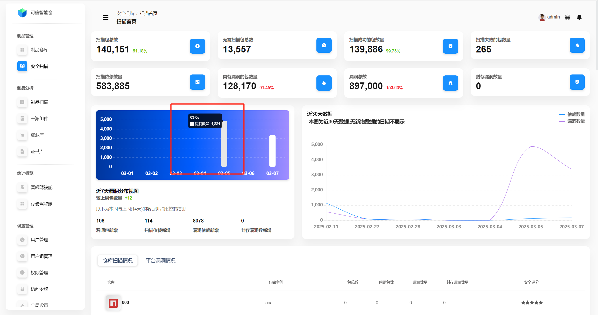
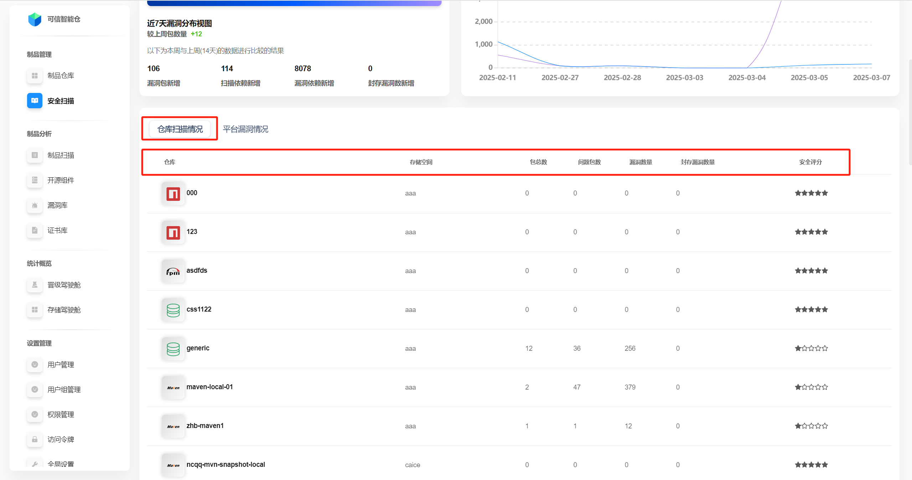
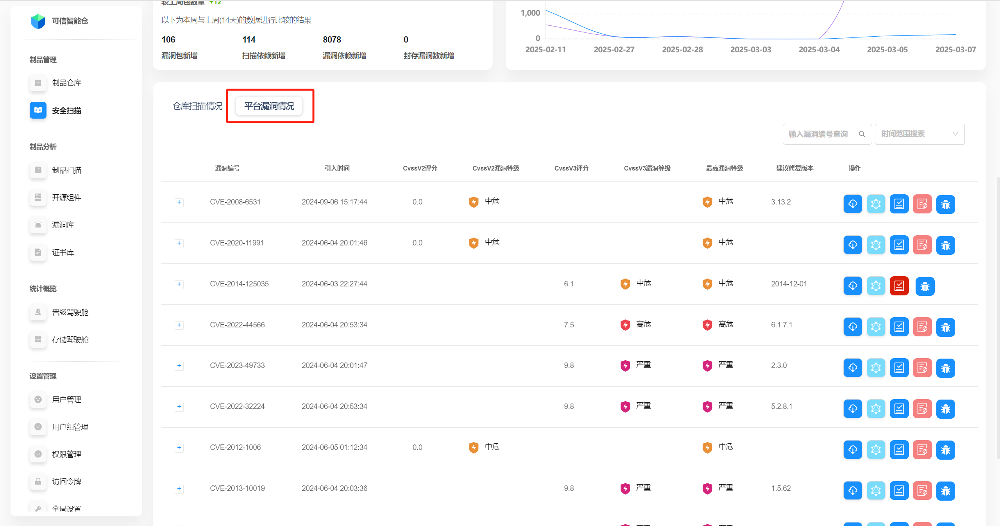

# Scanning Overview

Folib’s security scanning relies on the global NVD and the domestic CNVD vulnerability databases as public data sources. Using package identification, the platform recognizes each dependency and performs CVE analysis. A graph database processes dependency relations in real time, determines impact scope, tracks issues, and raises alerts. This supports cloud‑native transformation and rapid iteration.

## Interface Overview

## Platform‑wide Scan Statistics

The statistics cover the entire platform: direct numeric KPIs, a 7‑day vulnerability distribution chart, and 30‑day trends for dependency and vulnerability counts.

| Term | Description |
| --- | --- |
| Total scanned packages | Number of packages with security scanning enabled. The percentage shows its share of all packages. |
| Total packages not requiring scan | Number of packages with scanning disabled. |
| Successfully scanned packages | Packages that have scanning enabled and completed successfully. Percentage shows share among scanned packages. |
| Failed scans | Packages that have scanning enabled but whose scans did not complete successfully. |
| Total dependencies | All discovered dependencies (including transitive) after scanning. Usually greater than package count. |
| Packages with vulnerabilities | Packages (with scanning enabled) where vulnerabilities were found. Percentage shows share among scanned packages. |
| Total vulnerabilities | All vulnerabilities found across scanned packages. The same vulnerability in different packages/repositories is counted separately. Percentage shows share among dependencies. |
| Archived vulnerabilities | Vulnerabilities marked as ignorable. |

**7‑day distribution:** hover over the bars to see exact counts.

## Repository Scan Status

The lower part of the scanning home page shows **repository scan status** — one row per repository.

**Click** a row to open the **repository scan details** page (see “Security Scanning — Repository Scan Details”).

| Term | Description |
| --- | --- |
| Storage space | Which storage space the repository belongs to. |
| Total packages | Number of packages in the repository. |
| Problem packages | Number of packages with vulnerabilities. |
| Vulnerabilities | Total vulnerabilities in the repository. The same CVE found in different packages is counted separately. |
| Archived vulnerabilities | Number of vulnerabilities marked as ignorable. |
| Security score | Score based on the ratio of problem packages to total packages. Five black stars indicate the highest safety score. |

## Platform Vulnerabilities

Click **“Platform Vulnerabilities”** to switch to the global list of all vulnerabilities.

The elements and operations on this page are similar to **“Repository Statistics”** in the guide “Repository Management — Repository Overview”.

| Field | Description |
| --- | --- |
| Vulnerability ID | Unique identifier (e.g., CVE) used to distinguish vulnerabilities. |
| Introduced at | When the vulnerability was introduced or detected. |
| CVSS v2 score | Severity score per CVSS v2. |
| CVSS v2 severity | Severity class per CVSS v2 (low/medium/high, etc.). |
| CVSS v3 score | Severity score per CVSS v3. |
| CVSS v3 severity | Severity class per CVSS v3. |
| Highest severity | The highest severity among related scores — for quick risk assessment. |
| Recommended fixed version | Version to upgrade to in order to remediate the vulnerability. |
| Actions | Available operations for the vulnerability (see “Data Operations”). |
