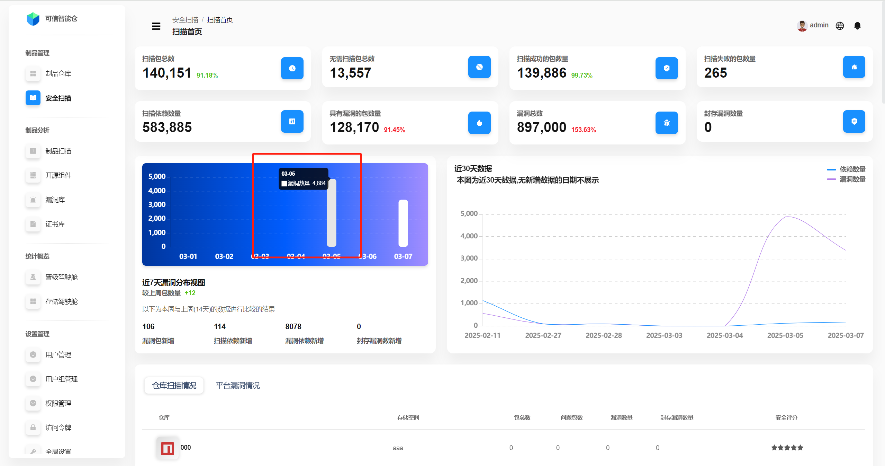
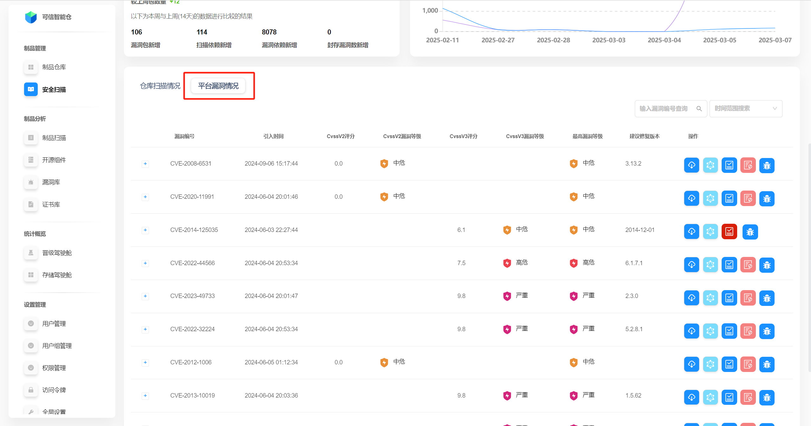

# Обзор сканирования

Функция безопасного сканирования Folib использует глобальную открытую базу уязвимостей NVD и китайскую базу CNVD как общедоступные источники. Платформа с помощью идентификации зависимостей выполняет распознавание каждого пакета и анализ CVE, а графовая БД в реальном времени обрабатывает связи зависимостей, определяет зону воздействия, отслеживает и оповещает. Это обеспечивает поддержку облачно‑нативной трансформации и быстрых итераций в компаниях.

## Описание интерфейса

## Общая статистика сканирования

Статистика охватывает всю платформу: прямые числовые показатели, диаграмму распределения уязвимостей за последние 7 дней и тренды количества зависимостей и уязвимостей за последние 30 дней.

| Термин | Пояснение |
| --- | --- |
| Сумма сканируемых пакетов | Общее число пакетов на платформе с включённым безопасным сканированием. Рядом показывается доля от общего числа пакетов. |
| Сумма не требующих сканирования | Общее число пакетов с отключённым сканированием. |
| Количество успешных сканирований | Пакеты со включённым сканированием, успешно прошедшие проверку. Рядом — доля от всех сканируемых пакетов. |
| Количество неуспешных сканирований | Пакеты со включённым сканированием, у которых проверка не завершилась успешно. |
| Количество зависимостей | Все найденные зависимости (включая транзитивные) по итогам сканирования. Как правило, больше числа пакетов. |
| Количество проблемных пакетов | Пакеты со включённым сканированием, в которых обнаружены уязвимости. Рядом — доля от всех сканируемых пакетов. |
| Суммарное число уязвимостей | Все обнаруженные уязвимости во всех сканируемых пакетах. Одинаковые уязвимости в разных пакетах/репозиториях считаются отдельно. Рядом — доля от числа зависимостей. |
| Количество «законсервированных» уязвимостей | Число уязвимостей, помеченных как игнорируемые. |

**Распределение уязвимостей за 7 дней:** наведите курсор на столбцы, чтобы увидеть точные значения.

## Статус сканирования по репозиториям

В нижней части главной страницы сканирования отображается **статус сканирования репозиториев** — одна строка на репозиторий.

**Кликните** по строке нужного репозитория, чтобы перейти на страницу **деталей сканирования** этого репозитория (см. «Безопасное сканирование — детали сканирования репозитория»).

| Термин | Пояснение |
| --- | --- |
| Пространство хранения | К какому пространству относится репозиторий. |
| Всего пакетов | Количество пакетов в репозитории. |
| Проблемных пакетов | Число пакетов с уязвимостями. |
| Уязвимостей | Сумма уязвимостей в репозитории. Одинаковые уязвимости в разных пакетах учитываются отдельно. |
| «Законсервированных» уязвимостей | Число помеченных как игнорируемые уязвимостей. |
| Оценка безопасности | Оценка на основе доли проблемных пакетов от общего количества. Пять чёрных звёзд — максимум. |

## Уязвимости на платформе

Нажмите **«Уязвимости платформы»**, чтобы переключиться на сводный список всех уязвимостей по платформе.

Элементы и операции на этой странице аналогичны разделу **«Статистика репозитория»** в руководстве «Управление репозиториями — Обзор репозитория».

| Поле | Пояснение |
| --- | --- |
| Номер уязвимости | Уникальный идентификатор (CVE и т. п.) для отличия уязвимостей. |
| Время появления | Когда уязвимость была внесена/обнаружена. |
| Оценка CVSS v2 | Балл серьёзности по CVSS v2. |
| Уровень CVSS v2 | Класс серьёзности по CVSS v2 (низкий/средний/высокий и т. д.). |
| Оценка CVSS v3 | Балл серьёзности по CVSS v3. |
| Уровень CVSS v3 | Класс серьёзности по CVSS v3. |
| Максимальный уровень | Наивысший уровень среди связанных оценок — для быстрой оценки риска. |
| Рекомендованная версия | Версия, до которой стоит обновиться для устранения уязвимости. |
| Действия | Доступные операции с уязвимостью (см. раздел «Операции с данными»). |
