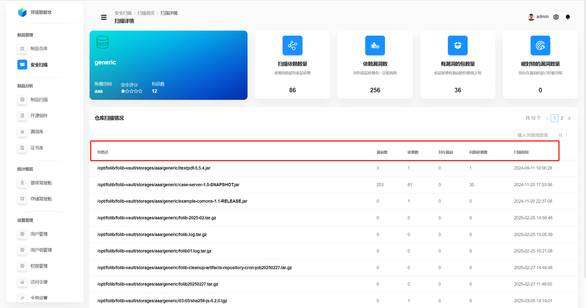
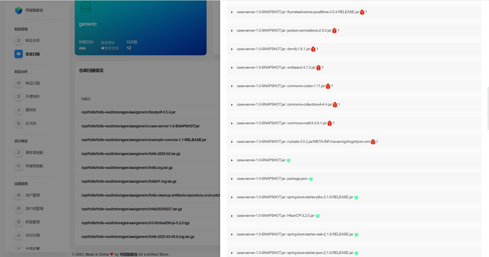
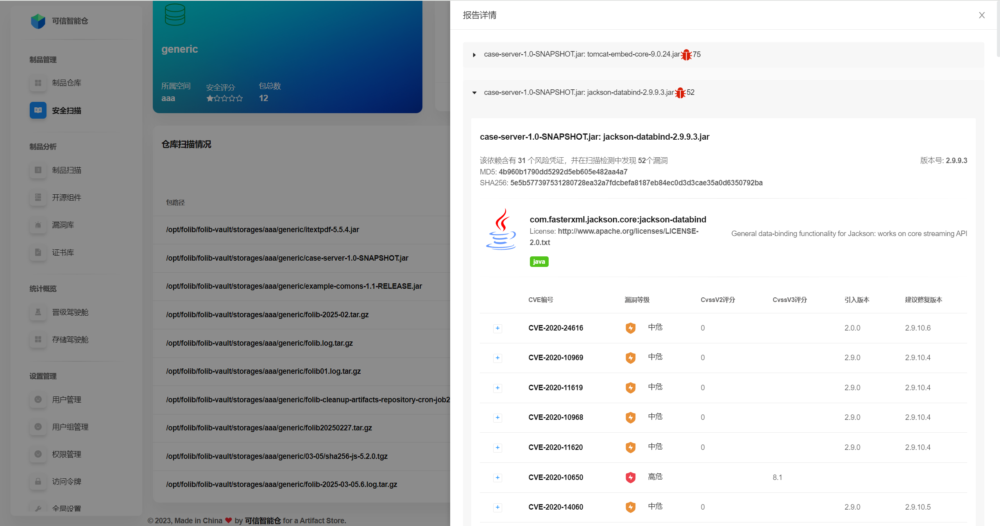

# Repository Scan Details

This page shows the **repository-level scan statistics**, **per‑package scan statistics**, and **file‑level scan report details** for each package.

## Repository Scan Statistics

Aggregated metrics for the repository after the security scan.

| Term | Description |
|---|---|
| Space | The storage space that owns this repository. |
| Security score | Rating based on the ratio of problem packages to total packages. **Five white stars** indicate the highest score. |
| Total packages | Total number of packages in the repository. |
| Scanned dependencies | Total number of dependencies (including transitive) found in the repository. |
| Vulnerable dependencies | Number of dependencies that contain vulnerabilities. |
| Packages with vulnerabilities | Number of packages in the repository that contain vulnerabilities. |
| Archived/ignored vulnerabilities | Count of vulnerabilities in this repo that are marked as ignorable. |

## Per‑Package Scan Statistics

Overview of scan results for each package inside the repository.

| Term | Description |
|---|---|
| Package path | Location of the package within the repository tree. |
| Vulnerabilities | Total number of vulnerabilities in the package. |
| Dependencies | Total number of dependencies in the package. |
| Archived/ignored vulns | Number of vulnerabilities in the package marked as ignorable. |
| Problem dependencies | Number of dependencies within the package that have vulnerabilities. |
| Scan time | The most recent scan time for the package. |

## File Scan Report Details within a Package

Click a package row to open its **file‑level scan report details**. Navigation path: **Scanning Home → Scan Details → File Scan Report Details**.

By default, the page lists all **dependencies** of the package.  
A **red bug icon** means the dependency is vulnerable; the **red number** next to it shows the count. A **green heart** means no vulnerabilities.

Click a dependency to view its **vulnerability list**.

**Dependency description — terms:**

| Term | Description |
|---|---|
| License risk | Security/compliance issues detected for the dependency’s license. |
| Vulnerabilities | Total vulnerability count for the dependency. |
| MD5 | MD5 checksum of the dependency (unique identifier). |
| SHA256 | SHA‑256 hash of the dependency (unique identifier). |
| Version | Dependency version. |
| License | Dependency license type. |

**Vulnerability entry — terms:**

| Term | Description |
|---|---|
| CVE | Unique vulnerability identifier. |
| Severity | Critical / High / Medium / Low. |
| CVSS v2 | Score per CVSS version 2. |
| CVSS v3 | Score per CVSS version 3. |
| Introduced in | Dependency version where the issue was introduced. |
| Fixed version | Recommended version to upgrade to in order to remediate. |

Click the **“+”** icon on the left to expand the **detailed description** of a vulnerability.

