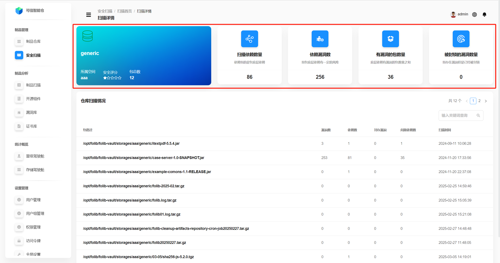
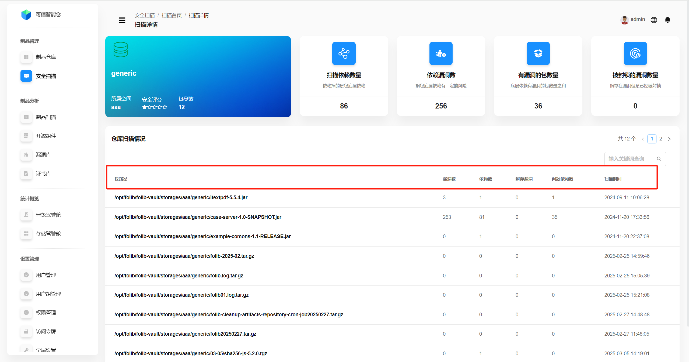
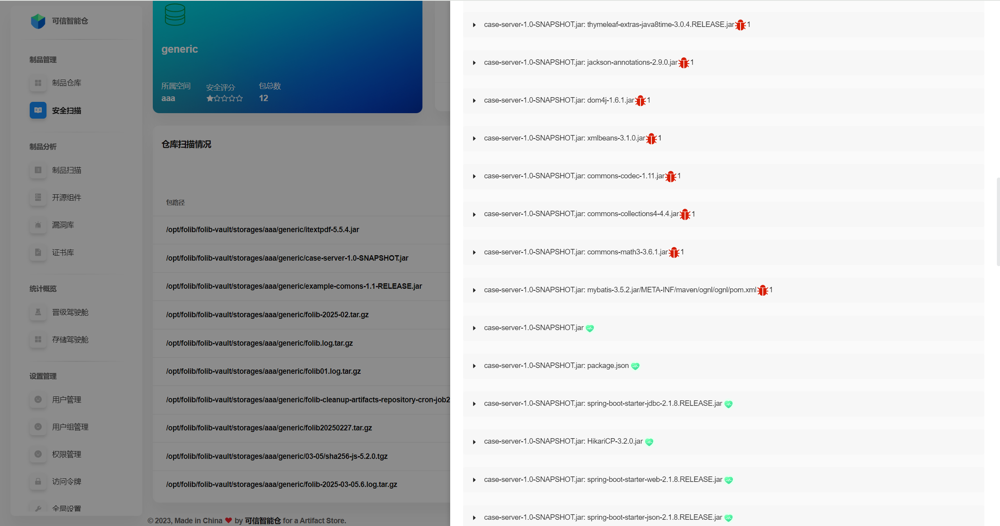
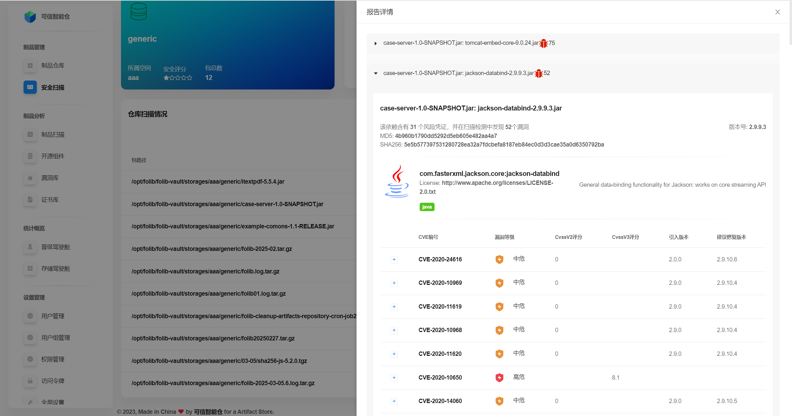
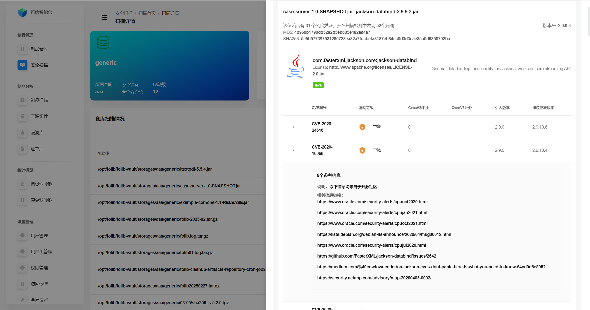

# Детали сканирования репозитория

Эта страница показывает **сводную статистику сканирования выбранного репозитория**, **статистику по каждому пакету** в нём и **детальные отчёты по сканированию файлов** внутри каждого пакета.

## Статистика сканирования репозитория

Общие агрегированные метрики по репозиторию после запуска безопасностного сканирования.

| Термин | Пояснение |
|---|---|
| Принадлежит пространству | Хранилищное пространство, к которому относится репозиторий. |
| Оценка безопасности | Рейтинг, рассчитанный по доле проблемных пакетов от общего числа пакетов. **Пять белых звёзд** означают максимальную оценку. |
| Всего пакетов | Общее количество пакетов в репозитории. |
| Количество просканированных зависимостей | Суммарное число зависимостей (включая транзитивные), найденных в репозитории. |
| Уязвимых зависимостей | Количество зависимостей, в которых обнаружены уязвимости. |
| Пакетов с уязвимостями | Число пакетов в репозитории, содержащих уязвимости. |
| Игнорируемые уязвимости | Количество уязвимостей в репозитории, помеченных как допускаемые/игнорируемые. |

## Статистика по пакетам

Обзор сканирования для каждого пакета внутри репозитория.

| Термин | Пояснение |
|---|---|
| Путь пакета | Расположение пакета в дереве репозитория. |
| Уязвимости | Общее число уязвимостей в пакете. |
| Зависимости | Общее число зависимостей пакета. |
| Игнорируемые уязвимости | Число уязвимостей пакета, помеченных как допускаемые/игнорируемые. |
| Проблемные зависимости | Количество зависимостей пакета, в которых обнаружены уязвимости. |
| Время сканирования | Время последнего сканирования пакета. |

## Детали отчёта о сканировании файлов в пакете

Нажмите строку нужного пакета, чтобы открыть **детали отчёта по файлам**. Ниже — путь от **Главной страницы сканирования → Детали сканирования → Детали отчёта по файлам**:

После входа по умолчанию показывается список всех **зависимостей** пакета.  
**Красная иконка жука** означает, что в зависимости есть уязвимости; стоящая рядом **красная цифра** показывает их количество. **Зелёное сердце** означает отсутствие уязвимостей.

Нажмите на нужную зависимость, чтобы открыть **список уязвимостей** по ней.

**Термины в описании зависимости:**

| Термин | Пояснение |
|---|---|
| Рисковый лиценз. аспект | Соответствие лицензии зависимости требованиям безопасности/комплаенса. |
| Уязвимости | Общее количество уязвимостей в зависимости. |
| MD5 | MD5‑сумма зависимости (уникальный идентификатор). |
| SHA256 | SHA‑256 хеш зависимости (уникальный идентификатор). |
| Версия | Версия зависимости. |
| Лицензия | Тип лицензии зависимости. |

**Термины в карточке уязвимости:**

| Термин | Пояснение |
|---|---|
| CVE | Уникальный идентификатор уязвимости. |
| Уровень | Классификация: Критический / Высокий / Средний / Низкий. |
| CVSS v2 | Балл по шкале CVSS версии 2. |
| CVSS v3 | Балл по шкале CVSS версии 3. |
| Введена в версии | Версия зависимости, с которой уязвимость была внесена. |
| Рекомендованная версия | Версия, на которую рекомендуется обновиться для устранения уязвимости. |

Нажмите слева на значок **«+»**, чтобы развернуть **подробное описание** уязвимости.

