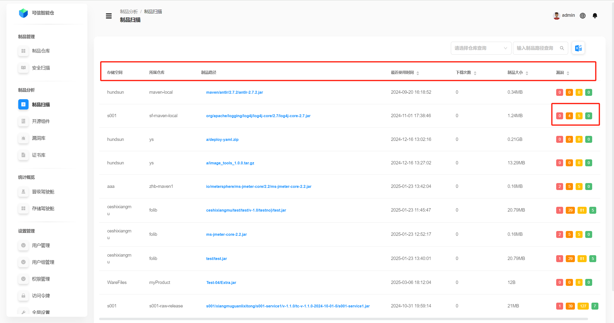
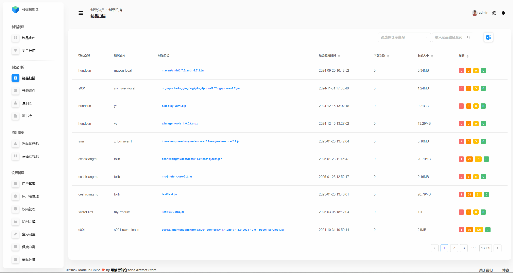
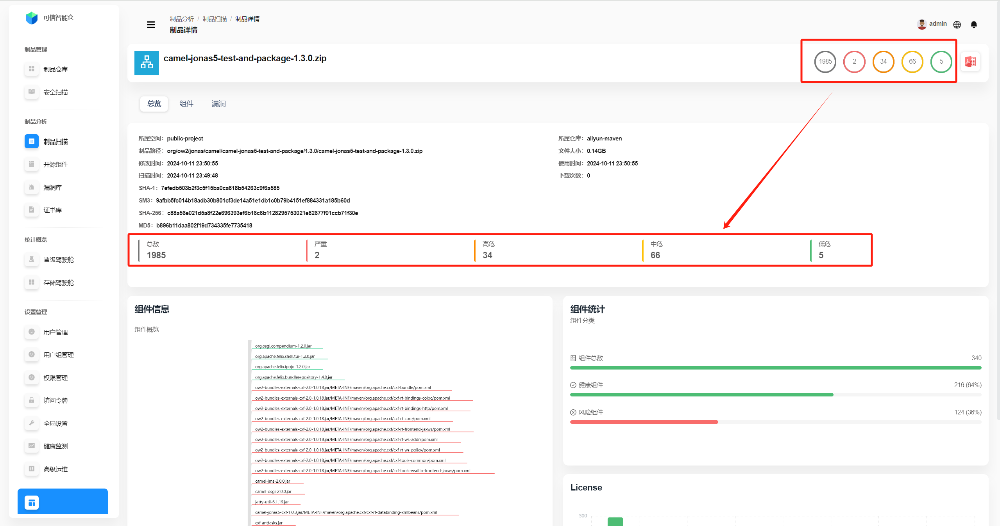
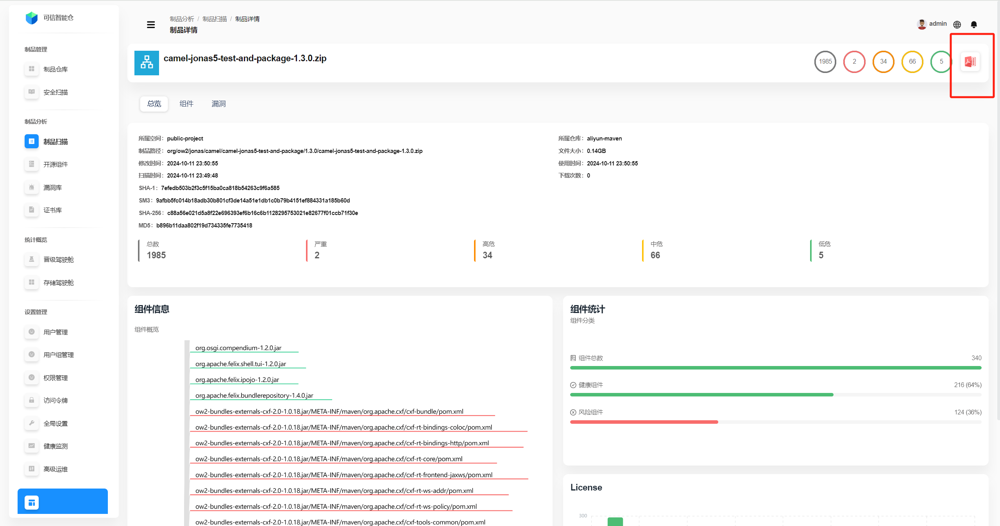
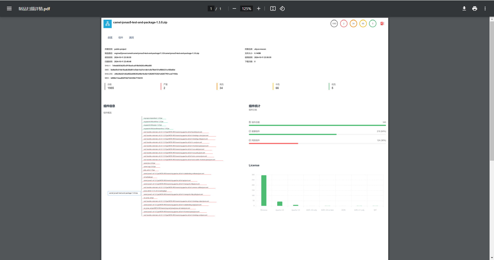
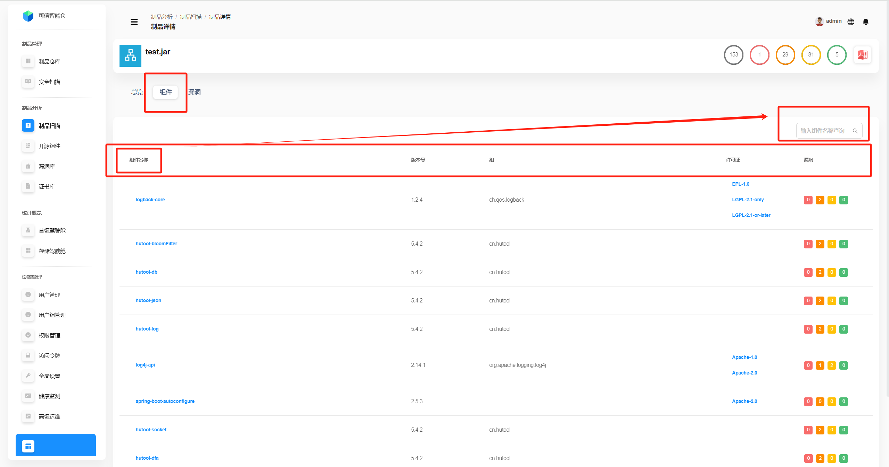
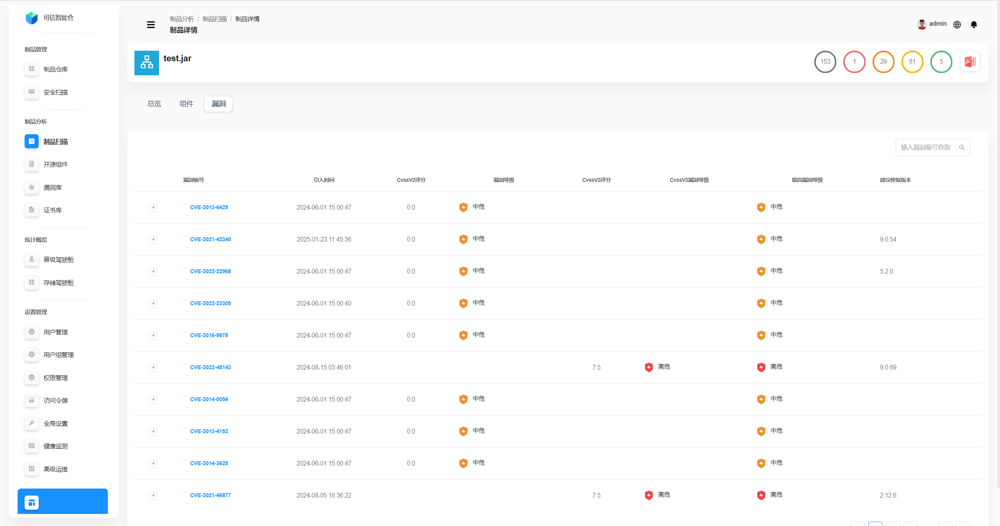

# Сканирование артефактов

## Список данных сканирования артефактов
Список показывает все артефакты платформы, по которым сканирование завершилось **успешно**.

| Поле | Описание |
|---|---|
| Пространство хранения | Пространство хранения, к которому относится артефакт. |
| Репозиторий | Репозиторий, к которому относится артефакт. |
| Путь артефакта | Путь размещения артефакта в дереве репозитория. **Кликните, чтобы открыть страницу деталей артефакта.** |
| Время последнего использования | Когда артефакт в последний раз использовали. Поддерживается сортировка по ближайшему/дальнему времени. |
| Скачивания | Сколько раз артефакт скачивали. Поддерживается сортировка по наибольшему/наименьшему числу. |
| Размер | Размер файла артефакта. Поддерживается сортировка по максимальному/минимальному значению. |
| Уязвимости | Слева направо (от красного к зелёному): количество **Критических**, **Высоких**, **Средних**, **Низких** уязвимостей. Поддерживается сортировка по общему числу уязвимостей. |

## Поиск по данным сканирования артефактов
Поддерживается фильтрация по двум измерениям — **Репозиторий** и **Путь артефакта** (по отдельности или в комбинации).

## Общий обзор артефакта
**Кликните по пути артефакта**, чтобы открыть страницу деталей. По умолчанию отображается **общий обзор артефакта**.

| Поле | Описание |
|---|---|
| Пространство хранения | Пространство хранения, к которому относится артефакт. |
| Репозиторий | Репозиторий, к которому относится артефакт. |
| Путь артефакта | Путь размещения артефакта в дереве репозитория. |
| Размер файла | Размер файла артефакта. |
| Время изменения | Когда артефакт в последний раз изменяли. |
| Время использования | Когда артефакт в последний раз использовали. |
| Время сканирования | Когда артефакт в последний раз сканировали. |
| Скачивания | Сколько раз артефакт скачивали. |
| SHA-1 | Хеш SHA‑1 артефакта (идентификатор; подходит для сценариев с невысокими требованиями безопасности). |
| SM3 | Хеш SM3 артефакта (идентификатор; часто используется по отечественным стандартам, подходит для высоких требований). |
| SHA-256 | Хеш SHA‑256 артефакта (идентификатор; подходит для высоких требований). |
| MD5 | Хеш MD5 артефакта (идентификатор; подходит для сценариев с невысокими требованиями безопасности). |
| Статистика | Слева направо: **Всего**, **Критические**, **Высокие**, **Средние**, **Низкие** уязвимости. |

Можно масштабировать обзор компонентов колёсиком мыши; при наведении курсора на компонент отображаются **общее число уязвимостей, критические, высокие, средние, низкие** по этому компоненту.

Справа блок **Статистика компонентов** рассчитан по блоку **Сведения о компонентах** слева: **любой компонент с уязвимостями** считается **рисковым**, компоненты **без уязвимостей** — **здоровыми**.

Нижний правый блок **license** показывает распределение лицензий всех компонентов артефакта. Наведите курсор на столбец, чтобы увидеть точное количество.

**Экспорт статистики в PDF:** нажмите иконку в правом верхнем углу для автоматического скачивания PDF со статистикой, пример ниже.

| | |
|---|---|
|  |  |

## Компоненты артефакта
Откройте вкладку **Компоненты**, чтобы увидеть список компонентов артефакта.

Здесь показаны **все типы** компонентов внутри артефакта (как открытые, так и собственные и т.д.). Доступен поиск по **названию компонента**.

| Поле | Описание |
|---|---|
| Название компонента | Имя компонента. |
| Версия | Версия компонента. |
| Группа | Группа/организация компонента. |
| Лицензия | Лицензия компонента. |
| Уязвимости | Слева направо: **Критические**, **Высокие**, **Средние**, **Низкие**. |

## Уязвимости артефакта
Откройте вкладку **Уязвимости**, чтобы посмотреть список уязвимостей. Доступен поиск по **ID уязвимости**.

| Параметр | Описание |
|---|---|
| ID уязвимости | Уникальный идентификатор уязвимости (номер/ID). |
| Время внесения | Когда уязвимость была внесена/появилась. |
| CVSSv2 score | Оценка тяжести по **CVSS v2**. |
| Уровень CVSSv2 | Класс тяжести по **CVSS v2** (низкий/средний/высокий и т.п.). |
| CVSSv3 score | Оценка тяжести по **CVSS v3**. |
| Уровень CVSSv3 | Класс тяжести по **CVSS v3** (низкий/средний/высокий/критический). |
| Максимальный уровень | Максимальный уровень тяжести для быстрой оценки риска. |
| Рекомендованная версия | Рекомендуемая версия для обновления/исправления уязвимости. |
