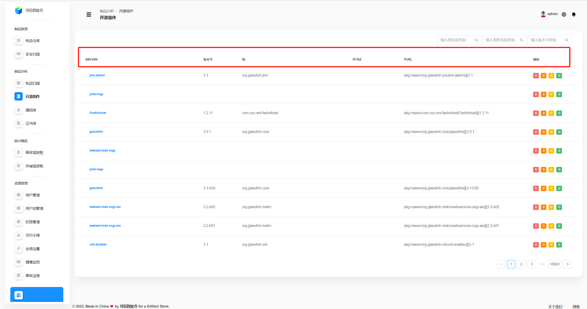
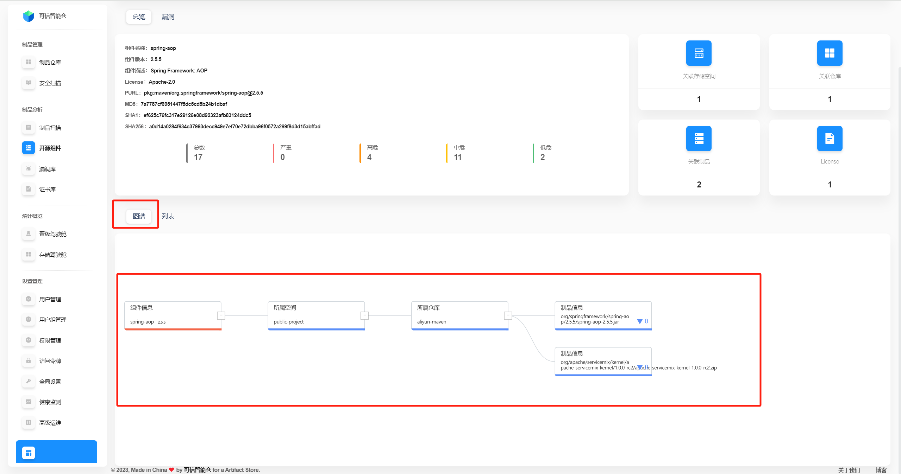
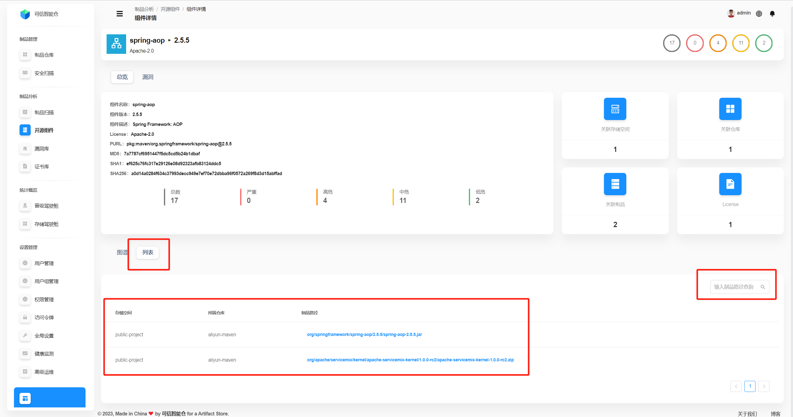

# Open Source Components

## Component List
This page shows all open‑source components across the platform.

| Field | Description |
| --- | --- |
| **Component Name** | The name of the component. |
| **Version** | The current version of the component. |
| **Group** | The organization or group identifier the component belongs to. |
| **License** | The component's license. |
| **PURL** | **PURL (Package URL)** is a standardized URL that uniquely identifies a software package. Base format: `pkg:<type>/<namespace>/<name>@<version>?<qualifiers>#<subpath>`  **`pkg`** — fixed prefix indicating a package identifier. **`<type>`** — package type (e.g., `maven`, `npm`, `pypi`), i.e., ecosystem/package manager. **`<namespace>`** — optional; for Maven this is the `groupId`. **`<name>`** — package name (Maven `artifactId`, npm package name, etc.). **`@<version>`** — package version. **`?<qualifiers>`** — optional qualifiers such as `arch=x86_64`, `os=windows`. **`#<subpath>`** — optional subpath within the package (a specific file/directory).  **Example:** `pkg:maven/org.glassfish.connectors/connectors-inbound-runtime@3.1` |
| **Vulnerabilities** | From left to right: counts of **Critical**, **High**, **Medium**, and **Low** severities. |

## Component Search
You can filter by **Group**, **Component Name**, and **Version** (individually or combined).

## Component Overview
Click the **component name** to open the **Component Details** page. The **Overview** tab is shown by default.

The **graph** below shows the component’s **impact scope**—where it is used and what it affects. For example, the diagram indicates this component is used by the artifacts `spring-aop-2.5.5.jar` and `apache-servicemix-kernel-1.0.0-rc2.zip` in the `aliyun-maven` repository (storage space `public-project`), and thus impacts them.

Switch to **List** to see the affected **artifacts** (including **artifact name**, **repository**, and **storage space**).

## Component Vulnerabilities
Open the **Vulnerabilities** tab to view the component’s CVEs. Searching by **vulnerability ID** is supported. Click the **“+”** icon to expand details.

| Field | Description |
| --- | --- |
| **Vulnerability ID** | Unique identifier (e.g., CVE). |
| **Introduced Time** | When the vulnerability was introduced. |
| **CVSS v2 Score** | Severity score based on CVSS v2. |
| **CVSS v2 Level** | Severity level per CVSS v2 (low/medium/high, etc.). |
| **CVSS v3 Score** | Severity score based on CVSS v3. |
| **CVSS v3 Level** | Severity level per CVSS v3. |
| **Max Severity** | Highest severity among multiple ratings (quick risk view). |
| **Suggested Fix Version** | Recommended version to upgrade to in order to remediate. |
