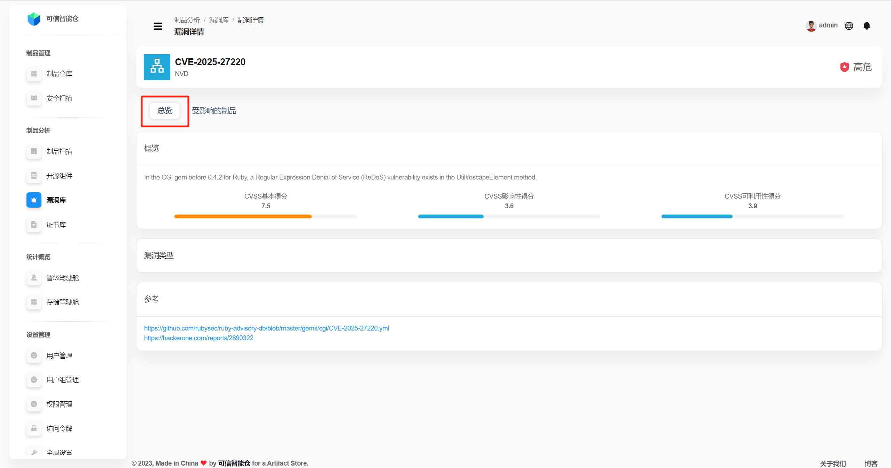
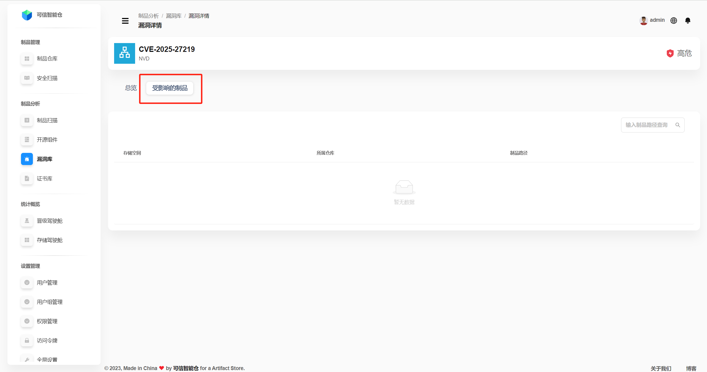

# Vulnerability Library

Folib’s vulnerability library is built on public data from the global NVD and China’s CNVD databases.

## Vulnerability List

The library displays all known vulnerabilities on the platform. Searching by **vulnerability ID** is supported.

| Term | Definition |
|---|---|
| **Vulnerability ID** | A standardized code that uniquely identifies a security issue. Commonly the CVE scheme: `CVE-YYYY-NNNNN`, where `YYYY` is the year and `NNNNN` is the unique sequence number. |
| **CVSS Score** | CVSS (Common Vulnerability Scoring System) is an open standard for rating severity. Higher scores indicate more severe vulnerabilities. |
| **Vulnerability Type** | A classification of the weakness’s nature (cause, form, impact), standardized via CWE (Common Weakness Enumeration), format: `CWE-NNN`. |
| **Affected Artifacts** | The list of artifacts impacted by the vulnerability. |
| **Severity Level** | Mapped from CVSS: **Critical** \[9–10), **High** \[7–9), **Medium** \[4–7), **Low** (0–4). |

## Vulnerability Overview

Click a **Vulnerability ID** to open the **Vulnerability Details** page. By default, the **overview** is shown.

| Term | Definition |
|---|---|
| **Overview** | A description of the issue (type, name, cause, etc.).  **CVSS Base Score** = *Exploitability* + *Impact*. It expresses the inherent severity of the vulnerability, independent of specific environments or time.  **CVSS Exploitability Score** reflects how easy it is to exploit: **attack vector** (e.g., Network—N), **attack complexity**, **required privileges**, **user interaction**.  **CVSS Impact Score** measures the consequences after exploitation: effects on **confidentiality**, **integrity**, and **availability**. |
| **CVSS Base Score** | The inherent severity (exploitability + impact). |
| **CVSS Exploitability Score** | How difficult exploitation is: vector, complexity, privileges, user interaction. |
| **CVSS Impact Score** | Resulting impact on confidentiality, integrity, and availability. |
| **Vulnerability Type** | CWE-based classification, format `CWE-NNN`. |
| **References** | Links to detailed external resources. |

## Affected Artifacts

