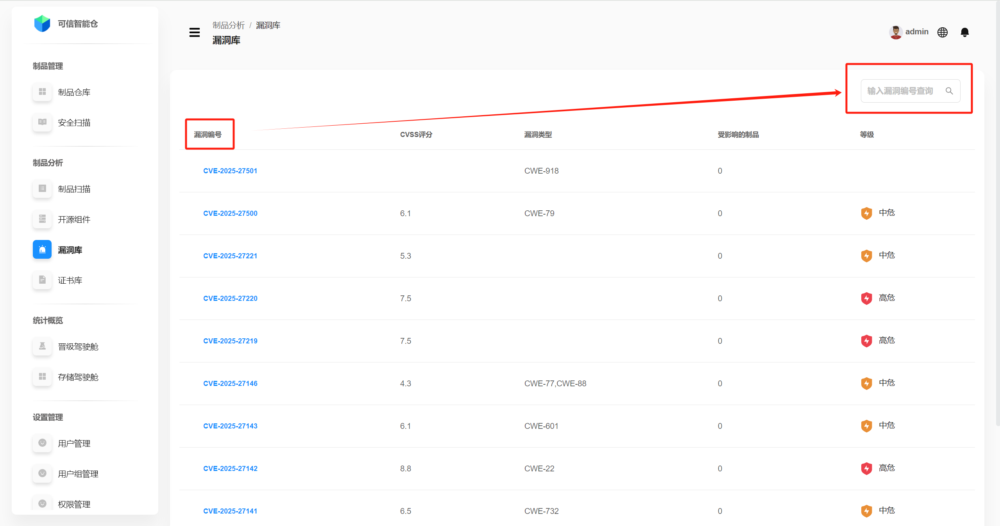
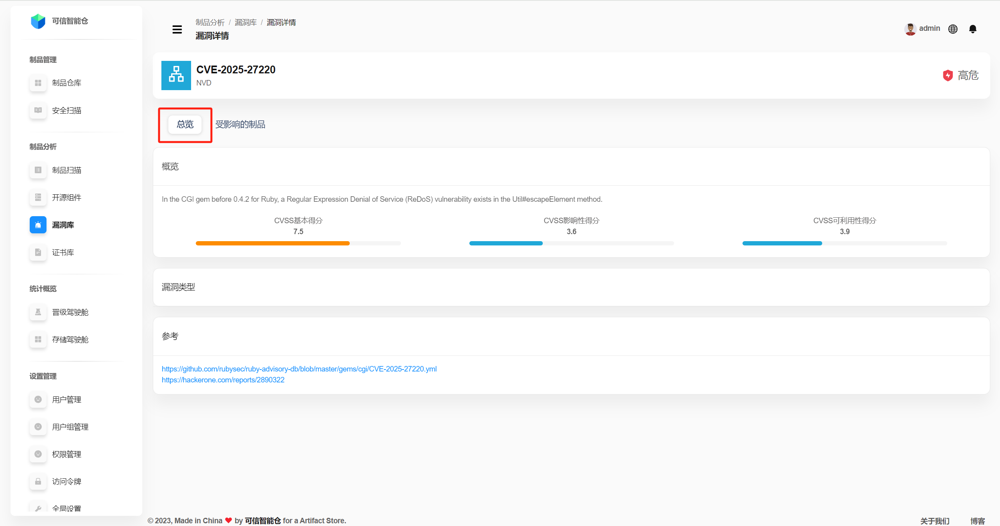
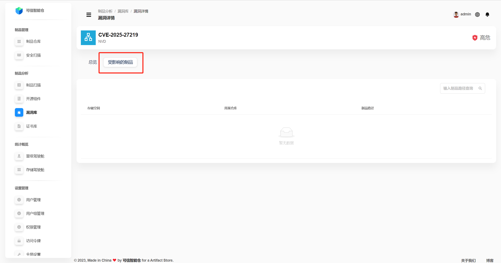

# Библиотека уязвимостей

Библиотека уязвимостей Folib основывается на глобальной открытой базе NVD и китайской базе CNVD.

## Список уязвимостей

Библиотека показывает список всех известных уязвимостей на платформе. Поддерживается поиск по **идентификатору уязвимости**.

| Термин | Определение |
|---|---|
| **Идентификатор уязвимости** | Стандартизированный код для уникальной идентификации и управления уязвимостями. Чаще всего используется CVE (Common Vulnerabilities and Exposures): `CVE-YYYY-NNNNN`, где `YYYY` — год регистрации, `NNNNN` — порядковый номер. |
| **Оценка CVSS** | CVSS (Common Vulnerability Scoring System) — открытый стандарт оценки серьёзности уязвимостей: чем выше балл, тем серьёзнее уязвимость. |
| **Тип уязвимости** | Классификация природы уязвимости (причины, проявления, влияние). Стандартизируется по CWE (Common Weakness Enumeration), формат: `CWE-NNN`. |
| **Затронутые артефакты** | Список артефактов, на которые влияет конкретная уязвимость. |
| **Уровень** | Классификация по баллу CVSS: **Серьёзная** \[9–10), **Высокая** \[7–9), **Средняя** \[4–7), **Низкая** (0–4). |

## Обзор уязвимости

Нажмите **идентификатор уязвимости**, чтобы открыть страницу **деталей уязвимости**. По умолчанию отображается **обзор**.

| Термин | Определение |
|---|---|
| **Обзор** | Краткое описание уязвимости (тип, название, причина и т. п.).  **Базовая оценка CVSS** = *оценка эксплуатационной возможности* + *оценка влияния*. Это ключевой показатель *внутренней* серьёзности уязвимости, не зависящий от окружения и времени.  **Оценка эксплуатационной возможности CVSS** показывает, насколько легко атакующему использовать уязвимость: **вектор атаки** (например, сеть — N), **сложность атаки**, **требуемые привилегии**, **необходимость взаимодействия пользователя**.  **Оценка влияния CVSS** отражает последствия успешной эксплуатации: воздействие на **конфиденциальность**, **целостность** и **доступность**. |
| **Базовая оценка CVSS** | Суммарная базовая оценка (эксплуатируемость + влияние), отражающая внутренний риск уязвимости. |
| **Оценка эксплуатационной возможности CVSS** | Трудоёмкость эксплуатации: вектор атаки, сложность, привилегии, участие пользователя. |
| **Оценка влияния CVSS** | Последствия для конфиденциальности, целостности и доступности. |
| **Тип уязвимости** | Классификация по CWE, формат `CWE-NNN`. |
| **Ссылки** | Переходы на внешние источники с подробной информацией. |

## Затронутые артефакты

