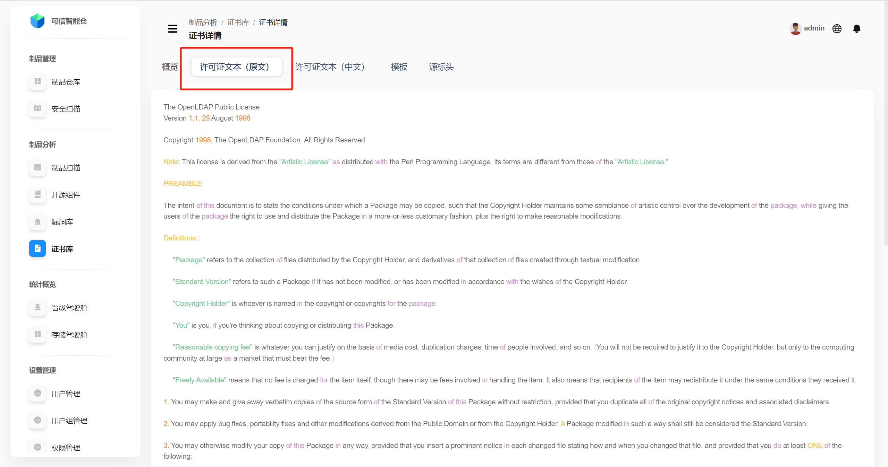
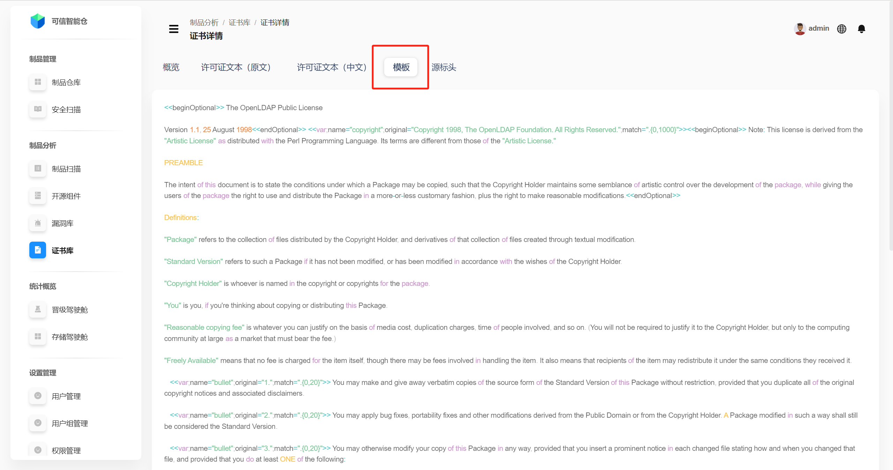

# Certificate (License) Library

## License List
The License Library shows all licenses stored on the platform. You can filter by **license name** and **list type** (whitelist/blacklist). You can also **add/remove** licenses to/from the white/black lists.

| Name | Description |
|---|---|
| **License Name** | The license’s name. |
| **License ID** | The license’s unique identifier. |
| **Actions** | Add/remove to/from the white/black lists. If a license is not in any list yet, two buttons are shown: blue — add to whitelist; red — add to blacklist. If the license is already on a list, a single button appears to remove it from that list. |

## License Details
Click the **License ID** to open the **License Details** page. The **Overview** tab is shown by default.

| Term | Definition |
|---|---|
| License Name | The license’s name. |
| SPDX License ID | Short identifier from the SPDX (Software Package Data Exchange) standard uniquely identifying the license. |
| OSI Approved | Whether the license is approved by the Open Source Initiative (OSI). |
| Free Software | Whether the license is considered a Free Software license. |
| Deprecated | Whether the license is marked as deprecated. |
| Custom License | Whether the license is a custom (user-defined) one. |
| Notes | Additional notes for the license. |

**License Text.** Click **“License Text (Original)”** or **“License Text (Chinese)”** to view the original text or the Chinese translation.

 

**Template.** Use templates to generate license texts while inserting variables as needed and keeping structure and formatting consistent.

**Source Header.** The header comment usually placed at the top of source files declaring the license, copyright notice, and related info.

For example, `Licensed under the Academic Free License version 1.1.` indicates the code is distributed under Academic Free License v1.1.

