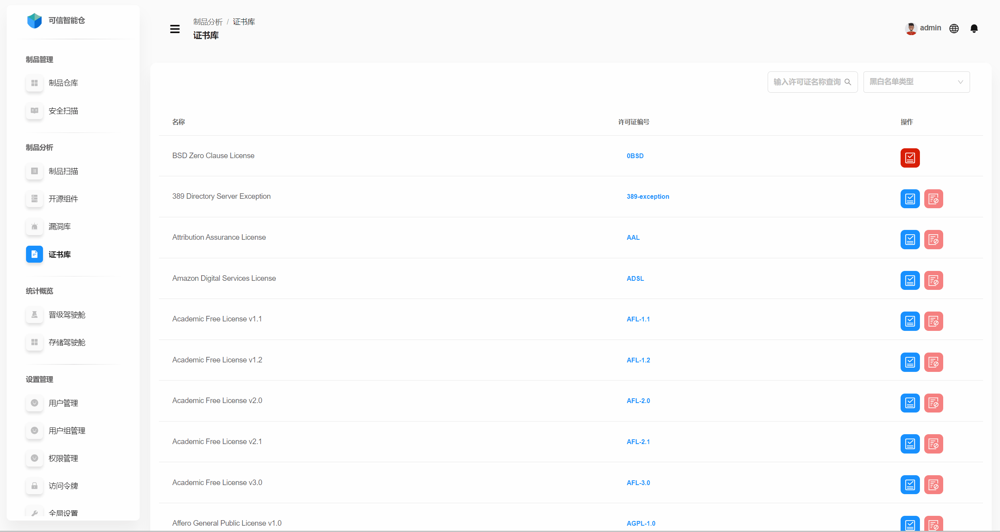
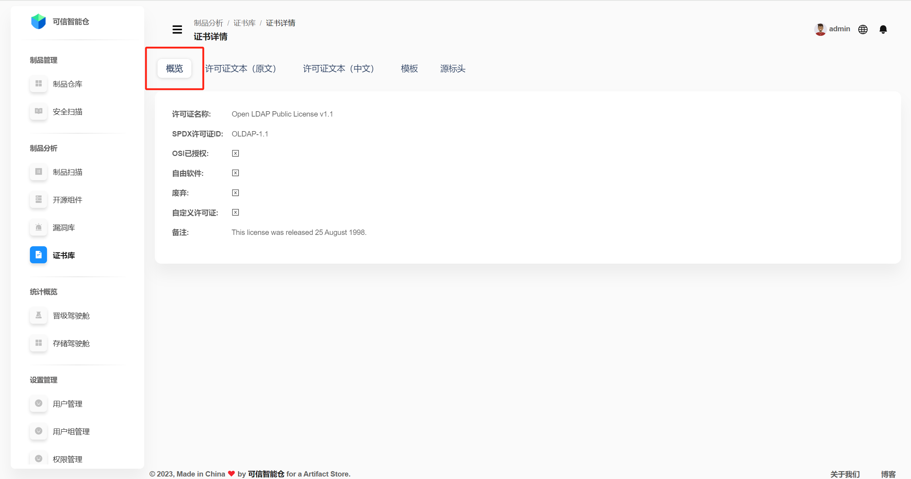
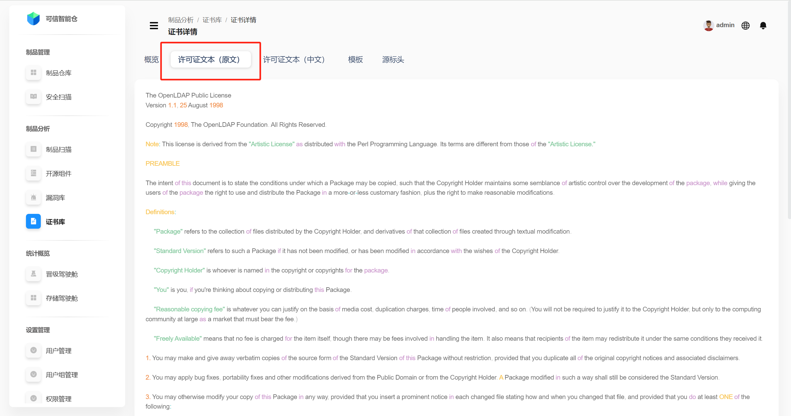
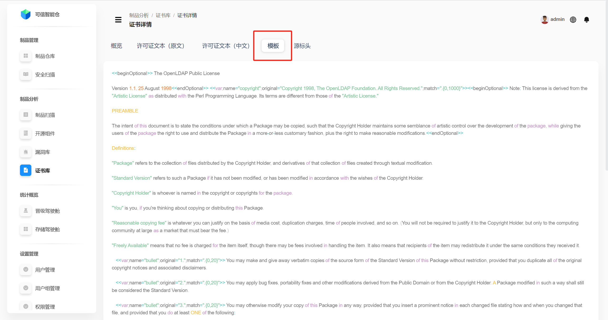
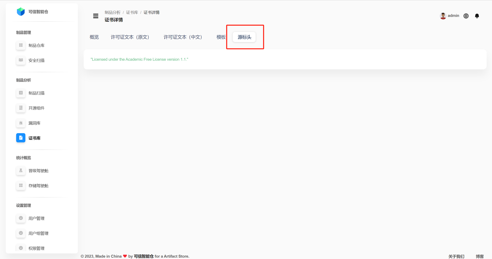

# Библиотека лицензий

## Список лицензий
Библиотека лицензий отображает все лицензии, сохранённые на платформе. Поддерживается фильтрация по **названию лицензии** и по **типу списка** (белый/чёрный). Доступны операции **добавления/удаления** в/из белого и чёрного списков.

| Название | Объяснение |
|---|---|
| **Лицензия** | Наименование лицензии. |
| **Идентификатор лицензии** | Уникальный идентификатор лицензии. |
| **Действия** | Поддерживается добавление/удаление из белого/чёрного списков. Если лицензия ещё не в списках — доступны две кнопки: синяя — добавить в белый список, красная — добавить в чёрный список. Если лицензия уже в одном из списков — доступна одна кнопка для удаления из соответствующего списка. |

## Детали лицензии
Нажмите на **идентификатор лицензии**, чтобы открыть страницу **деталей лицензии**. По умолчанию показывается раздел **Обзор**.

| Термин | Определение |
|---|---|
| Название лицензии | Наименование лицензии. |
| SPDX License ID | Короткий идентификатор из стандарта SPDX (Software Package Data Exchange), уникально обозначающий лицензию. |
| OSI‑одобрена | Пометка, является ли лицензия одобренной OSI (Open Source Initiative). |
| Свободное ПО | Является ли лицензия лицензией свободного ПО. |
| Устаревшая | Является ли лицензия помеченной как устаревшая/выведенная из обращения. |
| Пользовательская лицензия | Является ли лицензия кастомной (пользовательской). |
| Примечания | Дополнительная информация по лицензии. |

**Текст лицензии.** Нажмите **«Текст лицензии (оригинал)»** или **«Текст лицензии (китайский)»**, чтобы посмотреть оригинал/перевод.

 

**Шаблон.** Шаблон помогает генерировать текст лицензии с подстановкой переменных и при этом сохранять общую структуру и форматирование.

**Заголовок источника.** Это комментарий в верхней части файлов исходного кода, где указываются сведения о лицензии и авторских правах.

Например, строка `Licensed under the Academic Free License version 1.1.` означает, что файл/проект распространяется по лицензии Academic Free License 1.1.

