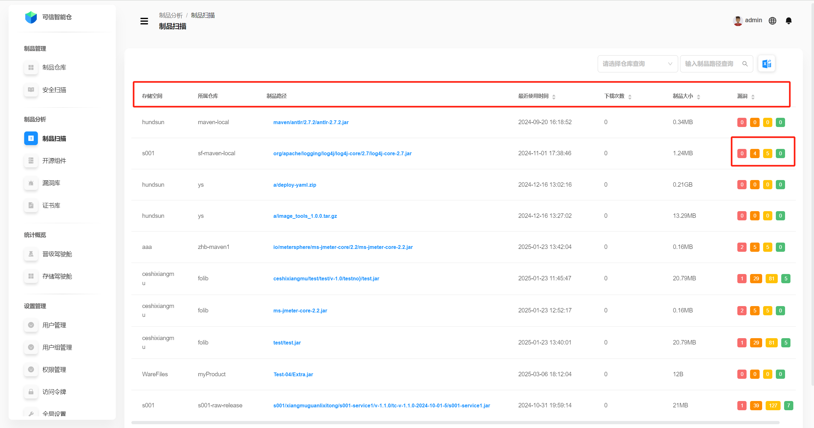
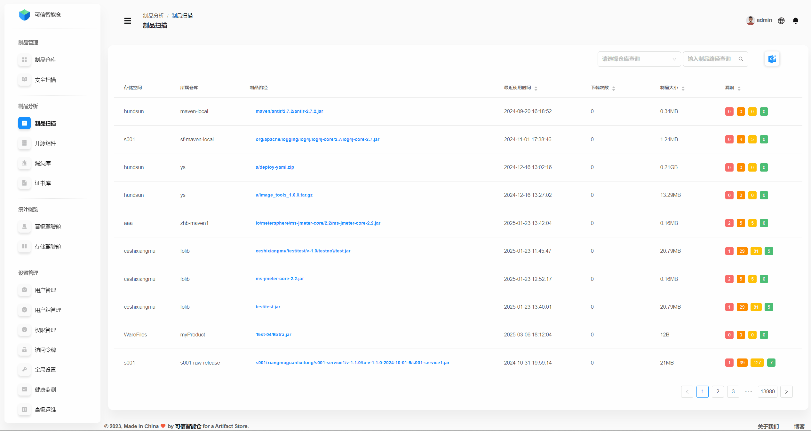
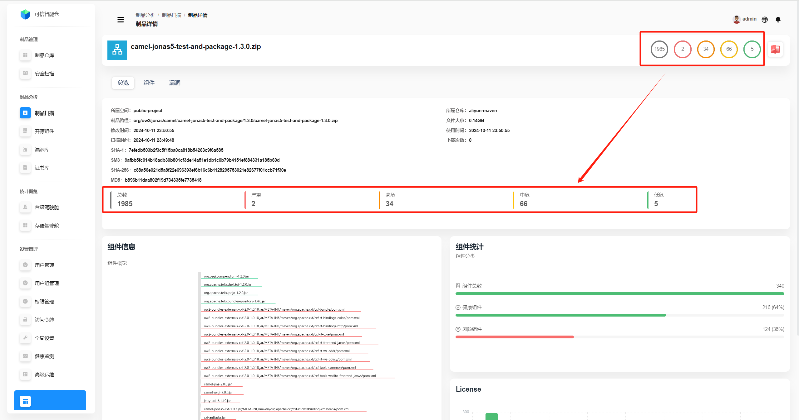
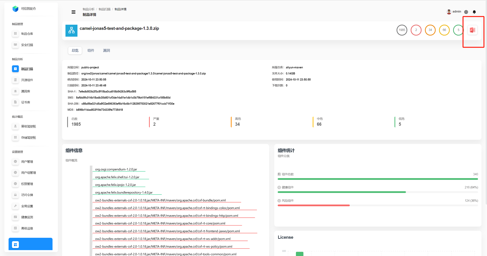
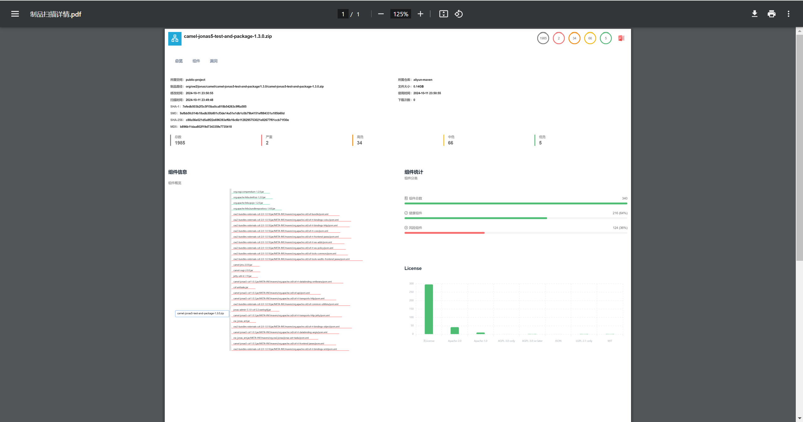
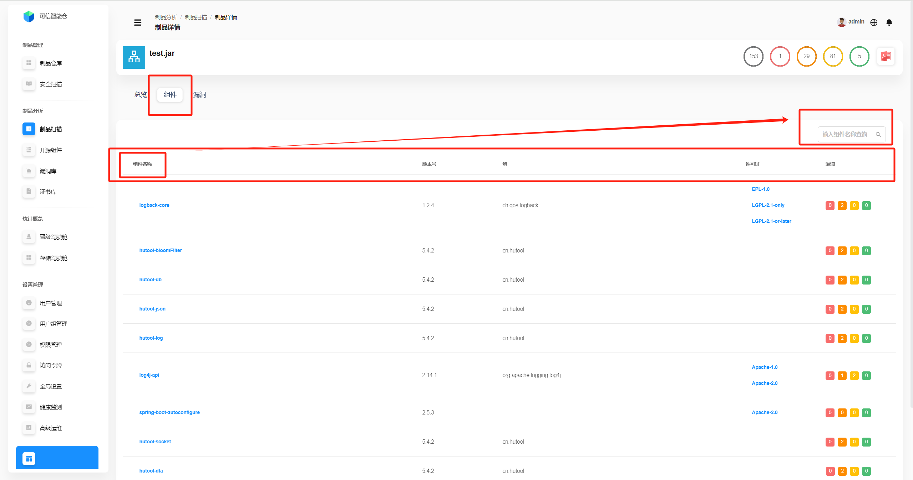
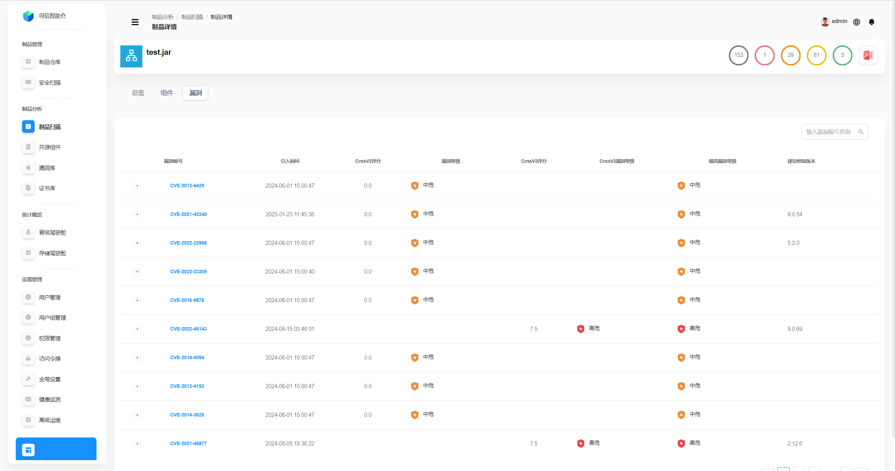

# Artifact Scanning

## Artifact Scan Data List
This list shows **all artifacts** on the platform whose scans completed **successfully**.

| Field | Description |
|---|---|
| Storage space | The storage space the artifact belongs to. |
| Repository | The repository the artifact belongs to. |
| Artifact path | Where the artifact is located in the repository tree. **Click to open the artifact detail page.** |
| Last used | The last time the artifact was used. Sort by most/least recent. |
| Downloads | How many times the artifact was downloaded. Sort by most/least. |
| Size | File size of the artifact. Sort by largest/smallest. |
| Vulnerabilities | From left to right (red → green): counts of **Critical**, **High**, **Medium**, **Low** issues. Sort by total vulnerabilities. |

## Query Artifact Scan Data
Filter by **Repository** and **Artifact path** (independently or combined).

## Artifact Overview
**Click an artifact path** to open its detail page. By default, the **artifact overview** is shown.

| Field | Description |
|---|---|
| Storage space | The storage space the artifact belongs to. |
| Repository | The repository the artifact belongs to. |
| Artifact path | Where the artifact is located in the repository tree. |
| File size | Size of the artifact file. |
| Modified time | When the artifact was last modified. |
| Last used | When the artifact was last used. |
| Scan time | When the artifact was last scanned. |
| Downloads | Download count for the artifact. |
| SHA-1 | Artifact SHA‑1 (identifier; suitable for lower security requirements). |
| SM3 | Artifact SM3 (identifier; common in domestic standards; suitable for higher security). |
| SHA-256 | Artifact SHA‑256 (identifier; suitable for higher security). |
| MD5 | Artifact MD5 (identifier; suitable for lower security requirements). |
| Statistics | From left to right: **Total**, **Critical**, **High**, **Medium**, **Low** vulnerabilities. |

You can zoom the component map with the mouse wheel. Hover a component to see **total, critical, high, medium, low** vulnerability counts for that component.

The **Component statistics** panel on the right summarizes the **Component info** on the left: **any component with vulnerabilities** is a **risky component**, components **with zero vulnerabilities** are **healthy**.

The lower‑right **license** panel shows license distribution across all components in the artifact. Hover a bar to see the exact count.

**Export statistics to PDF:** click the icon in the top‑right corner to download a PDF report, as shown below.

| | |
|---|---|
|  |  |

## Artifact Components
Open the **Components** tab to see the list of components for the artifact.

This includes **all types** of components (open‑source, in‑house, etc.). You can search by **component name**.

| Field | Description |
|---|---|
| Component | Component name. |
| Version | Component version. |
| Group | Component group/organization. |
| License | Component license. |
| Vulnerabilities | From left to right: **Critical**, **High**, **Medium**, **Low**. |

## Artifact Vulnerabilities
Open the **Vulnerabilities** tab to view the vulnerability list. You can search by **vulnerability ID**.

| Field | Description |
|---|---|
| Vulnerability ID | Unique identifier (number/ID). |
| Introduced at | When the vulnerability was introduced. |
| CVSSv2 score | Severity based on **CVSS v2**. |
| CVSSv2 level | Severity class based on **CVSS v2** (low/medium/high, etc.). |
| CVSSv3 score | Severity based on **CVSS v3**. |
| CVSSv3 level | Severity class based on **CVSS v3** (low/medium/high/critical). |
| Max severity | Highest severity among associated issues (quick risk glance). |
| Suggested fix version | Recommended version to upgrade to in order to fix the issue. |
