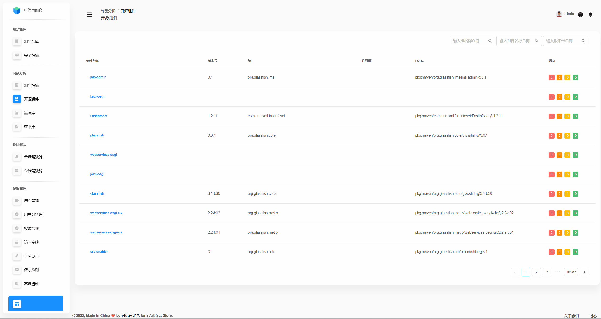
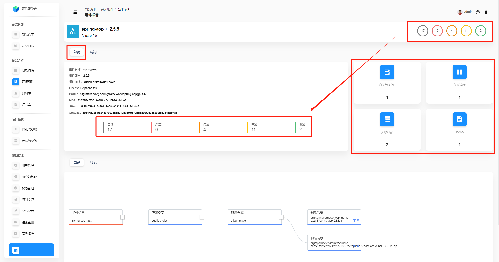
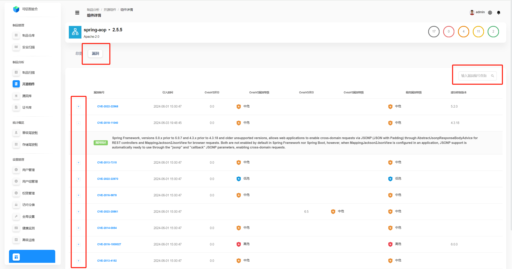

# Открытые компоненты

## Список компонентов
Здесь отображается список всех открытых компонентов на платформе.

| Поле | Описание |
| --- | --- |
| **Название компонента** | Имя компонента. |
| **Версия** | Текущая версия компонента. |
| **Группа** | Идентификатор организации/группы, к которой относится компонент. |
| **Лицензия** | Лицензия компонента. |
| **PURL** | **PURL (Package URL)** — стандартизованный URL для уникальной идентификации программного пакета. Базовый формат: `pkg:<type>/<namespace>/<name>@<version>?<qualifiers>#<subpath>`  **`pkg`** — фиксированный префикс, указывающий на идентификатор пакета. **`<type>`** — тип пакета (например, `maven`, `npm`, `pypi`) — экосистема/менеджер пакетов. **`<namespace>`** — необязательное поле (для Maven — это `groupId`). **`<name>`** — имя пакета (для Maven — `artifactId`, для npm — имя пакета). **`@<version>`** — версия пакета. **`?<qualifiers>`** — необязательные квалификаторы (например, `arch=x86_64`, `os=windows`). **`#<subpath>`** — необязательный под‑путь внутри пакета (конкретный файл/директория).  **Пример:** `pkg:maven/org.glassfish.connectors/connectors-inbound-runtime@3.1` |
| **Уязвимости** | Слева направо — количество **Критических**, **Высоких**, **Средних**, **Низких** уязвимостей. |

## Поиск компонентов
Поддерживается поиск по **названию группы**, **названию компонента** и **версии** (по отдельности или в комбинации).

## Обзор компонента
Нажмите на **название компонента**, чтобы открыть **детали компонента**. По умолчанию отображается **обзор**.

Ниже показана **графовая диаграмма** влияния: где и кем используется компонент, а значит — кого он потенциально затрагивает. Например, на схеме компонент используется артефактом `spring-aop-2.5.5.jar` и артефактом `apache-servicemix-kernel-1.0.0-rc2.zip` в репозитории `aliyun-maven` (пространство хранения `public-project`) — и влияет на них.

Переключитесь на вкладку **Список**, чтобы увидеть затронутые **артефакты** (с их **именем**, **репозиторием** и **пространством хранения**).

## Уязвимости компонента
Перейдите на вкладку **Уязвимости**, чтобы увидеть список уязвимостей компонента. Поддерживается поиск по **ID уязвимости**. Нажмите на значок **«+»**, чтобы развернуть подробности уязвимости.

| Параметр | Описание |
| --- | --- |
| **ID уязвимости** | Уникальный идентификатор (например, CVE). |
| **Время внедрения** | Когда уязвимость была введена. |
| **Оценка CVSS v2** | Балл по системе CVSS v2. |
| **Уровень по CVSS v2** | Классификация по CVSS v2 (низкий/средний/высокий и т. п.). |
| **Оценка CVSS v3** | Балл по системе CVSS v3. |
| **Уровень по CVSS v3** | Классификация по CVSS v3. |
| **Максимальный уровень** | Максимальный уровень среди всех оценок (быстрая оценка риска). |
| **Рекомендуемая версия** | Рекомендуемая версия компонента для устранения уязвимости. |
