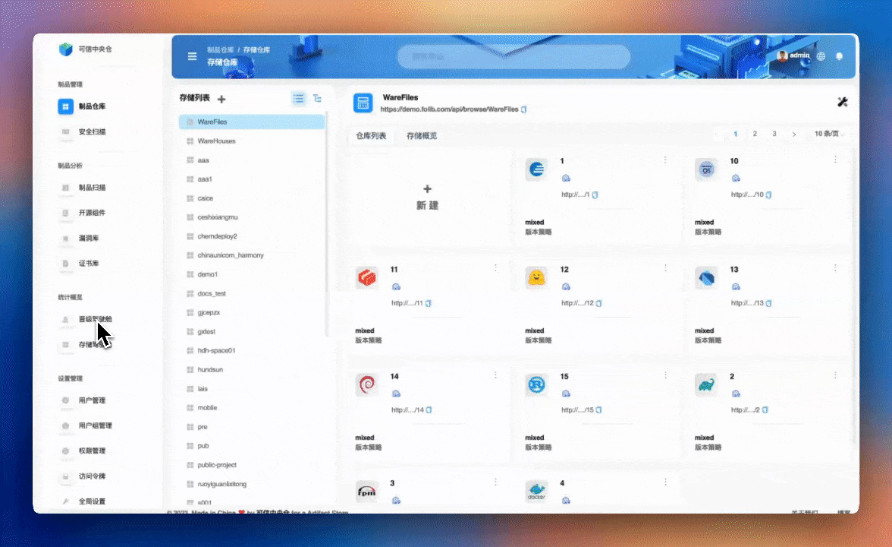
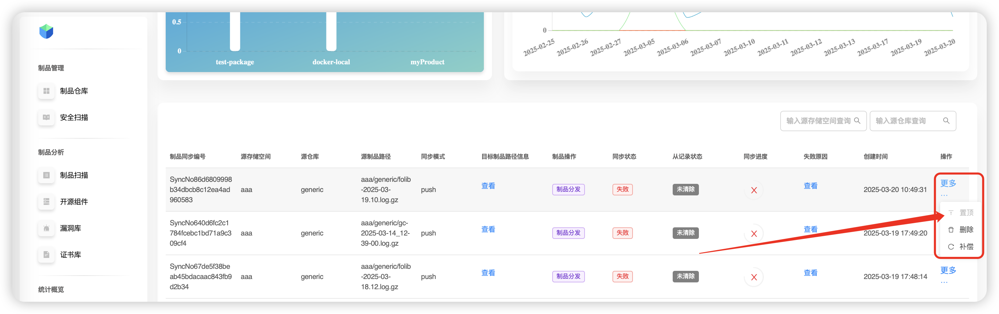

# Кабина продвижения

Используется для просмотра статусов всех **текущих продвижений** артефактов по всей платформе. Поддерживаются:
- **Компенсация** (повторная попытка) для неудачных задач синхронизации,
- просмотр **причины сбоя**,
- **закрепление** (поместить в топ) задач с высоким приоритетом,
- **удаление** задач.

## Компенсация
Выберите задачу со статусом «неудачно», затем **Ещё → Компенсация** — будет запущена повторная попытка продвижения.

## Удаление
Выберите неуспешную (или более неактуальную) задачу и нажмите **Ещё → Удалить** — задача будет удалена из очереди продвижения.

## Закрепление (в топ)
Чтобы ускорить выполнение важной задачи, нажмите **Ещё → Закрепить** — задача поднимется в списке и получит приоритет.

## Просмотр причины сбоя
Выберите соответствующую неудачную задачу и нажмите **Просмотр** — откроется окно с детализированной причиной ошибки.

