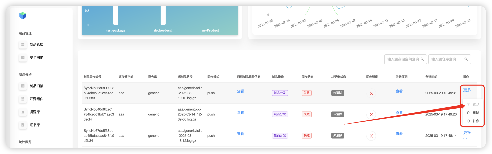

# Promotion Cockpit

Use this page to monitor the status of **all ongoing promotions** across the platform. It supports:
- **Compensation** (retry) for failed synchronization tasks,
- viewing the **failure reason**,
- **pinning** high‑priority tasks to the top,
- **deleting** tasks.

## Compensation
Select a task with a failed status and click **More → Compensate** to trigger a retry of the promotion job.

## Delete
Select a failed (or no longer needed) task and click **More → Delete** to remove it from the promotion queue.

## Pin to top
To prioritize an important task, click **More → Pin to top** — the task will move up in the list and get higher priority.

## Failure reason
Pick the failed task and click **View** to see detailed error information.

