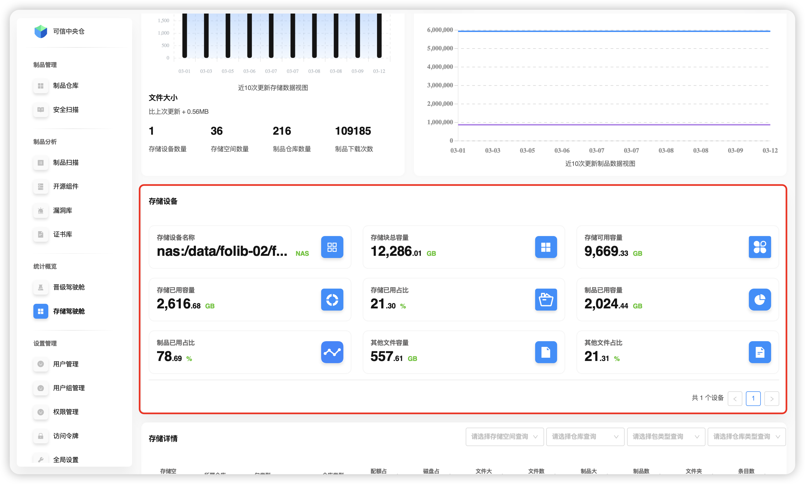
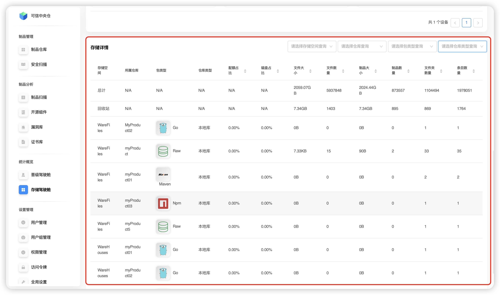

# Кокпит хранения

Используется для просмотра состояния хранения на платформе. Поддерживается глобальный обзор и просмотр по выбранному **пространству хранения**.

## Обзор хранения

В разделе обзора отображаются агрегированные метрики:

- **Размер файлов**
- **Количество файлов**
- **Размер артефактов**
- **Количество артефактов**
- **Количество папок**
- **Количество пространств хранения**
- **Количество репозиториев**
- **Время обновления данных**

Также доступны два графика: **вид хранения за последние 10 обновлений** и **вид артефактов за последние 10 обновлений**.

## Устройства хранения

Платформа показывает сведения и метрики по устройствам хранения, включая:

- **Название устройства хранения**
- **Общий размер блочного хранилища**
- **Доступный объём**
- **Используемый объём**
- **Доля использованного объёма**
- **Объём, занятый артефактами**
- **Доля объёма, занятого артефактами**
- **Объём прочих файлов**
- **Доля объёма прочих файлов**

## Детали хранения

Раздел «Детали» показывает состояние по **репозиториям**, **корзине** и **общему хранилищу**.

Поддерживаются фильтры по следующим полям:

- **Пространство хранения**
- Конкретный **репозиторий**
- **Тип пакета**
- **Тип репозитория**

> **TIP**
> - 💡 Выбор конкретного **репозитория** становится доступен только после выбора **пространства хранения**.  
> - 📚 **Тип пакета** — все типы, поддерживаемые платформой.  
> - 🔍 **Тип репозитория**: _локальный_ и _прокси_.

