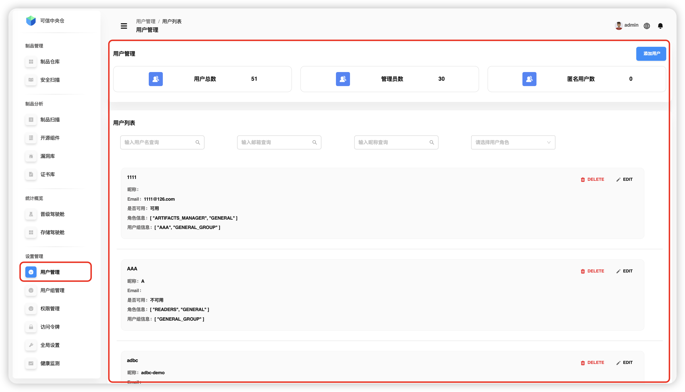

# Управление пользователями

Перейдите: **«Настройки» → «Управление пользователями»**. Модуль предоставляет базовые операции над пользователями — создание, поиск, изменение и удаление. Через назначение встроенных ролей и управление правами редактирования групп обеспечивается корректное разделение доступа.

**Основные возможности:**

1. **Базовые операции с пользователями**
   - создание нового аккаунта;
   - поиск и фильтрация пользователей;
   - редактирование основных данных;
   - деактивация или удаление аккаунта.
2. **Управление ролями**
   - назначение встроенных ролей (администратор, глобальный readonly и др.);
   - гибкая смена ролей.
3. **Права групп**
   - настройка прав редактирования пользователем со стороны групп;
   - контроль доступа к просмотру и изменению данных.

После выполнения операций интерфейс динамически показывает **общее число пользователей**, **число администраторов** и **число анонимных пользователей**.

**Особенности:**

- полный набор базовых операций;
- быстрое назначение встроенных ролей;
- управление правами редактирования через пользовательские группы.

---

## Поиск пользователей

Поддерживаются три точных (не размытных) способа поиска:

- **по имени пользователя** — точное совпадение;
- **по e‑mail** — точное совпадение адреса;
- **по роли** — точное совпадение роли.

> 💡 *Маски и частичные совпадения не поддерживаются.*

В результатах выводятся: имя пользователя, признак «доступен/нет», e‑mail, роли, группы пользователя. Результаты обновляются в реальном времени.

---

## Добавление пользователя

**Только «Системный администратор»** может добавить пользователя — нажмите **«Добавить пользователя»** в правом верхнем углу.

### Настройки профиля

- **Имя пользователя** — должно быть **уникальным**.
- **Пароль** — длина **12–30** символов; минимум **три типа** из: буквы, цифры, спецсимволы `~!@#$%^&*()_.`.  
  Пример: `example666@abc`.
- **Email** — также **уникален**, в стандартном формате (например, `username@example.com`).
- **Активировать** — при включении пользователю разрешается доступ в другие модули. Во втором ряду карточки в списке пользователей признак «доступен/нет» отражает активность учетной записи.

### Настройки ролей

- **ADMIN** — суперпользователь с полным набором прав.
- **ARTIFACTS_MANAGER** — права на загрузку, удаление, перемещение, копирование и **продвижение** артефактов.
- **GENERAL** — базовый доступ: просмотр и скачивание артефактов.
- **OPEN_SOURCE_MANAGE** — управление открытым ПО: проверка лицензий, просмотр результатов сканирования уязвимостей и пр.

### Настройки групп

Список всех групп с названием и описанием. По умолчанию переключатель **включен** — после создания пользователя группы смогут выполнять над ним операции (например, добавлять его в группу).

---

## Изменение пользователя

Найдите учетную запись в списке и нажмите **EDIT** в правом верхнем углу карточки. Доступно редактирование профиля, ролей и групп.

---

## Удаление пользователя

Найдите учетную запись в списке и нажмите **DELETE**. Подтвердите действие во всплывающем диалоге — после подтверждения пользователь будет удален.

