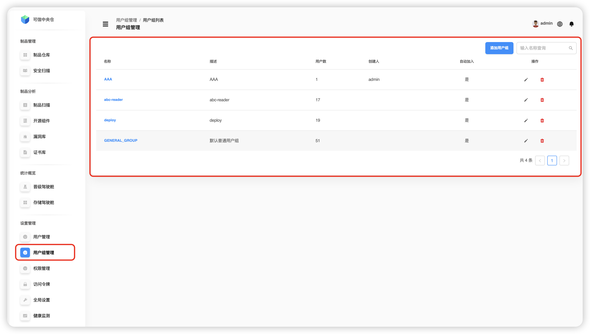

# User Group Management

Go to **“Settings → User Group Management”**. This module lets you create, search, edit, and delete user groups. Groups enable bulk user administration and **auto‑join** for newly created users.

**Key capabilities:**

1. **Group basics**
   - Create a new group
   - Search existing groups
   - Edit group details
   - Delete a group

2. **Group membership**
   - Add users to a group
   - Remove users from a group
   - Adjust members in bulk

3. **Auto‑join**
   - Configure groups that new users automatically join
   - Simplify onboarding and access setup

---

## Search Groups

Type a **group name** in the search box. Results show: **group name**, **description**, **member count**, **creator**, and whether **auto‑join** is enabled for new users.

> 💡 **Tip:** supports **fuzzy matching** and is **case‑insensitive**.

---

## Create a Group

A **System Administrator** can create a group: specify **name** and **description**, toggle **auto‑join** for new users, select **members** and move them between lists using **“>”** / **“<”**, then confirm.

**Field notes:**

- **Group name** — unique identifier to distinguish and find the group.
- **Description** — purpose or notes to help other admins understand the group.
- **Auto‑join** — when enabled, newly created users are added to this group automatically.
- **Member selection** — pick from existing users; search and bulk actions are supported.
- **Move members** — use **“>” / “<”** to add/remove users from the group.

---

## Edit a Group

Click the **edit** icon in the **Operations** column to modify **name**, **description**, toggle **auto‑join**, and **move members** between lists.

---

## Delete a Group

Click the **delete** icon in the **Operations** column and confirm to remove the group.

