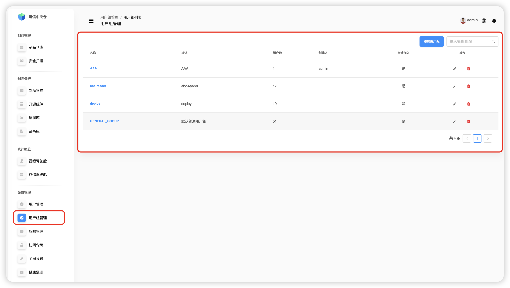
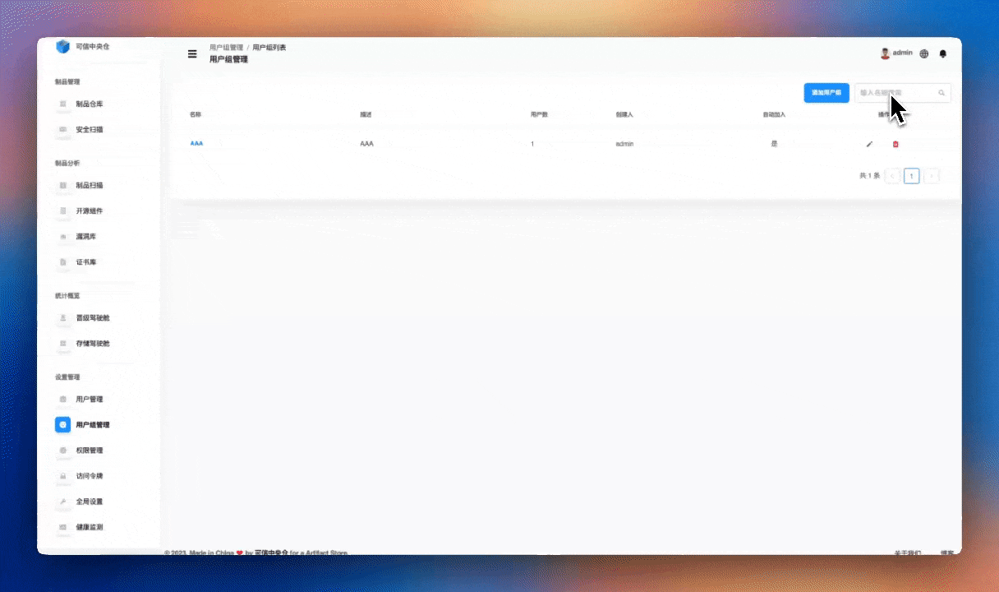
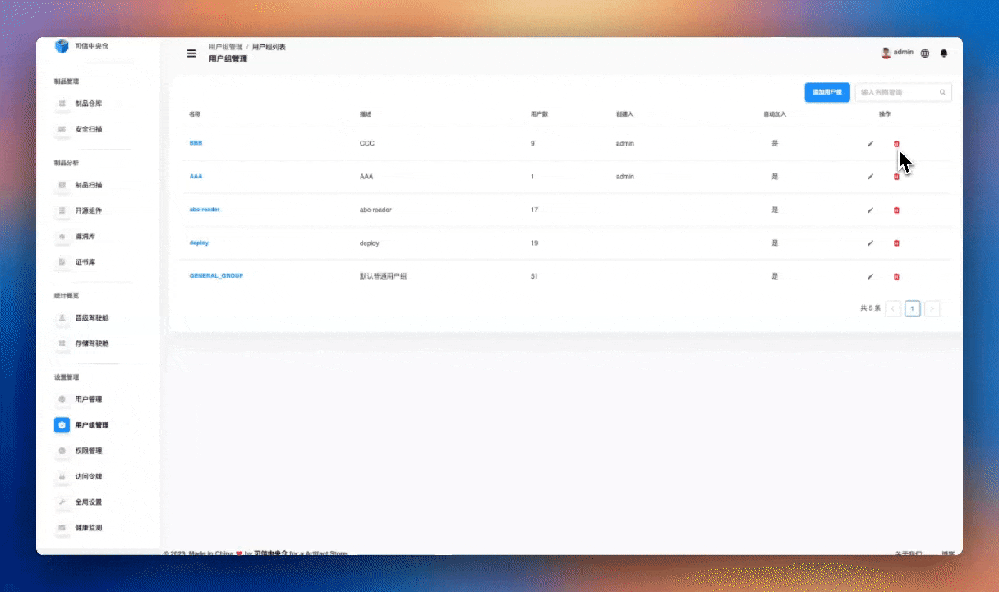

# Управление группами пользователей

Перейдите: **«Настройки» → «Управление группами пользователей»**. Модуль позволяет создавать, искать, изменять и удалять группы. Через группы удобно массово управлять пользователями и настраивать **автодобавление** новых пользователей.

**Основные возможности:**

1. **Базовые операции с группами**
   - Создание новой группы
   - Поиск существующих групп
   - Редактирование сведений о группе
   - Удаление группы

2. **Управление составом группы**
   - Добавление пользователей в группу
   - Удаление пользователей из группы
   - Массовая корректировка участников

3. **Автодобавление**
   - Настройка групп, куда новые пользователи будут добавляться автоматически
   - Упрощение первичной настройки доступа

---

## Поиск групп

В поле поиска введите **название группы** — будет выполнен точный либо частичный (нестрогий) поиск. В результатах отображаются: **название**, **описание**, **количество пользователей**, **создатель**, а также признак **автодобавления** новых пользователей.

> 💡 **Подсказка:** поддерживаются **нечёткий поиск** и **регистронезависимость**.

---

## Добавление группы

Пользователь с ролью **Системный администратор** может создать группу: укажите **название**, **описание**, включите/выключите **автодобавление новых пользователей**, подберите **участников** и перенесите их между списками с помощью кнопок **“>”** и **“<”**, затем подтвердите создание.

**Пояснения к полям:**

- **Название группы** — уникальный идентификатор, по которому группу легко найти и отличить.
- **Описание** — назначение и особенности группы для коллег‑администраторов.
- **Автодобавление** — если включено, все новые пользователи автоматически попадают в эту группу.
- **Выбор участников** — выбирайте из списка существующих пользователей; доступны поиск и массовые операции.
- **Перенос участников** — используйте кнопки **“>” / “<”** для добавления/исключения пользователей из группы.

---

## Изменение группы

Администратор может нажать значок **редактирования** в колонке **«Операции»**. Доступно изменение **названия**, **описания**, переключение **автодобавления**, а также **перенос участников** между списками.

---

## Удаление группы

Администратор может нажать значок **удаления** в колонке **«Операции»** и после повторного подтверждения удалить группу.

