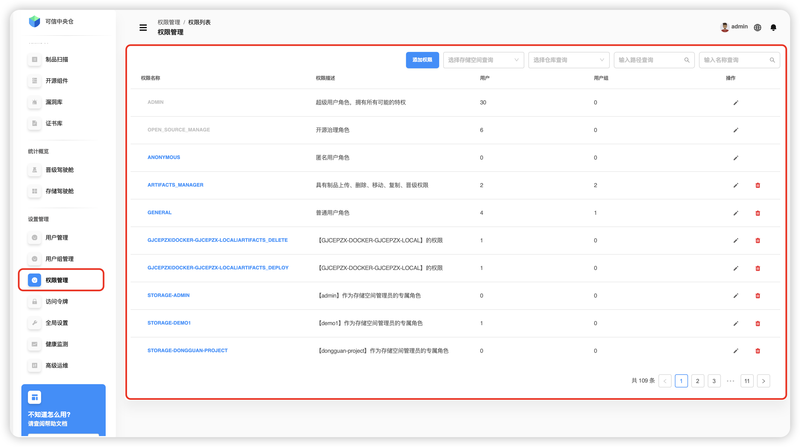

# Permission Management

Path: **Settings → Permission Management**. This module gives fine‑grained control over access to artifact repositories. You can assign access to specific **storages** and **repositories**, and optionally restrict it to particular **paths**, for both **users** and **groups**.

## Capabilities
- Create, search, update, and delete permission rules.
- Resource scoping: select **storage**, **repository**, and **paths**.
- Permission levels: **View/Download**, **Metadata**, **Deploy Cache**, **Delete/Overwrite**, **Repository Admin**.
- Assign permissions to **users** and **groups**.

---

## Search
Filter precisely by **storage name**, **repository name**, **path**, and **permission name**.

---

## Add a Permission
1. **Name & Description.** Click **Add Permission** and enter a **unique name** and a **description**.
2. **Resources.** In *Resources*, click **Select Resources**. You’ll first see storages; expand a storage (the “+” button or click its name) to view its repositories.
3. **Find repository & path.** Use the search next to a repository to locate it, optionally specify **path(s)** to scope the rule, and check the storages/repositories to include.
4. **Users.** In *Users*, pick from the list (or search by username) and move selected entries to the right column.
5. **User permissions.** Choose levels: **View/Download**, **Metadata**, **Deploy Cache**, **Delete/Overwrite**, **Repository Admin**.
6. **Groups.** Do the same in *Groups*: select groups and move them to the right column.
7. **Group permissions.** Choose the required levels for selected groups.
8. **Confirm.** Click **Confirm** (bottom‑right) to save.

---

## Edit a Permission
1. Click the **edit** icon on the desired rule.
2. Update **resources** (storages, repositories, paths) if needed.
3. Adjust **users** and their permission levels.
4. Adjust **groups** and their permission levels.
5. Click **Confirm** to apply changes.

---

## Delete a Permission
Click the **delete** icon on the rule and confirm. The permission rule will be removed.

