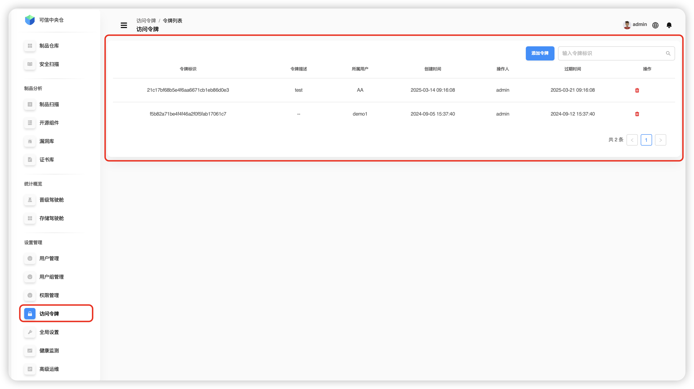
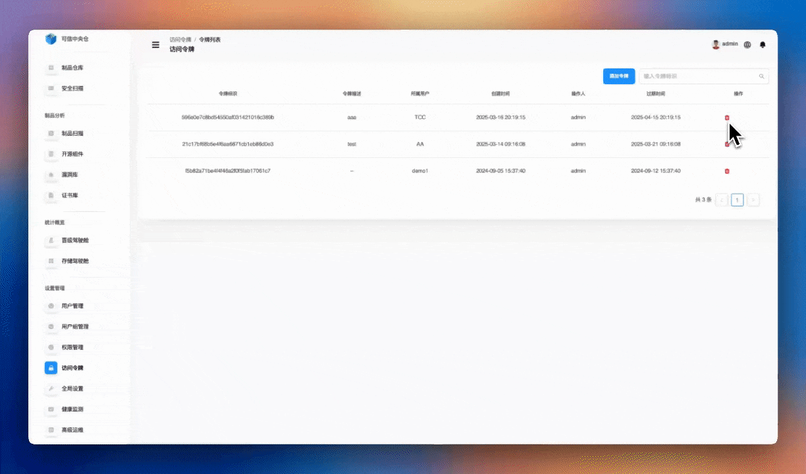

# Управление токенами доступа

Найдите раздел **Настройки → Управление доступом → Управление токенами**. Модуль токенов предоставляет безопасный механизм аутентификации, позволяя получать доступ к ресурсам **без** передачи логина и пароля. Создавайте и управляйте токенами, чтобы гибко контролировать доступ систем и автоматизаций.

## Что можно делать

1. **Базовые операции с токенами**
   - Просмотр списка существующих токенов  
   - Генерация нового токена доступа  
   - Удаление токена  

2. **Настройка свойств токена**
   - Имя (описание) токена  
   - Срок действия токена  
   - Владелец (пользователь, от имени которого используется токен)  
   - Назначение/комментарий  

3. **Типичные сценарии использования**
   - Интеграция в CI/CD-процессы  
   - Подключение сторонних систем  
   - Доступ из автоматизированных скриптов  

**Особенности:** безопасная аутентификация, гибкое управление сроком действия, удобная интеграция, отслеживаемые операции.

---

## Поиск токена доступа

В верхнем поиске введите **идентификатор токена** для точного совпадения.  
> ℹ️ Мягкие/нечёткие совпадения не поддерживаются.

---

## Добавление токена доступа

1. Нажмите **Добавить токен**.  
2. Заполните **описание**.  
3. В поле **Владелец** выберите пользователя.  
4. В поле **Срок действия** укажите дату/время истечения.  
5. Нажмите **Подтвердить** в правом нижнем углу.

---

## Удаление токена доступа

Выберите нужную запись и нажмите значок **Удалить** в столбце действий. Подтвердите удаление.

