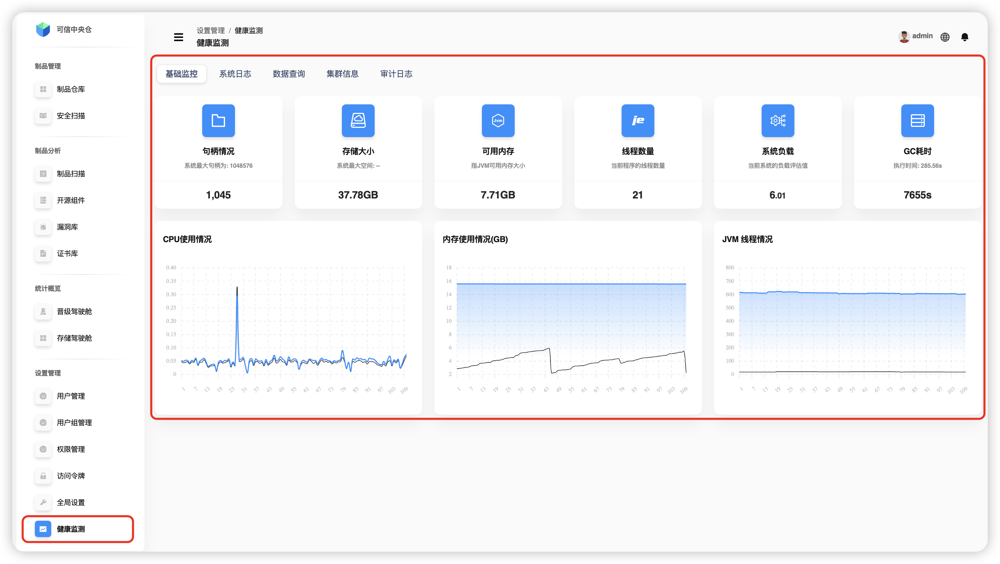
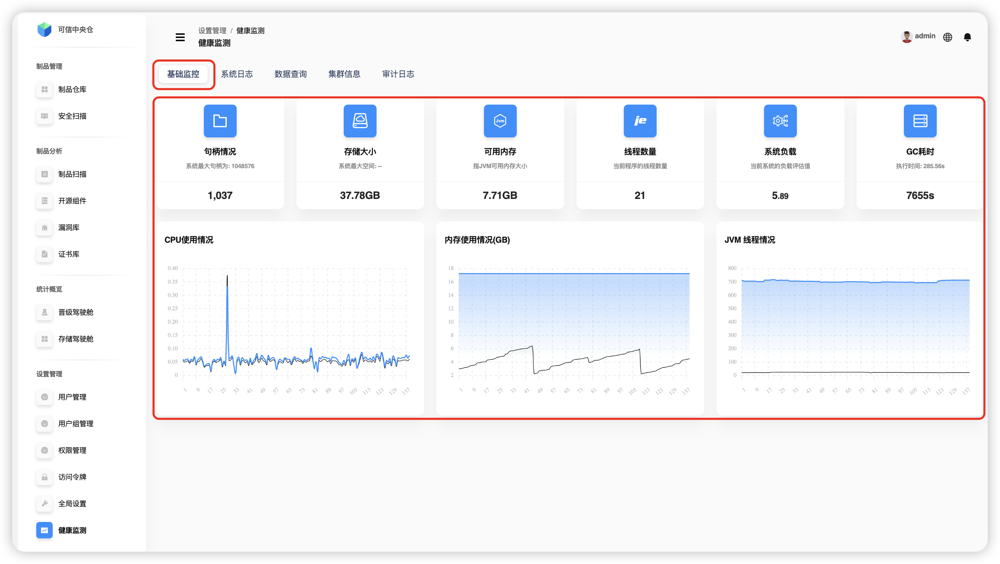
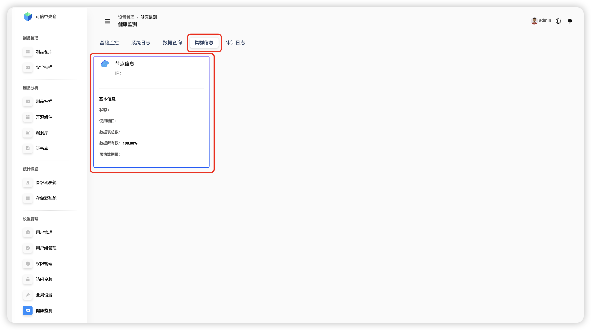

# Health Monitoring

Health Monitoring provides tools to inspect product information and logs, helping you track runtime dynamics and keep the system healthy.

## Basic Monitoring

The server hosting the product is monitored in real time. Key charts — **CPU usage**, **memory usage**, and **JVM threads** — are updated continuously.

| Term | Description |
|---|---|
| Handle status | Remaining available file descriptors (limit of open files/resources). |
| Storage size | Free disk space on the server. |
| Available memory | Amount of JVM memory currently available. |
| Thread count | Current number of process threads. |
| System load | Current system load indicator. |
| GC time | Time spent per garbage-collection cycle. |

## System Logs

A visual view of the product’s runtime log directory. Select a file and use **Sync** to pull the latest log lines into the viewer.

## Data Query

Use **Gremlin** queries to explore graph data and topology results.

> 💡 By default, the built‑in Gremlin server listens on port **8182**.

## Cluster Information

Displays each cluster node’s IP, status, ports, tables, ownership percentage, estimated data size, and more.

## Audit Logs

Filter and review audit events by module, and constrain results by a time range.

