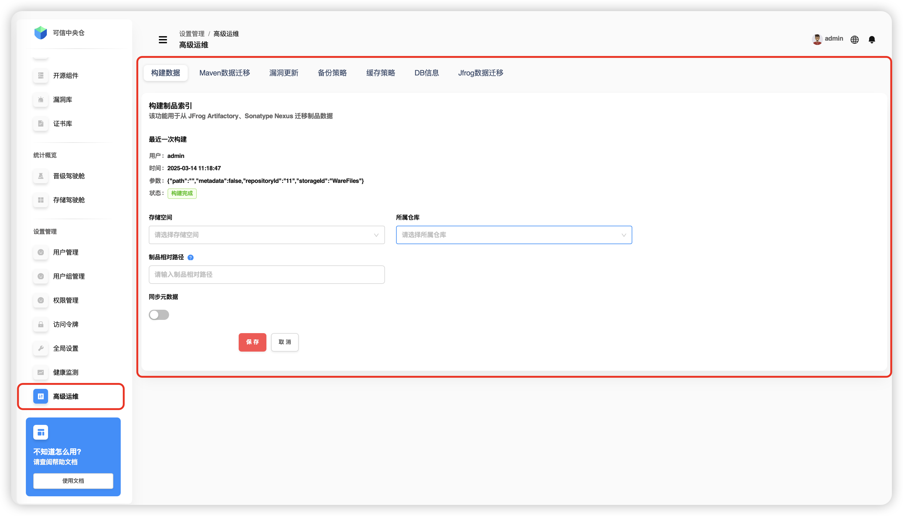
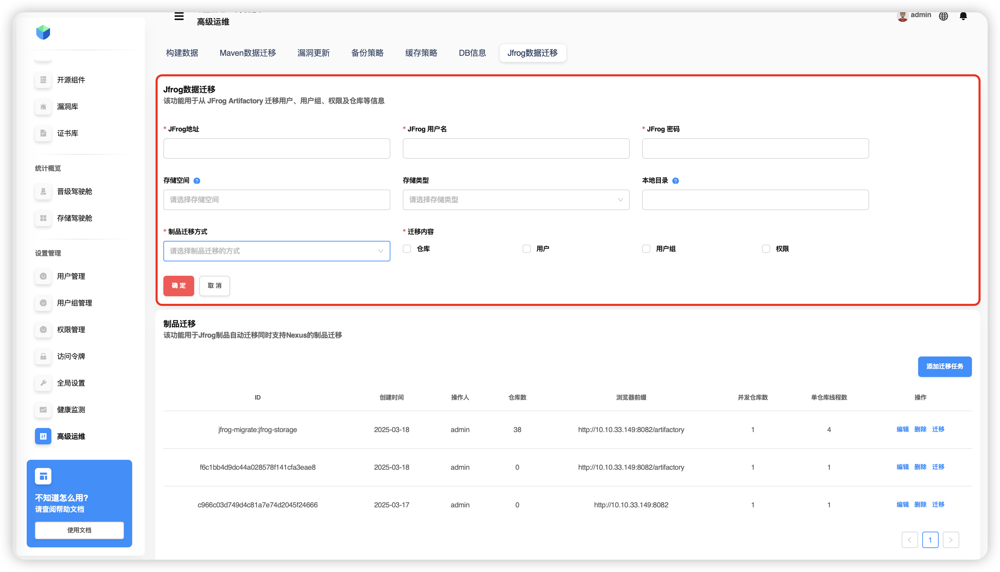

# Advanced Operations

## Build Data

Quickly migrate existing artifacts from **JFrog Artifactory** and **Sonatype Nexus** into **Folib**. This helps teams switch systems with minimal effort.

**Steps:**  
1. Go to **Settings → Advanced Operations**.  
2. Click **Build Data**.  
3. **Select** the target **storage** and **repository**.  
4. **Enter** the relative **path** of artifacts to index/migrate.  
5. Click **Save**.  
6. Confirm in the dialog.  
7. The system **builds data** (migrates from source repository).  
8. The top area shows **status** and the **latest build** info.

**Latest build parameters:**

| Parameter | Description |
|---|---|
| `path` | Relative path to build the index (e.g., `com.jfrog`). |
| `metadata` | Whether to include metadata (`true` includes versions, dependencies, etc.). |
| `repositoryId` | Repository identifier (e.g., `m1`). |
| `storageId` | Storage identifier (e.g., `demo-storages`). |

> **TIP**  
> • The build runs **asynchronously**; click the status to manually stop it.  
> • If the path is empty, the **repository root** is used. The path is always **relative to the repository**.

---

## Maven Data Migration

Accelerated import from **Artifactory/Nexus** into **Folib** via **MavenIndexer**, with configurable **batch size**. Target repositories must be **proxy repositories** pre‑configured with remote URLs and credentials for Artifactory/Nexus.

**Steps:**  
1. Go to **Settings → Advanced Operations**.  
2. Click **Maven Data Migration**.  
3. Select **storage** and **repository**.  
4. Enter the **path** to index/migrate.  
5. Set the **batch size**.  
6. Click **Save** and confirm.

> **TIP**  
> • The process is **asynchronous** and relies on previously built indexes.  
> • Batch size balances load, reduces failures, and simplifies recovery.

**Recommendations:**  
- Back up before migration.  
- Ensure stable network and sufficient storage.  
- Run large migrations during off‑peak hours.

---

## Vulnerability Update

Updates the local **vulnerability database** and triggers a **full scan** of repositories with scanning enabled. View results in **Artifacts → Security Scanning → Repository Scan Status / Platform Vulnerabilities**.

**Steps:**  
1. Go to **Settings → Advanced Operations**.  
2. Click **Vulnerability Update**.  
3. Click **Update Manually**.  
4. In “Latest Update”, click the **Updating** status (lock icon) to stop the task manually.  
5. Enter a **cron** rule (e.g., `0 0 12 * * ?`) and click **Schedule Update**.  
6. Click **Delete Task** to remove the schedule.  
7. Click **Scan Now** for an immediate full scan, or set a **scheduled scan** (same flow as update).

**Cron example `0 0 12 * * ?`:**  
- **Seconds** `0` — at second 0.  
- **Minutes** `0` — at minute 0.  
- **Hours** `12` — at 12:00.  
- **Day** `*` — every day.  
- **Month** `*` — every month.  
- **Day‑of‑week** `?` — not specified (day field is used).

---

## Backup Strategy

Configure backups for artifacts under specified repository directories.

**Steps:**  
1. Go to **Settings → Advanced Operations**.  
2. Click **Backup Strategy**.  
3. Select **target repositories** and **one directory** in each (you may pick multiple repositories, but only one folder path).  
4. Click **Save** and confirm to start the backup.  
5. Use the search on the right to **fuzzy search** by storage/repository to view backup info.  
6. The system shows the backup path: **storage + repository + directory**.

---

## Caching Strategy

Configure **SSD‑based caching** to accelerate artifact access.

**Steps:**  
1. Go to **Settings → Advanced Operations**.  
2. Click **Caching Strategy**.  
3. **Enable caching**, fill in the policy and **save** (if disabled, it’s saved as a profile only).  
4. Set: **cache directory**, **capacity**, **min/max file size**, **cleanup threshold (%)**, **cleanup ratio (%)**.  
5. **Cancel** clears the form. **Clear** wipes the cache directory after confirmation.

> **TIP**  
> • **Cache directory** in containerized deployments must be mounted to a persistent volume.  
> • **Cache capacity** units: MB/GB/TB.  
> • **Min/Max file size** units: KB/MB/GB.  
> • **Cleanup threshold**: e.g., `90` → start cleanup at ≥ 90% usage.  
> • **Cleanup ratio**: e.g., `10` → when triggered, free at least 10% of capacity.

---

## DB Info

### Schema

Shows the graph database structure.

1. Go to **Settings → Advanced Operations**.  
2. Open **DB Info → Schema**.

**Contents:**

**Vertex Labels**  
- Artifact coordinates (Maven, Docker, NPM, etc.)  
- Component  
- Artifact  
- Vulnerability  
- User  
- SecurityRole

**Edge Labels**  
- `ArtifactHasTags` — artifact ↔ tags  
- `ArtifactHasVulnerabilities` — artifact ↔ vulnerabilities  
- `UserHasSecurityRoles` — user ↔ roles  
- `ComponentHasVulnerabilities` — component ↔ vulnerabilities

**Property Keys**  
- Basics: `name`, `description`, `version`  
- Security: `vulnerabilityID`, `safeLevel`  
- Time: `created`, `lastUpdated`  
- Files: `sizeInBytes`, `checksums`  
- Users: `username`, `password`

**Graph Indexes**  
- By `UUID`  
- By storage space  
- By user type  
- By email

### Index Operations

1. Go to **Settings → Advanced Operations**.  
2. Open **DB Info → Index Operations**.  
3. Enter an index name and click **Rebuild Index** (confirm).  
   - Removes fragmentation and improves performance.  
   - Prefer off‑peak time windows.  
4. Enter an index name and click **Register Index** (confirm).  
   - Create a new index: choose keys and type; consider data distribution and query patterns.

**When to use indexes:**  
- Speed up queries on large datasets.  
- Enable fast search, sorting, grouping.  
- Balance performance vs. maintenance cost.  
- Optimize for real query patterns and update rates.

### Instance Operations

Manage database instances.

> **TIP**  
> If there is only one instance, it is the active one and **cannot be deleted**.

---

## JFrog Data Migration

Direct migration from **JFrog**: provide server URL, username and password, then choose what to migrate and the target storage.

**Steps:**  
1. Go to **Settings → Advanced Operations**.  
2. Click **JFrog Data Migration**.  
3. Enter server URL/username/password, then select content and storage.

> **TIP**  
> **Storage space** refers to where synchronized JFrog repositories will live. You can select an existing one, create a new one, or leave empty to create a default local storage space.
