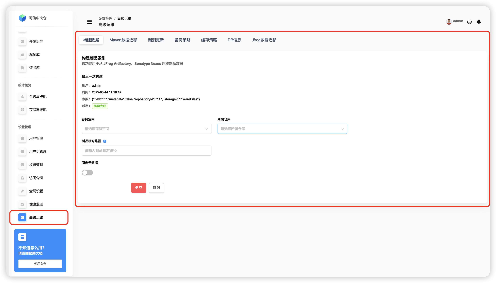
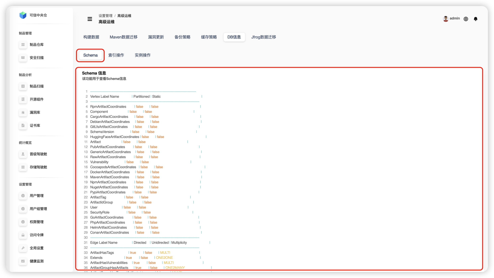
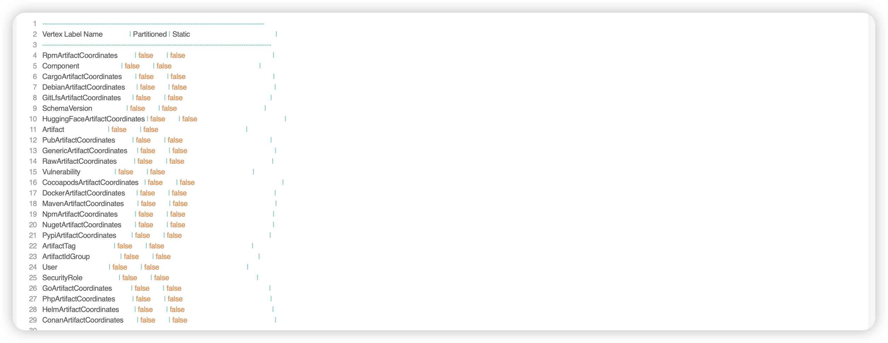
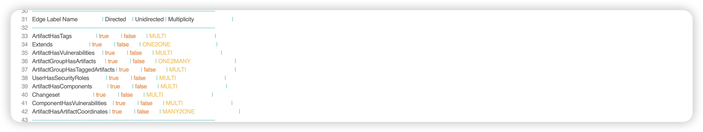
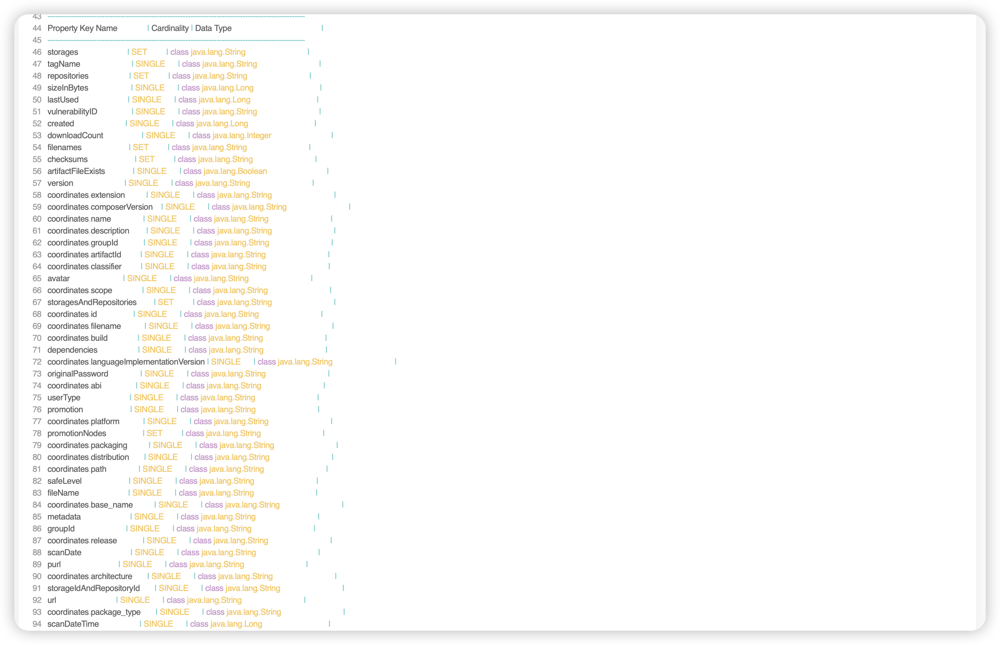
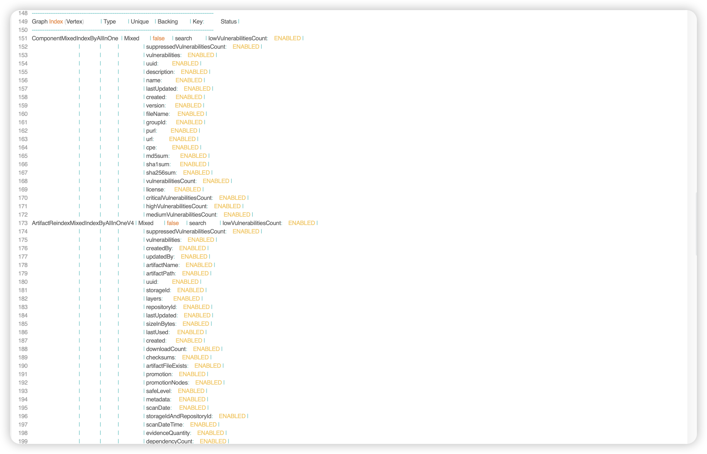
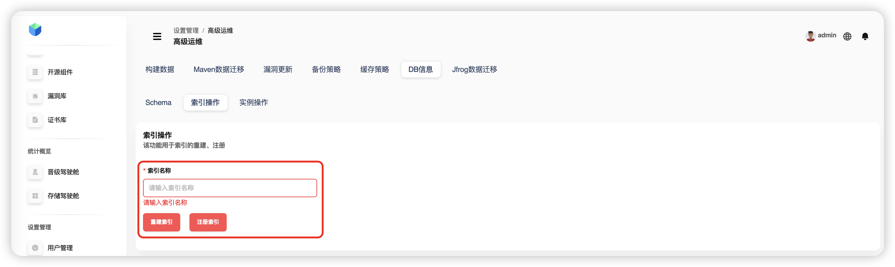
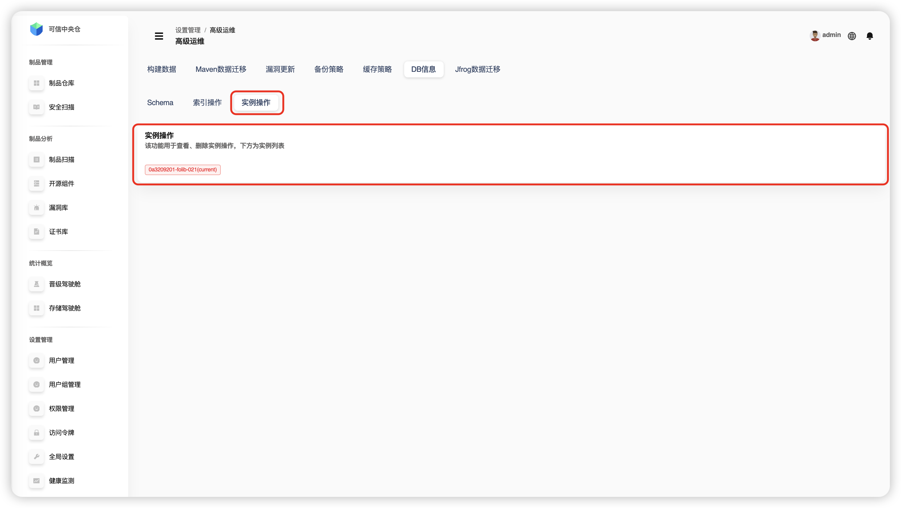
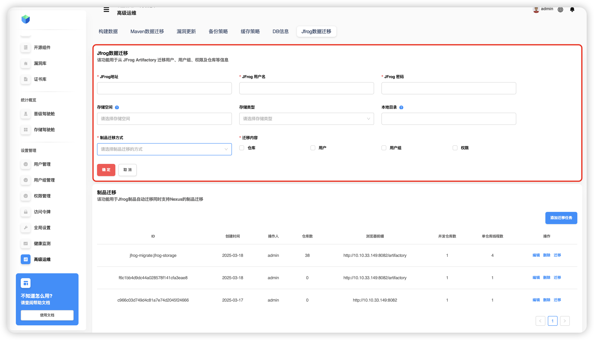

# Расширенное администрирование

## Построение данных

Функция для быстрого переноса накопленных данных из **JFrog Artifactory** и **Sonatype Nexus** в **Folib**. Помогает быстро переключиться на новую систему.

**Шаги:**  
1. Откройте **«Настройки» → «Расширенное администрирование»**.  
2. На странице **«Расширенное администрирование»** выберите **«Построение данных»**.  
3. **Выберите хранилище и репозиторий** назначения.  
4. **Укажите относительный путь** артефактов для индексации/переноса.  
5. Нажмите **«Сохранить»**.  
6. Подтвердите действие во всплывающем окне.  
7. Дождитесь **построения данных** (переноса из исходного репозитория).  
8. Вверху отображаются **статус** и **информация о последнем построении**.

**Параметры последнего построения:**

| Параметр | Описание |
|---|---|
| `path` | Относительный путь для построения индекса (например, `com.jfrog`). |
| `metadata` | Включать ли метаданные (`true` – включать версии, зависимости и т. п.). |
| `repositoryId` | Идентификатор репозитория (например, `m1`). |
| `storageId` | Идентификатор пространства хранения (например, `demo-storages`). |

> **TIP**  
> • Построение выполняется **асинхронно**; по клику на статус можно вручную остановить задачу.  
> • Если путь не указан — используется **корень репозитория**. Путь всегда задаётся **относительно репозитория**.

---

## Миграция данных Maven

Ускоренный перенос данных из **Artifactory/Nexus** в **Folib** через **MavenIndexer** с настройкой **размера пачки**. Целевые репозитории должны быть **прокси‑репозиториями** с заранее настроенными удалёнными адресами, логином и паролем к Artifactory/Nexus.

**Шаги:**  
1. Откройте **«Настройки» → «Расширенное администрирование»**.  
2. Нажмите **«Миграция данных Maven»**.  
3. Выберите **пространство хранения** и **репозиторий**.  
4. Укажите **путь** для индексации/переноса.  
5. Задайте **размер батча**.  
6. Нажмите **«Сохранить»** и подтвердите действие.

> **TIP**  
> • Процесс выполняется **асинхронно** и основан на ранее построенных индексах.  
> • Размер батча помогает сбалансировать нагрузку, снизить риск ошибок и упростить восстановление.

**Рекомендации:**  
- Делайте резервные копии перед миграцией.  
- Проверьте стабильность сети и объём свободного места.  
- Массовые миграции — в периоды низкой нагрузки.

---

## Обновление сведений об уязвимостях

Обновляет локальную **базу уязвимостей** и запускает **полное сканирование** включённых репозиториев. Результаты смотрите в **«Управление артефактами → Безопасное сканирование → Состояние репозиториев / Уязвимости платформы»**.

**Шаги:**  
1. Откройте **«Настройки» → «Расширенное администрирование»**.  
2. Нажмите **«Обновление уязвимостей»**.  
3. Нажмите **«Обновить вручную»**.  
4. В блоке «Последнее обновление» по клику на статус **«Обновляется»** можно вручную завершить задачу (замок).  
5. Введите правило **cron** (например, `0 0 12 * * ?`) и нажмите **«Планировать обновление»**.  
6. Чтобы отменить план — нажмите **«Удалить задачу»**.  
7. Для сканирования нажмите **«Сканировать сейчас»** или настройте **плановое сканирование** (аналогично обновлению).

**Пример cron `0 0 12 * * ?`:**  
- **Секунды** `0` — запуск на 0‑й секунде.  
- **Минуты** `0` — на 0‑й минуте.  
- **Часы** `12` — в 12:00.  
- **Дни** `*` — каждый день.  
- **Месяцы** `*` — каждый месяц.  
- **День недели** `?` — не указан (используется поле «Дни»).

---

## Стратегия резервного копирования

Настройка резервного копирования артефактов для указанных директорий репозитория.

**Шаги:**  
1. Откройте **«Настройки» → «Расширенное администрирование»**.  
2. Выберите **«Стратегия бэкапа»**.  
3. Укажите **целевые репозитории** и **единую директорию** в каждом (разрешено выбрать несколько репозиториев, но только один каталог).  
4. Нажмите **«Сохранить»** и подтвердите запуск.  
5. Справа можно выполнять **поиск по пространству/репозиторию** (нечёткий).  
6. Система покажет путь бэкапа: **пространство + репозиторий + каталог**.

---

## Стратегия кэширования

Конфигурация ускоряющего **SSD‑кэша** для артефактов.

**Шаги:**  
1. Откройте **«Настройки» → «Расширенное администрирование»**.  
2. Нажмите **«Стратегия кэширования»**.  
3. Переключателем **включите кэш**, задайте параметры и **сохраните** (если выключено — сохраняется как профиль без применения).  
4. Укажите: **каталог кэша**, **ёмкость**, **минимальный и максимальный размер файла**, **условие очистки (%)**, **долю очистки (%)**.  
5. **«Отмена»** — очистить форму. **«Очистить»** — удалить содержимое каталога кэша (с подтверждением).

> **TIP**  
> • **Каталог кэша** при контейнерном развертывании должен быть смонтирован во внешний том.  
> • **Ёмкость кэша**: единицы MB/GB/TB.  
> • **Мин./макс. размер файла** для кэширования: единицы KB/MB/GB.  
> • **Условие очистки**: например, `90` — начинать чистку при ≥ 90% заполнения.  
> • **Доля очистки**: например, `10` — при срабатывании условия освободить ≥ 10% ёмкости.

---

## DB‑информация

### Schema

Показывает структуру графовой БД.

1. Откройте **«Настройки» → «Расширенное администрирование»**.  
2. Перейдите в **«DB‑информация» → «Schema»**.

**Содержимое:**

**Vertex Label (метки вершин)**  
- Координаты артефактов (Maven, Docker, NPM и др.)  
- Компонент (**Component**)  
- Артефакт (**Artifact**)  
- Уязвимость (**Vulnerability**)  
- Пользователь (**User**)  
- Роль безопасности (**SecurityRole**)

**Edge Label (метки рёбер)**  
- `ArtifactHasTags` — связь артефакта с тегами  
- `ArtifactHasVulnerabilities` — связь артефакта с уязвимостями  
- `UserHasSecurityRoles` — связь пользователя с ролями  
- `ComponentHasVulnerabilities` — связь компонента с уязвимостями

**Property Keys (ключи свойств)**  
- Базовые: `name`, `description`, `version`  
- Безопасность: `vulnerabilityID`, `safeLevel`  
- Время: `created`, `lastUpdated`  
- Файлы: `sizeInBytes`, `checksums`  
- Пользователи: `username`, `password`

**Graph Index (индексы)**  
- По `UUID`  
- По пространству хранения  
- По типу пользователя  
- По адресу электронной почты

### Операции с индексами

1. Откройте **«Настройки» → «Расширенное администрирование»**.  
2. Перейдите в **«DB‑информация» → «Операции с индексами»**.  
3. Введите имя индекса и нажмите **«Перестроить индекс»** — подтвердите действие.  
   - Устраняет фрагментацию, улучшает структуру и производительность.  
   - Запускайте в периоды низкой нагрузки.  
4. Введите имя и нажмите **«Зарегистрировать индекс»** — подтвердите.  
   - Создание нового индекса: выбор ключей и типа; учитывайте распределение данных и шаблоны запросов.

**Когда использовать индексы:**  
- Ускорение выборок на больших объёмах данных.  
- Быстрый поиск, сортировка, группировка.  
- Баланс между скоростью запросов и стоимостью обслуживания.  
- Оптимизация под реальные шаблоны запросов и частоту обновлений.

### Операции с инстансами

Функции управления экземплярами БД.

> **TIP**  
> Если экземпляр единственный, это текущий рабочий инстанс — **удаление недоступно**.

---

## Миграция данных JFrog

Прямой перенос из **JFrog**: укажите адрес, имя пользователя и пароль, затем выберите содержимое для миграции и целевое пространство хранения.

**Шаги:**  
1. Откройте **«Настройки» → «Расширенное администрирование»**.  
2. Выберите **«Миграция данных JFrog»**.  
3. Заполните адрес/логин/пароль, затем выберите содержимое и пространство хранения.

> **TIP**  
> **Пространство хранения** — это пространство для синхронизируемых репозиториев JFrog. Можно выбрать существующее, создать новое, или оставить пустым — тогда будет создано новое локальное пространство по умолчанию.
