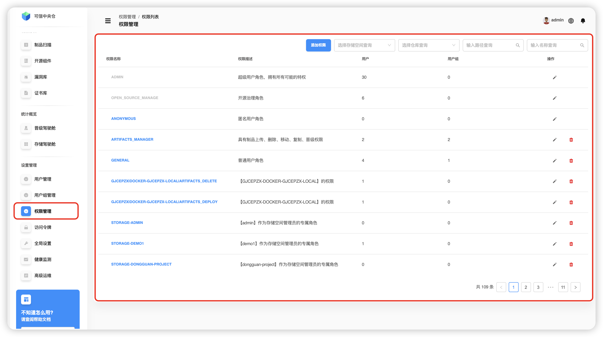
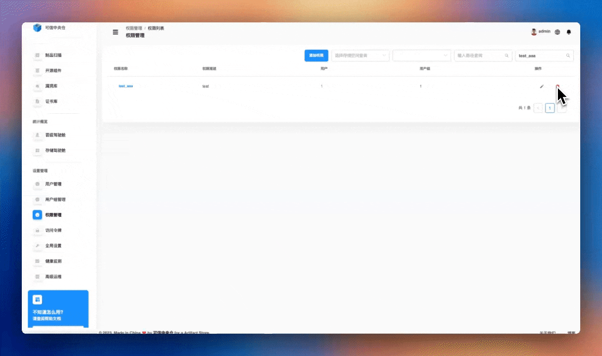

# Управление правами

Перейдите: **Настройки → Управление правами**. Модуль позволяет тонко контролировать доступ к хранилищам артефактов. Через правила прав можно назначать пользователям и группам доступ к конкретным **хранилищам (Storage)** и **репозиториям (Warehouse)**, а также сузить его до нужных путей.

## Что умеет
- Создание, поиск, изменение и удаление правил.
- Контроль ресурсов: выбор **хранилища**, **репозитория**, настройка **путей** и области действия.
- Уровни прав: **просмотр/скачивание**, **метаданные**, **кэш деплоя**, **удаление/перезапись**, **управление репозиторием**.
- Назначение прав **пользователям** и **группам**.

---

## Поиск прав
Точно фильтруйте правила по: **названию хранилища**, **названию репозитория**, **пути**, **названию правила**.

---

## Добавление права
1. **Имя и описание.** Нажмите **Добавить право**, задайте **уникальное имя** и **описание**.
2. **Ресурсы.** В блоке *Ресурсы* нажмите **Выбрать ресурсы**. Сначала откроется список хранилищ. Раскройте хранилище (кнопка «+» или клик по названию), чтобы увидеть его репозитории.
3. **Поиск репозитория и путь.** По кнопке поиска у репозитория найдите нужный, при необходимости укажите **путь(и)** внутри него. Отметьте хранилища/репозитории, к которым даёте доступ.
4. **Пользователи.** В блоке *Пользователи* выберите из списка (или найдите по имени) и переместите выбранных в правую колонку.
5. **Права для пользователей.** Отметьте уровни: **просмотр/скачивание**, **метаданные**, **кэш деплоя**, **удаление/перезапись**, **управление репозиторием**.
6. **Группы.** Аналогично выберите группы и переместите их в правую колонку.
7. **Права для групп.** Отметьте нужные уровни для групп.
8. **Подтверждение.** Нажмите **Подтвердить** в правом нижнем углу.

---

## Изменение права
1. В строке нужного правила нажмите **изменить**.
2. При необходимости обновите **ресурсы** (хранилища, репозитории, пути).
3. Перенастройте **пользователей** и их уровни прав.
4. Перенастройте **группы** и их уровни прав.
5. Сохраните изменения кнопкой **Подтвердить**.

---

## Удаление права
В строке правила нажмите **удалить** и подтвердите действие. Правило будет удалено.

