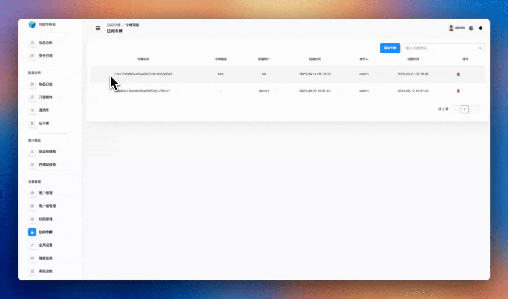
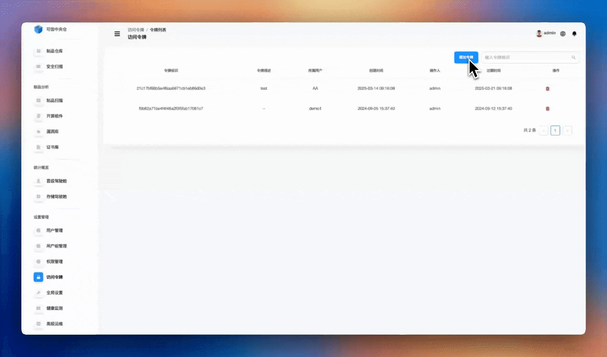

# Access Token Management

Open **Settings → Access Control → Access Tokens**. This module provides a secure authentication mechanism that lets you access resources **without** sending a username and password. Create and manage tokens to achieve safe and flexible access control for systems and automations.

## What you can do

1. **Token basics**
   - View existing tokens  
   - Generate a new access token  
   - Delete a token  

2. **Token properties**
   - Token name/description  
   - Expiration time  
   - Token owner (user the token acts as)  
   - Usage notes/purpose  

3. **Common use cases**
   - CI/CD pipeline integrations  
   - Third‑party system integrations  
   - Automated scripts access  

**Highlights:** secure auth, flexible expiration, easy integrations, auditable actions.

---

## Search access tokens

Enter the **token identifier** for an exact match.  
> ℹ️ Fuzzy search is **not** supported.

---

## Create an access token

1. Click **Add Token**.  
2. Fill in the **description**.  
3. Select the **owner** user.  
4. Set the **expiration** time.  
5. Click **Confirm** to finish.

---

## Delete an access token

Select a token and click the **Delete** icon in the actions column. Confirm the operation.

