# Global Settings

In **Global Settings** you can configure: **Global Configuration**, **Security Policies**, **LDAP**, **SSO**, **Metadata**, **Node Distribution**, **Federated Promotion Policies**, **Custom Layouts**, **Webhook**, **Audit**, and **Global Schedules**.

---

## Global Configuration

### 1) Basic Info
Admins (**admin role**) can set the application name, base URL and server port.

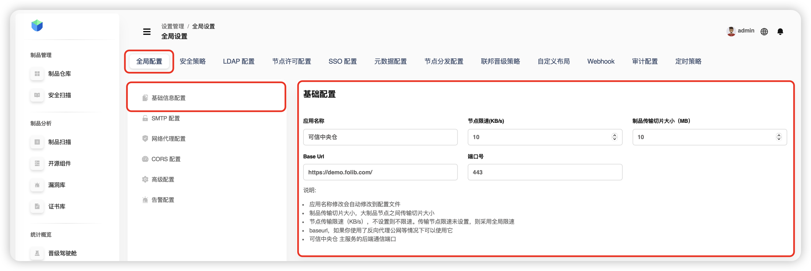

> **Tip**
>
> - Typical deployment is inside a private network and exposed via a reverse proxy. In that case set the public domain/IP in `baseurl` and the port.  
> - Changing the app name is persisted to the config file.  
> - `baseurl`: use it when serving behind a reverse proxy.  
> - `folib-Server`: backend service port.

### 2) SMTP
Configure system email: username, password, `HOST`, port and protocol.

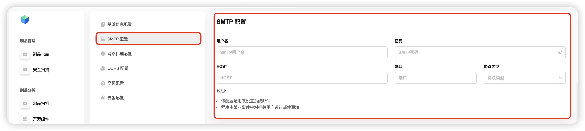

> **Tip**
>
> Certain platform events send email notifications.

### 3) Network Proxy
A platform‑wide proxy. Parameters:
- **Proxy username** — authentication user.
- **Proxy password** — authentication secret.
- **Proxy host** — IP/domain of the proxy server.
- **Port** — e.g. `8080`.
- **Proxy type** — `HTTP`, `SOCKS4/SOCKS5`, **transparent**, **anonymous**.

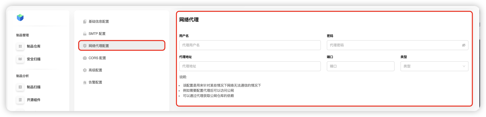

> **Tip**
>
> Proper configuration is critical.  
> **Use cases:** when your host has no direct Internet access, set a proxy to  
> • reach public networks,  
> • fetch dependencies from public repositories.

### 4) CORS
Cross‑origin requests policy. Add allowed origins or flip **Enable** to lift origin restrictions globally.

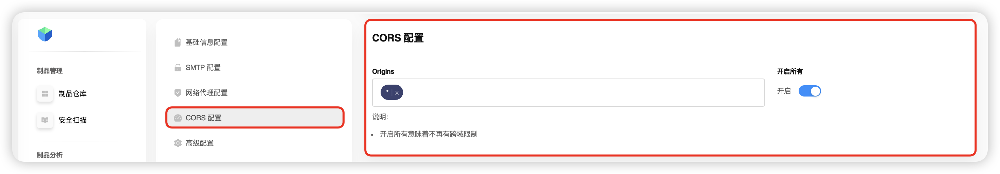

---

## Security Policy

Go to **Settings → Global Settings → Security Policy**.

### 1) Whitelist
Mark vulnerabilities/licenses as trusted (with an expiration period):
- During validity they’re ignored by the system (no alarms).
- Use for risks you’ve assessed as acceptable.

> **Tip**
>
> Whitelists are available for **Vulnerabilities** and **Licenses**.

### 2) Blacklist
Strict control for high‑risk items:
- Add **vulnerability IDs**, **licenses** and **packages** (with validity period).
- While valid, the items are **blocked** from download/use.

> **Tip**
>
> Version constraints are supported, e.g. **`<= 2.1.10`** blocks all versions up to and including 2.1.10; later versions remain available.

### 3) Notifications
Configure global alerting:
- Risk‑level threshold,
- Recipient scope,
- Trigger conditions.

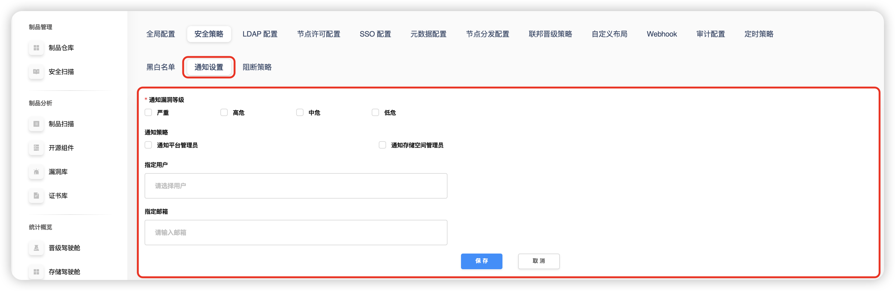

### 4) Blocking Rules
Automated blocking policies:
- **Per‑repository** blocking,
- **Vulnerability** whitelist/blacklist blocking,
- **Package name** blocking (exact match / version rules),
- **License** whitelist/blacklist blocking.

---

## LDAP

For unified sign‑on via corporate directory: enter basic settings, then proceed to **user‑role mapping**.

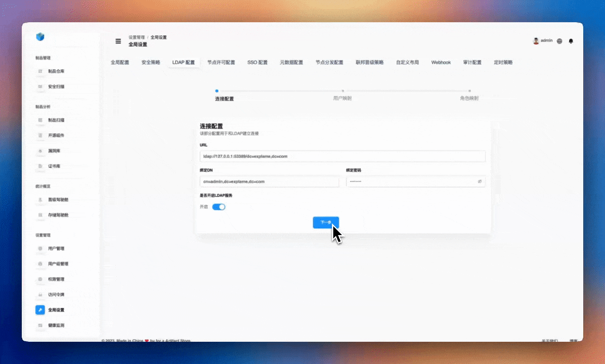

---

## Node License

Paste your license content into the field on the right and click **Activate**.

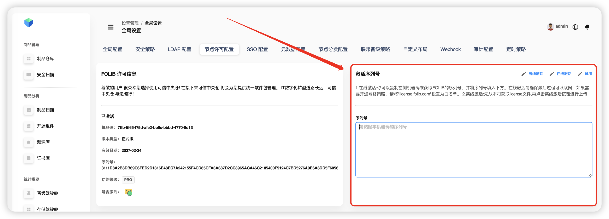

> **Tip**
>
> - **Production** activation requires Internet access.  
> - **Trial** activation works up to 1 month and does not require Internet.  
> - If the host is offline, route activation through a global proxy on a machine that has Internet access.

---

## SSO

Add client entries to hand off authentication to a third‑party IdP.

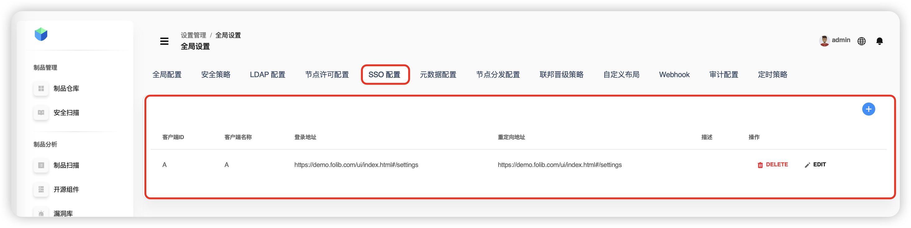  
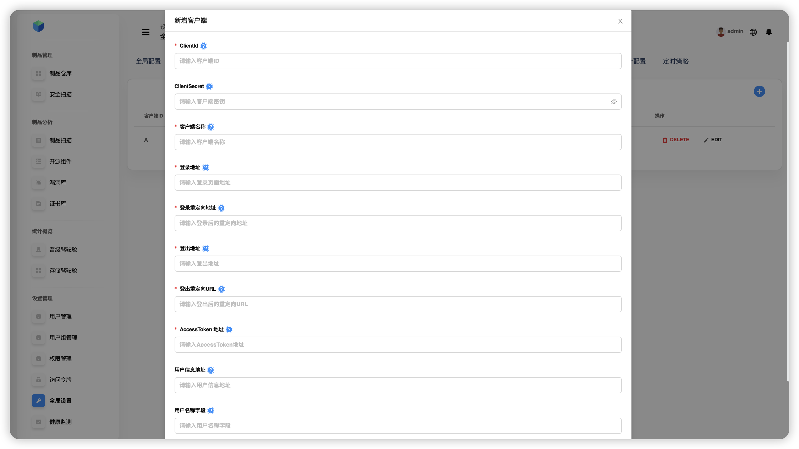

**Fields:**
- `clientId` — unique client ID.
- **Client name**.
- **Login URL** — SSO login page URL provided by IdP.
- **Logout URL** — endpoint to terminate session on IdP.
- **Post‑logout redirect URL**.
- **Post‑login redirect URL**.
- **Token endpoint URL** — to fetch access tokens.
- **Description** — free‑form notes.

---

## Metadata

Configure artifact metadata types (appear in the type dropdown when editing metadata).

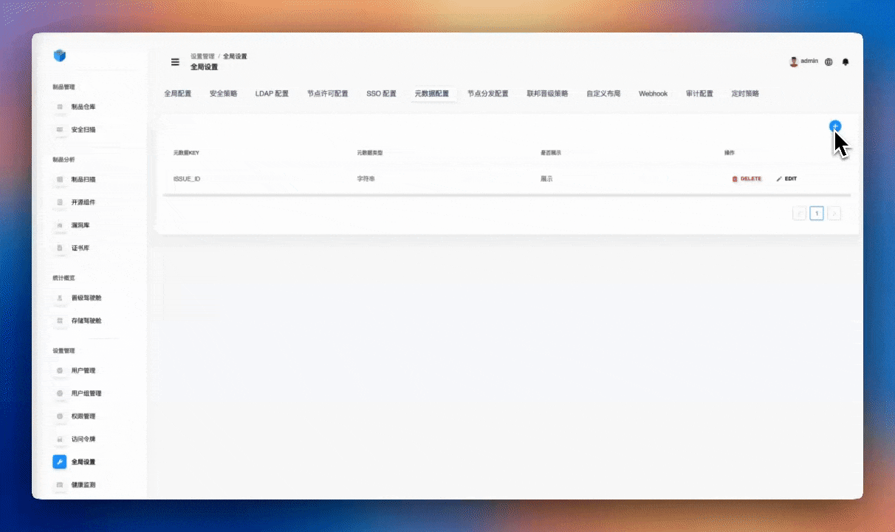

---

## Node Distribution

Configure **internal** and **external** cluster nodes for distribution/replication.

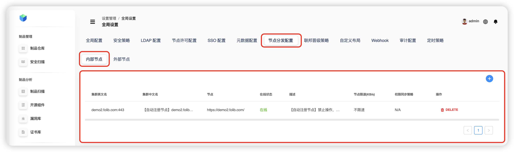  
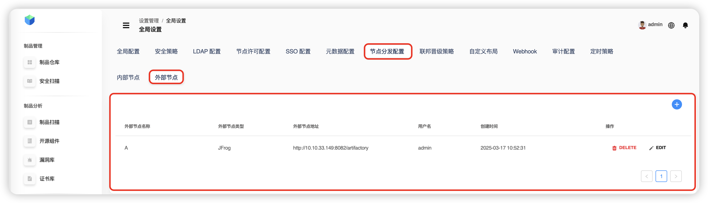

---

## Federated Promotion Policies

View all policies with their source/target repositories, created time and owner. You can create, edit and delete policies.

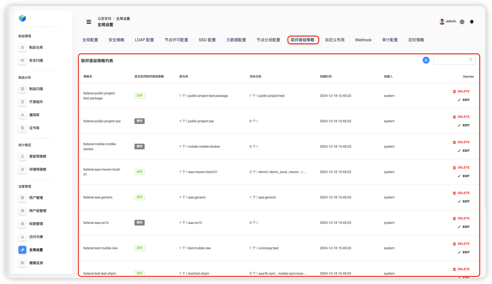

---

## Custom Layouts

Browse and edit existing layouts or create new ones.

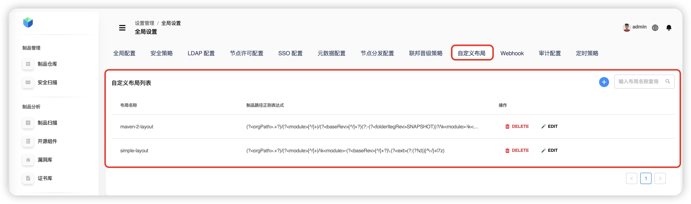

---

## Webhook

Set the callback URL, **X-Token** header (access token), and select event triggers.

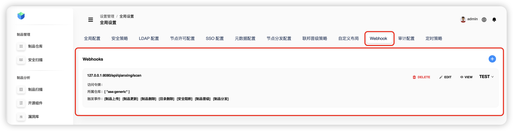  
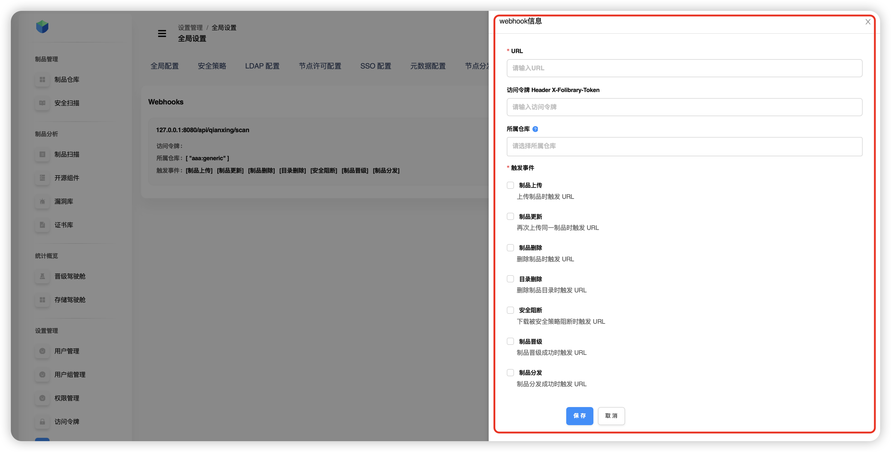

**Triggers:**
- Artifact uploaded,
- Artifact updated (same artifact re‑uploaded),
- Artifact downloaded,
- Artifact deleted,
- Directory deleted,
- **Security block** (download blocked by policy).

---

## Audit

Global audit settings covering: **artifact repositories**, **system settings**, **advanced operations**, **user management**.

---

## Global Schedules

Configure platform‑wide scheduled tasks for repositories.

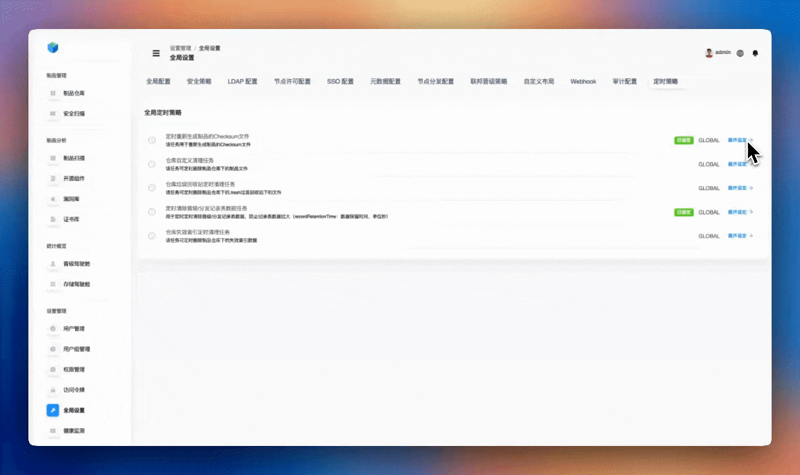
