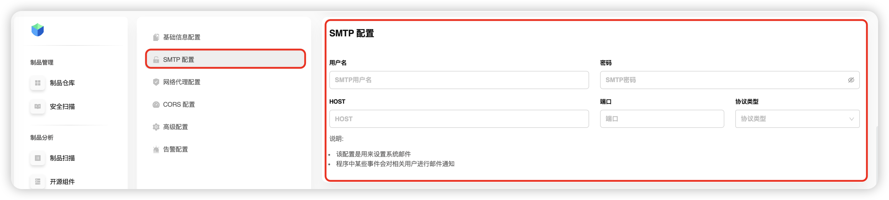
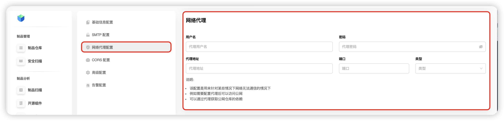
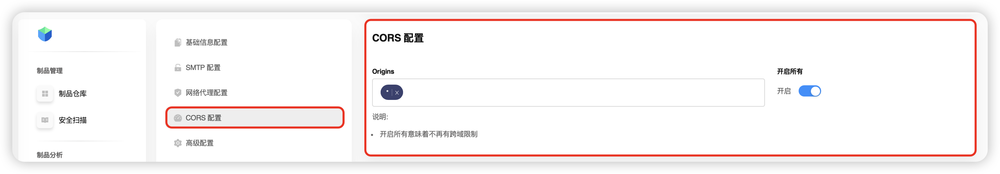
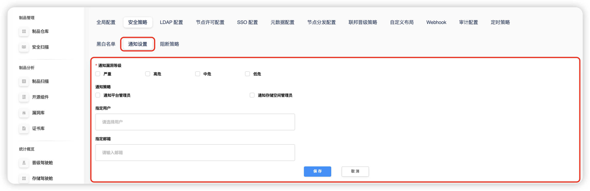
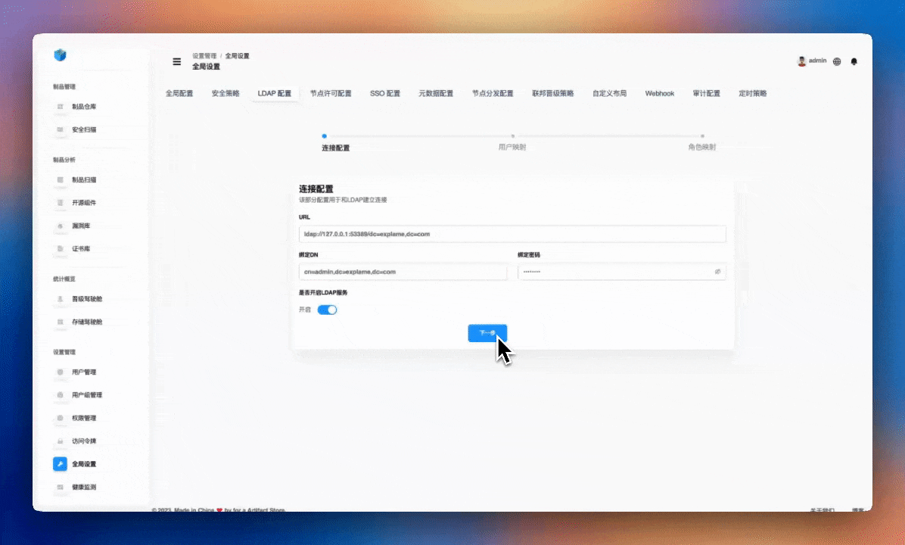
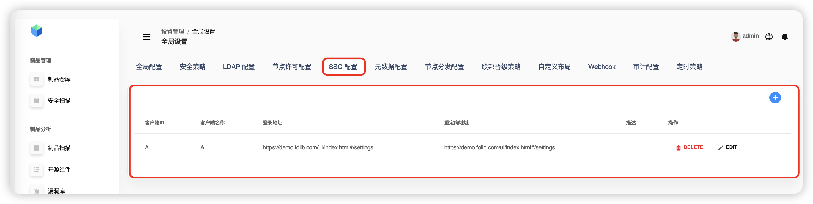
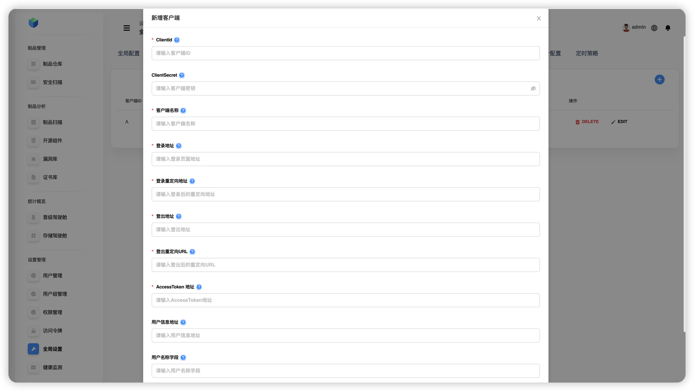
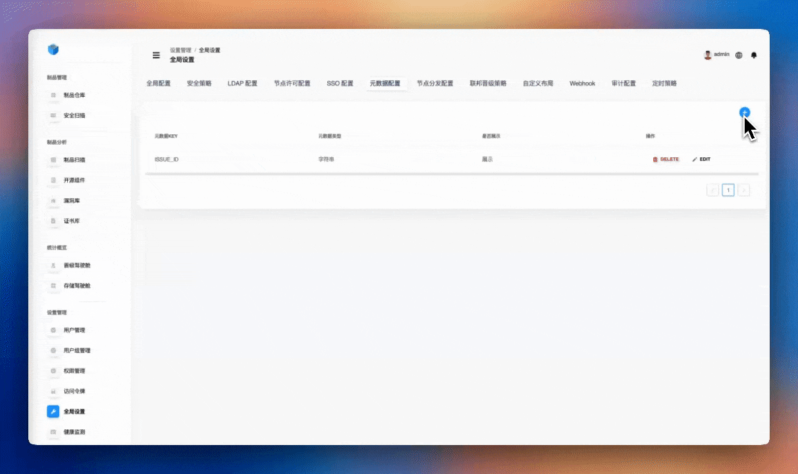

# Глобальные настройки

В разделе **Глобальные настройки** можно настраивать: **Глобальную конфигурацию**, **Политику безопасности**, **LDAP**, **SSO**, **Метаданные**, **Настройки узловой дистрибуции**, **Стратегии федеративного продвижения**, **Пользовательские схемы (layout)**, **Webhook**, **Аудит** и **Глобальные расписания**.

---

## Глобальная конфигурация

### 1) Базовая информация
Администратор (**роль admin**) задаёт имя приложения, базовый URL и порт сервиса.

> **Подсказка**
>
> - Обычно система развёрнута во внутренней сети и публикуется наружу через прокси. В этом случае укажите публичный IP/домен в `baseurl` и порт.  
> - Изменение имени приложения автоматически отражается в конфигурационном файле.  
> - `baseurl`: используйте при обратном проксировании.  
> - `folib-Server`: порт бэкенд‑сервиса.

### 2) SMTP
Настройте системную почту: логин, пароль, `HOST`, порт и протокол.

> **Подсказка**
>
> Некоторые события в системе сопровождаются почтовыми уведомлениями.

### 3) Сетевой прокси
Глобальный прокси платформы (proxy). Параметры:
- **Пользователь прокси** — имя для аутентификации на прокси.
- **Пароль прокси** — пароль для аутентификации.
- **Адрес прокси** — IP/домен прокси‑сервера.
- **Порт** — например, `8080`.
- **Тип прокси** — `HTTP`, `SOCKS4/SOCKS5`, **прозрачный**, **анонимный**.

> **Подсказка**
>
> Правильная настройка критична для корректной работы прокси.  
> **Сценарии:** нет прямого выхода в Интернет → настраиваем прокси, чтобы:  
> • обращаться к публичным ресурсам,  
> • скачивать зависимости из внешних репозиториев через прокси.

### 4) CORS
Политика междоменных запросов. Укажите разрешённые источники либо включите глобальное разрешение (кнопка **Включить**), чтобы снять ограничения происхождения.

---

## Политика безопасности

Откройте: **Настройки → Глобальные настройки → Политика безопасности**.

### 1) Белый список
Позволяет помечать уязвимости/лицензии как доверенные (с выбором срока действия):
- В течение срока действия записи игнорируются системой и не вызывают тревоги.
- Подходит для случаев подтверждённого отсутствия риска.

> **Подсказка**
>
> Доступны белые списки для **уязвимостей** и **лицензий**.

### 2) Чёрный список
Жёсткий контроль высокорисковых артефактов:
- Добавляйте **уязвимости**, **лицензии** и **пакеты** (срок действия обязателен).
- На срок действия загрузка и использование будут **заблокированы**.

> **Подсказка**
>
> Поддерживается ограничение по версиям пакета, например **`<= 2.1.10`** — все версии до и включая 2.1.10 блокируются, более новые доступны.

### 3) Уведомления
Настройте глобальную схему оповещений:
- Порог уровня риска,
- Кого уведомлять,
- Условия срабатывания.

### 4) Стратегии блокировки
Автоматические правила блокировки:
- **Блокировка по репозиторию**,
- **По чёрным/белым спискам уязвимостей**,
- **По имени пакета** (точное соответствие/правила версий),
- **По чёрно‑/белому списку лицензий**.

---

## LDAP

Для SSO по корпоративному каталогу: заполните базовые настройки, затем перейдите к сопоставлению ролей пользователей.

---

## Лицензирование узла

После получения лицензии вставьте содержимое сертификата в поле справа и нажмите **Активировать**.

> **Подсказка**
>
> - Для **боевой** активации требуется Интернет.  
> - **Пробная** активация — до 1 месяца, без Интернета.  
> - Если хост без доступа наружу — используйте глобальный прокси на машине с доступом в Интернет для активации.

---

## SSO

Добавляйте клиентские записи для перенаправления аутентификации в стороннюю систему.

  

**Поля:**
- `clientId` — уникальный ID клиента.
- **Название клиента**.
- **URL входа** — страница SSO от третьей стороны.
- **URL выхода** — endpoint для logout (очистка сессии на стороне провайдера).
- **URL редиректа после выхода**.
- **URL редиректа после входа**.
- **URL получения токена** — endpoint выдачи access token.
- **Описание** — произвольный комментарий к настройке.

---

## Метаданные

Справочник типов пользовательских метаданных артефактов (появляется в выпадающем списке при редактировании метаданных).

---

## Узловая дистрибуция

Настройте **внутренние** и **внешние** узлы кластера для дистрибуции/репликации.

  

---

## Федеративные стратегии продвижения

Список стратегий с указанием исходных/целевых репозиториев, даты создания и автора. Доступно создание, редактирование и удаление стратегий.

---

## Пользовательские схемы (Layout)

Общий список всех пользовательских схем хранения. Можно редактировать существующие и создавать новые.

---

## Webhook

Задайте URL, заголовок **X-Token** (токен доступа) и выберите события‑триггеры.

  

**События:**
- Загрузка артефакта,
- Обновление артефакта (повторная загрузка той же версии),
- Скачивание артефакта,
- Удаление артефакта,
- Удаление каталога,
- **Безопасностная блокировка** (скачивание заблокировано политикой).

---

## Аудит

Глобальные параметры аудита для: **репозиториев**, **системных настроек**, **расширенных операций**, **управления пользователями**.

---

## Глобальные расписания

Настройка плановых задач для репозиториев на уровне всей платформы.

